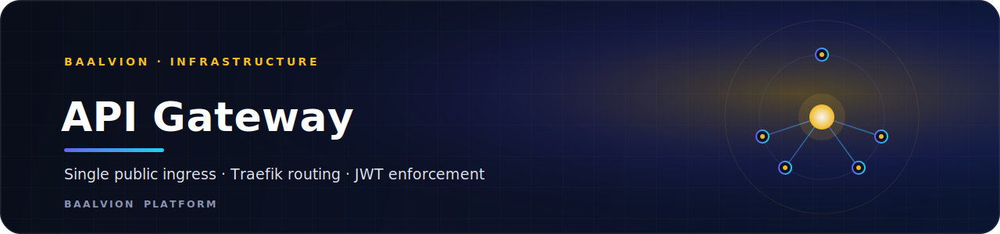

<div align="center">



<br/>
<br/>

**The single public API ingress — a declarative Traefik routing table that maps `api.baalvion.com/api/v1/<domain>/<service>/...` onto private backend services and enforces auth-service JWT on every protected route.**


<sub>[Overview](#overview) · [Files](#files) · [Path &amp; Auth Model](#path--auth-model) · [Port Collisions](#port-collision-fixes-baked-into-the-table) · [Frontend Convention](#frontend-env-convention-step-3--staged) · [Run](#run--verify)</sub>

</div>

---

## Overview

This directory realizes the API ingress as **declarative config** — no Go, no new
service. Backend services have **no public entrypoint**; they are reachable only on
the internal network through the routes defined here.

The Go [`Backend/gateway`](../../gateway/) is a separate concern: it remains the
**proxy egress data plane** for customer proxy traffic and is unchanged by this
ingress.

- **Domain / tier:** Infrastructure (API ingress)
- **Engine:** `traefik:v3.1`
- **Public ports:** `:80` → redirected to `:443`
- **Routing table:** 29 routers / services across the 6 domains, plus shared
  middlewares (in `dynamic.yml`).

## Files

| File | Purpose |
|---|---|
| `traefik.yml` | static config — entrypoints `:80`→`:443`, file provider, dashboard, logging |
| `dynamic.yml` | the routing table — routers / services / middlewares (path strip, JWT auth, rate limit, security headers) |
| `docker-compose.gateway.yml` | runnable Traefik stack on the shared `baalvion-net` network |
| `verify-routes.sh` | direct-vs-gateway route comparison script |

## Path & Auth Model

- **Path:** `https://api.baalvion.com/api/v1/<domain>/<service>/<resource>`
  → a path-strip middleware rewrites to the service's own `/v1/<resource>` mount,
  so services keep their existing `/v1` routes (non-breaking).
- **Auth (unification point):** the `jwt-auth` middleware (`forwardAuth` →
  `auth-service`) validates the auth-service JWT on every protected route.
  `identity/auth` + `identity/oauth` are public (token issuers). Because services
  are private and only reachable through this gateway, **auth-service becomes the
  single enforced authority**.
  - `forwardAuth` expects `GET /v1/auth/verify` on auth-service → `2xx`
    (+`X-User-Id` / `X-Tenant-Id` / `X-Roles`) or `401`. If that endpoint does not
    exist yet, add it (small, additive) or switch `jwt-auth` to a JWKS-validating
    JWT plugin against `auth-service/.well-known/jwks.json`. This is the only
    backend code change the auth step needs.

## Port-collision fixes baked into the table

- `ctm-service` 3011 → **3017** (was colliding with `cms-service` 3011)
- `fulfillment-service` 3015 → **3016** (was colliding with `law-service` 3015)

These are the upstream targets in `dynamic.yml`; update each service's `PORT` /
compose to match when deploying.

## Frontend env convention (Step 3 — staged)

Every frontend collapses its many per-service URLs to ONE:

```
NEXT_PUBLIC_GATEWAY_URL=https://api.baalvion.com      # Next.js apps
VITE_GATEWAY_URL=https://api.baalvion.com             # Vite apps
```

and calls `${GATEWAY}/api/v1/<domain>/<service>/<resource>`. **Do not flip the
live defaults until this gateway is deployed and verified**, otherwise every app
points at a non-running ingress.

## Run / verify

### Runnable stack (Docker Compose)

```bash
docker network create baalvion-net          # once, if it does not exist
docker compose -f docker-compose.gateway.yml up -d
./verify-routes.sh                          # direct-vs-gateway comparison
# reversible:
docker compose -f docker-compose.gateway.yml down
```

The compose stack stands up only the gateway with the validated routing table.
Services join the same `baalvion-net` network under their service-name hostnames
(`http://auth-service:3001`, …) — exactly what `dynamic.yml` targets. Host-mode
(pm2) services are reached via `host.docker.internal`.

### Manual (Traefik image directly)

```bash
docker run -p 80:80 -p 443:443 \
  -v $PWD/traefik.yml:/etc/traefik/traefik.yml \
  -v $PWD/dynamic.yml:/etc/traefik/dynamic.yml traefik:v3.1
# then: curl https://api.baalvion.com/api/v1/identity/auth/health            (public)
#       curl -H "Authorization: Bearer <jwt>" .../api/v1/commerce/order/...  (protected)
```

## Notes

- TLS: wire ACME (Let's Encrypt) for `api.baalvion.com` in production, or mount a
  cert for local. `traefik.yml` keeps TLS minimal so the routing table is the
  reviewable unit.
- Not run in the authoring environment (no Docker here) — deploy and
  integration-test before any frontend cutover.

---

<div align="center">
<sub>Part of the <a href="https://github.com/baalvionservice/Baalvion-Project-Infra">Baalvion Platform</a> · centralized identity · domain-driven monorepo</sub>
</div>
