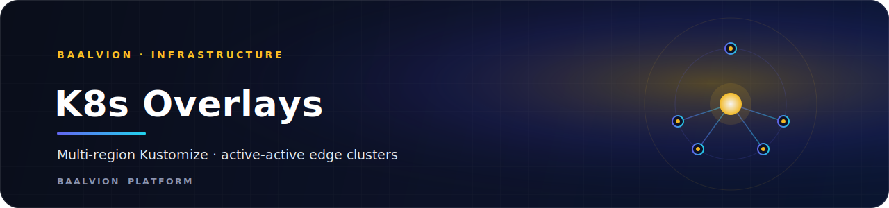

<div align="center">



<br/>
<br/>

**Per-region Kustomize overlays over the shared base — each region is a separate, active-active cluster with its own labels, replica counts, and node selectors.**


<sub>[Overview](#overview) · [Deploy](#deploy) · [Region Map](#region-map) · [Adding a Region](#adding-a-region) · [Notes](#notes)</sub>

</div>

---

## Overview

Each region is a **separate cluster** (active-active). Overlays layer region
identity, replicas, and node selectors on top of [`../../base`](../../base/), and
pin a released image tag per region for controlled, staggered rollouts.

- **Pattern:** Kustomize `resources: [../../base]` + region label + `region-patch.yaml`
- **Namespace:** `baalvion-edge` (gateway Deployment + HPA)
- **Shipping overlays:** `us-east`, `eu`, `india`, `sea`

## Deploy

```bash
kubectl --context us-east-1 apply -k infra/k8s/overlays/us-east
kubectl --context eu-west-1  apply -k infra/k8s/overlays/eu
```

## Region map

| Overlay | `topology.kubernetes.io/region` | Gateway replicas (min/max) | Notes |
|---------|---------------------------------|----------------------------|-------|
| `us-east` | `us-east-1` | 6 / 150 | primary, highest capacity |
| `eu` | `eu-west-1` | 4 / (HPA) | GDPR data residency |
| `india` | `ap-south-1` | 4 / 100 | Mumbai (Razorpay/INR locality) |
| `sea` | `ap-southeast-1` | 3 / 80 | Singapore hub (SG/ID/TH/VN/MY) |

Overlays stamp `topology.kubernetes.io/region` on every object so dashboards and
routing can split by region, and override the gateway Deployment replicas + HPA
`minReplicas`/`maxReplicas` via `region-patch.yaml`.

## Adding a region

Copy an existing overlay and change two things — the region label and the
`region-patch.yaml` nodeSelector / replicas:

```bash
cp -r us-east us-west
# edit us-west/kustomization.yaml  -> region label: us-west-2
# edit us-west/region-patch.yaml   -> nodeSelector region: us-west-2, replicas
```

Candidate expansion regions: `us-west` (`us-west-2`, active-active with us-east),
`middle-east` (`me-central-1`, UAE), and others — see the
[edge region matrix](../../edge/README.md#8-region-matrix).

## Notes

- Control-plane DBs (Postgres/ClickHouse) are primary in `us-east-1` with
  cross-region read replicas; each edge region runs gateways + a regional Redis for
  session affinity.
- Global routing (GeoDNS / Anycast) is documented in
  [`infra/mesh/global-lb.md`](../../mesh/global-lb.md); service mesh and network
  policies live alongside it in [`infra/mesh/`](../../mesh/).

---

<div align="center">
<sub>Part of the <a href="https://github.com/baalvionservice/Baalvion-Project-Infra">Baalvion Platform</a> · centralized identity · domain-driven monorepo</sub>
</div>
