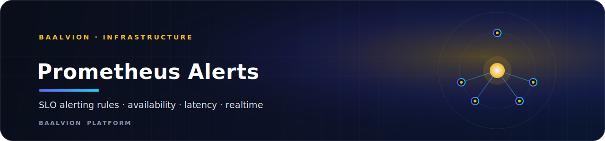

<div align="center">



<br/>
<br/>

**Prometheus SLO alerting rules for the Baalvion platform — auth availability, API p95 latency, realtime-connection health, and worker job failures.**


<sub>[Overview](#overview) · [Rules](#rules-sloyml) · [Loading](#loading-the-rules-into-prometheus) · [Verifying](#verifying-the-rules) · [Metric Sources](#metric-sources)</sub>

</div>

---

## Overview

This directory contains the Prometheus alerting rules for the Baalvion enterprise
platform. All rules live in `slo.yml` under the group `baalvion_slo`
(`interval: 30s`).

## Rules (`slo.yml`)

| Alert | SLO | `for` | Severity |
|---|---|---|---|
| `AuthServiceErrorRateTooHigh` | Auth routes < 0.5% error rate (5m) | 2m | critical |
| `APILatencyP95High` | Per-route p95 < 500 ms (5m) | 3m | warning |
| `APILatencyP95HighAggregate` | Aggregate p95 < 500 ms (5m) | 3m | warning |
| `RealtimeConnectionsDrop` | Active connections must not drop >30% in 5m | 2m | critical |
| `RealtimeServiceConnectionsDrop` | Realtime-service connections must not drop >30% in 5m | 2m | critical |
| `WorkerJobFailureRateHigh` | Worker health endpoint < 10% error rate | 5m | warning |

All rules carry `team: platform` labels and a `runbook_url` annotation.

## Loading the rules into Prometheus

### Option 1 — Static configuration

Add the rules file path to your `prometheus.yml`:

```yaml
rule_files:
  - /etc/prometheus/alerts/*.yml
```

Then restart (or `kill -HUP`) the Prometheus process.

### Option 2 — Kubernetes ConfigMap

```bash
kubectl create configmap baalvion-prom-alerts \
  --from-file=slo.yml=infra/prometheus/alerts/slo.yml \
  --namespace monitoring \
  --dry-run=client -o yaml | kubectl apply -f -
```

Mount the ConfigMap into the Prometheus pod and reference it from `prometheus.yml`
via the `rule_files` key (see Prometheus Helm chart `additionalRulesForClusterRole`
or `ruleFiles` values).

### Option 3 — Prometheus Operator (PrometheusRule CRD)

Wrap the rule group inside a `PrometheusRule` custom resource:

```yaml
apiVersion: monitoring.coreos.com/v1
kind: PrometheusRule
metadata:
  name: baalvion-slo
  namespace: monitoring
  labels:
    prometheus: kube-prometheus    # must match your Prometheus CR selector
spec:
  groups: []                       # paste the contents of slo.yml here
```

## Verifying the rules

```bash
# Lint the YAML
promtool check rules infra/prometheus/alerts/slo.yml

# Unit-test rules (add a slo_test.yml alongside this file)
promtool test rules infra/prometheus/alerts/slo_test.yml
```

## Metric sources

| Metric | Source | Notes |
|---|---|---|
| `http_requests_total` | `proxy-backend` (`observability/metrics.js`) | Labels: `method`, `route`, `status_code` |
| `http_request_duration_seconds` | `proxy-backend` (`observability/metrics.js`) | Histogram with standard buckets |
| `http_active_connections` | `proxy-backend` (`observability/metrics.js`) | Gauge |
| `realtime_active_connections` | `realtime-service` | Export this gauge from the realtime-service when it is instrumented |

---

<div align="center">
<sub>Part of the <a href="https://github.com/baalvionservice/Baalvion-Project-Infra">Baalvion Platform</a> · centralized identity · domain-driven monorepo</sub>
</div>
