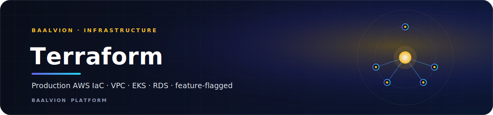

<div align="center">



<br/>
<br/>

**Production AWS infrastructure as code — VPC, EKS, RDS PostgreSQL, ElastiCache Redis, plus a set of feature-flagged edge/data modules that default OFF so the stack is safe to adopt incrementally.**


<sub>[Overview](#overview) · [Prerequisites](#0-prerequisites) · [Bootstrap](#1-bootstrap-the-remote-state-backend-one-time-out-of-band) · [Secrets](#2-required-secret-inputs) · [Apply](#3-init--plan--apply) · [Feature Flags](#4-enabling-the-feature-flagged-modules-recommended-order) · [Security](#5-security-posture--known-operator-hardening) · [Outputs](#7-outputs-operators-use)</sub>

</div>

---

## Overview

This stack provisions the Baalvion platform's AWS footprint: VPC, EKS, RDS
PostgreSQL, ElastiCache Redis, and a set of **feature-flagged** edge/data modules
(S3, CloudFront, ALB, WAFv2, ECR, Secrets Manager + SSM, VPC endpoints).

- **Terraform:** `>= 1.7`
- **Providers:** `hashicorp/aws ~> 5.0`, `hashicorp/kubernetes ~> 2.30`,
  `hashicorp/helm ~> 2.13`, `hashicorp/random ~> 3.6`
- **State:** S3 backend (`baalvion-terraform-state`) with DynamoDB locking
  (`baalvion-terraform-locks`)
- **Default region:** `ap-south-1` (Mumbai) — override with `region`
- **Modules:** `vpc`, `eks`, `postgres`, `redis`, `edge`, `s3`, `cloudfront`,
  `alb`, `waf`, `ecr`, `secrets`, `vpc-endpoints`, `monitoring`

> Everything under "feature flags" defaults **OFF** so enabling this stack never
> disrupts an existing apply. Turn modules on one at a time (see §4).

## 0. Prerequisites

- Terraform `>= 1.7`, AWS CLI v2, `kubectl`, authenticated AWS creds with admin
  (or sufficiently scoped) permissions in the target account.
- Region defaults to `ap-south-1` (Mumbai). Override with `region`.
- **ACM certificates** (issued + validated *before* apply):
  - ALB HTTPS listener → a **regional** cert in the deploy region (`alb_acm_certificate_arn`).
  - CloudFront custom domain → a cert in **us-east-1** (`cloudfront_acm_certificate_arn`).

## 1. Bootstrap the remote-state backend (one-time, out-of-band)

`main.tf` uses an S3 backend with DynamoDB locking. The bucket and lock table must
exist **before** `terraform init`. Create them once:

```bash
AWS_REGION=ap-south-1
aws s3api create-bucket \
  --bucket baalvion-terraform-state \
  --region "$AWS_REGION" \
  --create-bucket-configuration LocationConstraint="$AWS_REGION"
aws s3api put-bucket-versioning \
  --bucket baalvion-terraform-state \
  --versioning-configuration Status=Enabled
aws s3api put-bucket-encryption \
  --bucket baalvion-terraform-state \
  --server-side-encryption-configuration \
  '{"Rules":[{"ApplyServerSideEncryptionByDefault":{"SSEAlgorithm":"aws:kms"}}]}'
aws s3api put-public-access-block \
  --bucket baalvion-terraform-state \
  --public-access-block-configuration \
  BlockPublicAcls=true,IgnorePublicAcls=true,BlockPublicPolicy=true,RestrictPublicBuckets=true
aws dynamodb create-table \
  --table-name baalvion-terraform-locks \
  --attribute-definitions AttributeName=LockID,AttributeType=S \
  --key-schema AttributeName=LockID,KeyType=HASH \
  --billing-mode PAY_PER_REQUEST \
  --region "$AWS_REGION"
```

Then:

```bash
cp backend.hcl.example backend.hcl              # adjust if your bucket/table/region differ
cp terraform.tfvars.example terraform.tfvars    # never commit terraform.tfvars
```

## 2. Required secret inputs

Pass these as env vars — never put them in tfvars:

```bash
export TF_VAR_db_password='<strong-master-db-password>'
# Required in PRODUCTION (gates Redis TLS); recommended everywhere:
export TF_VAR_redis_auth_token='<>=16-char-redis-auth-token>'
```

`db_password` has no default — `plan`/`apply` fails fast without it. In
`environment = "production"`, `redis_auth_token` is enforced by a precondition (it
gates `transit_encryption_enabled` on the Redis cluster).

## 3. Init / plan / apply

```bash
terraform init -backend-config=backend.hcl
terraform plan  -var-file=terraform.tfvars -out tfplan
terraform apply tfplan
aws eks update-kubeconfig --region <region> --name $(terraform output -raw eks_cluster_name)
```

## 4. Enabling the feature-flagged modules (recommended order)

All default to `false`. Enable per module by adding to `terraform.tfvars`:

| Flag | Notes / required companion inputs |
|---|---|
| `enable_secrets = true` | Define `secrets` / `ssm_parameters`. Attach `terraform output secrets_read_policy_json` to the IRSA / task role. |
| `enable_ecr = true` | **Set `ecr_repositories = ["auth-service", ...]`** — defaults to `[]`, which creates **zero** repos. |
| `enable_vpc_endpoints = true` | Cuts NAT egress for ECR/Secrets/SSM/S3. |
| `enable_s3 = true` | Buckets default to `uploads`/`assets`/`backups`. |
| `enable_cloudfront = true` | Requires `enable_s3`. Serves `cloudfront_origin_bucket_key` (default `assets`). For a custom domain set `cloudfront_aliases` + `cloudfront_acm_certificate_arn` (**us-east-1** cert). The CloudFront module owns the origin bucket's policy (OAC read + TLS-only deny); the S3 module skips its policy for that one bucket — do not point a third policy at it. |
| `enable_alb = true` | **Requires `alb_acm_certificate_arn`** (regional). A precondition fails the apply if it's empty. Restrict `alb_ingress_cidrs` from the default `0.0.0.0/0` where possible. |
| `enable_waf = true` | Associates a regional WAFv2 ACL with the ALB (enable ALB first). CloudFront is **not** WAF-protected by this stack (would need a separate us-east-1 `CLOUDFRONT`-scope ACL). |

## 5. Security posture / known operator hardening

- **RDS** enforces TLS at the server (`rds.force_ssl=1`), storage is encrypted,
  Multi-AZ + 7-day backups + deletion protection in production. Clients must set
  `DB_SSL=true` + `DB_SSL_REJECT_UNAUTHORIZED=true` (+ the RDS CA bundle).
- **Redis:** at-rest encryption always on; transit (TLS) requires `redis_auth_token`
  (enforced in production).
- **S3:** versioned, SSE, full public-access-block, `BucketOwnerEnforced`, TLS-only.
- **CloudFront:** OAC (private origin), `redirect-to-https`, TLS1.2_2021 min.
- **EKS API server** currently allows `0.0.0.0/0` (see `modules/eks/main.tf`).
  **Restrict `eks_public_access_cidrs` to your office / VPN / CI egress ranges for
  production** (operator action; tracked as a hardening item).
- **RLS role:** this stack does NOT provision the `baalvion_app` DB role or run
  app migrations — do that during app deploy (see
  [`Backend/docs/RLS-PRODUCTION-CUTOVER.md`](../../docs/RLS-PRODUCTION-CUTOVER.md)).

## 6. Edge (multi-region Anycast) — optional

`edge_regions` defaults to `[]` (disabled). Global Accelerator is a **us-east-1**
global resource; populating `edge_regions` additionally requires a us-east-1
provider alias (not yet wired) — keep disabled until the multi-region rollout. See
[`infra/edge/`](../edge/) for the topology.

## 7. Outputs operators use

`eks_cluster_name`, `db_endpoint`, `redis_endpoint`, `alb_dns_name`, `alb_zone_id`
(Route53 alias), `cloudfront_domain_name`, `ecr_repository_urls`, `secret_arns`,
`ssm_parameter_arns`, `secrets_read_policy_json`, `eks_node_security_group_id`,
`waf_web_acl_arn`, `kubeconfig_command`.

---

<div align="center">
<sub>Part of the <a href="https://github.com/baalvionservice/Baalvion-Project-Infra">Baalvion Platform</a> · centralized identity · domain-driven monorepo</sub>
</div>
