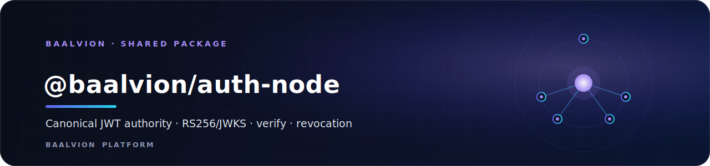
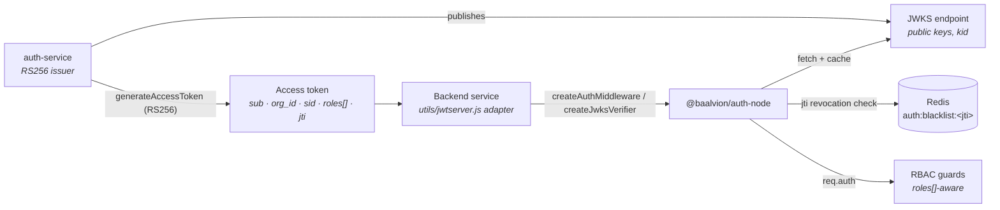

<div align="center">



<br/>
<br/>

**The canonical backend JWT authority for Baalvion — the single module permitted to import `jsonwebtoken`, giving every service one verification scheme, one issuance path, and one place to rotate keys.**

<p>
  
  
  
  
</p>

<sub><a href="#overview">Overview</a> · <a href="#architecture">Architecture</a> · <a href="#installation">Installation</a> · <a href="#usage">Usage</a> · <a href="#configuration">Configuration</a> · <a href="#api">API</a> · <a href="#verification-scheme">Verification</a> · <a href="#testing">Testing</a> · <a href="#security--notes">Security &amp; Notes</a></sub>

</div>

---

## Overview

`@baalvion/auth-node` is the **canonical backend JWT authority** for the Baalvion
platform. It is the **only** module in the monorepo permitted to import
`jsonwebtoken` — a boundary enforced by `catalog/enforce.mjs`, condition
**C3 — no auth duplication**. Every backend service consumes token verification
and issuance through this package via a thin `utils/jwtserver.js` adapter that
injects its own config.

Before this package, roughly twenty services each shipped a hand-copied
`utils/jwtserver.js`. They drifted: some verified RS256 via JWKS, most only ran
legacy `jwt.verify(token, sharedSecret)` and could not verify the RS256 tokens the
issuer now mints. This package collapses that into **one library, one behaviour,
one place to rotate keys**.

- **Package:** `@baalvion/auth-node` `1.0.0` (private workspace package)
- **Module system:** CommonJS — pure JS, **no build step**, always resolvable
  from any CJS service
- **Entry:** `index.js` (also ships `requireEnv.js`, `rbac.js`, `blacklist.js`,
  `dbSsl.js`)
- **Only runtime dependency:** `jsonwebtoken` `^9.0.3`
- **Sits at:** the platform trust anchor — the identity domain. Services depend on
  it for authn; the auth-service issues RS256 tokens and publishes the JWKS that
  every other service verifies against.

## Architecture



Three verification entry points cover every backend shape:

- **`createAuthServer`** — local verify/issue for a service that holds key
  material (issuer or in-process verifier).
- **`createJwksVerifier`** — async verifier for edge services that verify against
  the issuer's public JWKS endpoint rather than holding keys.
- **`createAuthMiddleware`** — the canonical Express middleware: verifies RS256
  via JWKS, enforces the canonical claim contract, checks the JTI blacklist, and
  populates `req.auth`.

## Installation

It is a private workspace package — depend on it through the monorepo workspace:

```jsonc
// service package.json
{
  "dependencies": {
    "@baalvion/auth-node": "workspace:*"
  }
}
```

```bash
# from the monorepo root
pnpm install
```

## Usage

### Verify-only service

```js
const { createAuthServer } = require('@baalvion/auth-node');
const config = require('../config/appConfig');

const auth = createAuthServer({ accessSecret: config.jwt.accessSecret, env: config.env });

module.exports = { verifyAccessToken: (t) => auth.verifyAccessToken(t) };
```

### Canonical Express middleware (JWKS)

```js
const { createAuthMiddleware } = require('@baalvion/auth-node');

const requireAuth = createAuthMiddleware({
  jwksUri: process.env.JWT_JWKS_URI,
  issuer: process.env.JWT_ISSUER,
  audience: process.env.JWT_AUDIENCE,
  redis, // optional — enables shared jti revocation checks (fail-closed)
});

app.use('/v1', requireAuth); // populates req.auth { userId, orgId, sessionId, roles, permissions, jti, ... }
```

A service that configures no RS256 keys is rejected at start-up in production
(fail-closed); in dev/test it constructs without keys and verification simply
rejects all tokens — still fail-closed.

## Configuration

`createAuthServer` options (all optional unless your role requires them):

| Option | Default | Purpose |
|--------|---------|---------|
| `accessSecret` / `refreshSecret` | — | HS256 secret(s). Refresh tokens are HS256 by design (opaque, per-service); access tokens are RS256-only. |
| `accessExpiresIn` / `refreshExpiresIn` | `24h` / `7d` | Token TTLs |
| `env` | `process.env.NODE_ENV` | Governs fail-closed behaviour; `production` requires an RS256 public key |
| `keysDir` / `activeKid` / `issuer` / `audience` | env / defaults | RS256 + JWKS key material and claim validation |
| `claimStyle` | `'sub'` | `'sub'` (modern), `'id'` (legacy issuer), or `'canonical'` (sub/org_id/sid/roles[]) |
| `normalizeClaims` | `false` | Adds `userId` / `organizationId` (and canonical aliases) to the decoded token |
| `disableRs256` | `false` | Force legacy mode regardless of ambient keys |
| `publicKey` | — | Inject a resolved RS256 public PEM directly (verify-only services) |
| `requireRs256InProduction` | `false` | Retained but inert — RS256 is always required for access tokens |
| `allowHs256Fallback` | inert | Retained for adapter compatibility — HS256 access tokens are disabled (R2) |

`createJwksVerifier` / `createAuthMiddleware` options:

| Option | Default | Purpose |
|--------|---------|---------|
| `jwksUri` | — | Issuer JWKS endpoint |
| `jwksTtlMs` | `300000` | JWKS cache TTL |
| `issuer` / `audience` | — | Enforced only when set |
| `staticPublicKey` / `staticPublicKeyB64` | — | RSA fallback when JWKS is unreachable (still RS256-only) |
| `requiredClaims` | `['sub','org_id','sid','jti']` (middleware) | Claims that must be present |
| `isBlacklisted` / `redis` | — | jti revocation lookup; a Redis client enables the shared `auth:blacklist:<jti>` store |

Key material is read from environment when not passed explicitly:
`JWT_PRIVATE_KEY` / `JWT_PUBLIC_KEY` / `JWT_PUBLIC_KEYS`, `JWT_KEYS_DIR`,
`JWT_ACTIVE_KID` (default `baalvion-key-1`), `JWT_ISSUER` (default
`baalvion-auth`), `JWT_AUDIENCE` (default `baalvion-platform`).

## API

The package's default export re-exports its factories, guards, revocation
helpers, and DB-TLS config:

| Member | Purpose |
|--------|---------|
| `createAuthServer(opts)` | Local verify/issue: `generateAccessToken` (RS256), `generateRefreshToken`, `verifyAccessToken`, `verifyRefreshToken`, `getJwks`, `reloadKeys`, `isRs256Enabled` |
| `createJwksVerifier(opts)` | Async `verify(token)` against a remote JWKS with RSA fallback; `fetchJwks`, `resetCache` |
| `createAuthMiddleware(opts)` | Canonical Express middleware; verifies RS256, enforces claims, populates `req.auth`; exposes `.verifier` |
| `requireEnv` | Required-env-var assertion helper (`requireEnv.js`) |
| `VerifyError` | Classified verification error with a machine `code` (`alg_not_allowed`, `missing_claim`, `blacklisted`, …) |
| `...blacklist` | Shared JTI revocation (`auth:blacklist:<jti>`), incl. `createRedisBlacklist` (`blacklist.js`) |
| `...rbac` | Hierarchical, `roles[]`-aware RBAC guards + platform-role helpers (`hasTenantBypass`, `assertNoRoleConfusion`) (`rbac.js`) |
| `...dbSsl` | Canonical Postgres TLS config: `buildPgSsl`, `buildPgPoolSsl`, `buildPgDialectOptions`, `isDbTlsEnabled` (`dbSsl.js`) |

`req.auth` populated by the middleware: `{ userId, orgId, sessionId, roles,
permissions, jti, issuer, audience, isImpersonation, impersonatedBy }`.

## Verification scheme

Access tokens are **RS256-only** (R2 hard state). The algorithm-confusion /
shared-secret-forgery bypass is closed by accepting and issuing **only** RS256
access tokens — any other algorithm (`HS256`, `none`, …) is rejected before
verification is attempted. RS256 + JWKS is the target scheme: tokens are signed
RS256 with a `kid` so any service can verify via the public JWKS without sharing a
secret.

Refresh tokens remain **HS256** by design — opaque, per-service, never verified
cross-service. The legacy `signAccessToken` (raw HS256 issuance) is retired and
now throws if called, so any legacy caller fails loud instead of silently minting
an HS256 token.

## Testing

```bash
pnpm --filter @baalvion/auth-node test
# runs: node test.smoke.js && node --test
```

The `tests/` suite covers RS256-only enforcement, the canonical verifier,
blacklist (jti revocation), impersonation, C4 platform roles, and DB-TLS config.

## Security & Notes

- **C3 boundary:** this is the only module allowed to import `jsonwebtoken`. Do
  not hand-roll JWT verification or introduce a second issuer anywhere else.
- **RS256-only access tokens.** HS256 access-token issuance and verification are
  permanently disabled. `allowHs256Fallback`, `hs256Secret`, `rejectHs256`, and
  `requireRs256InProduction` are retained as inert no-ops only so existing
  adapters do not error.
- **Fail-closed by default.** Production refuses to start without an RS256 public
  key; a revocation-store outage rejects tokens rather than letting them through
  (`blacklist_unavailable`).
- **Behaviour-preserving adapters.** A service that configures no RS256 keys
  keeps its old behaviour in dev/test and gains RS256 verification the moment keys
  are present.
- **Impersonation** is surfaced additively via `req.auth.isImpersonation` /
  `impersonatedBy`; a service opts in by configuring `issuer` to also accept the
  impersonation issuer.
- See [`CONTRACT.md`](CONTRACT.md) for the canonical claim contract.

---

<div align="center">
<sub>Part of the <a href="../../../README.md">Baalvion Platform</a> · centralized identity · domain-driven monorepo</sub>
</div>
