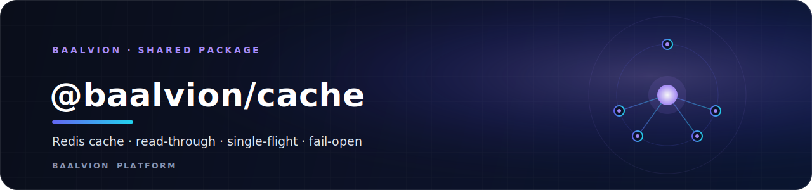
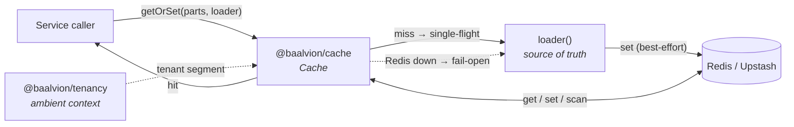

<div align="center">



<br/>
<br/>

**One consistent Redis caching layer for every Baalvion service — read-through `getOrSet` with single-flight stampede protection, fail-open behaviour, tenant-scoped keys, and canonical TTL profiles.**

<p>
  
  
  
  
</p>

<sub><a href="#overview">Overview</a> · <a href="#architecture">Architecture</a> · <a href="#installation">Installation</a> · <a href="#usage">Usage</a> · <a href="#ttl-profiles">TTL profiles</a> · <a href="#api">API</a> · <a href="#configuration">Configuration</a> · <a href="#testing">Testing</a> · <a href="#notes">Notes</a></sub>

</div>

---

## Overview

`@baalvion/cache` is the shared Redis cache abstraction for the Baalvion platform —
one consistent caching layer for every service instead of ad-hoc `ioredis` calls.
It is Redis- and **Upstash**-compatible: a `rediss://` `REDIS_URL` works as-is.

It exists to give every service the caching patterns it actually needs, once:

- **Read-through / write-through** via `getOrSet`
- **Single-flight stampede protection** — concurrent misses for a key run the
  loader **once** per process
- **Fail-open** — if Redis is down, fall through to the loader; never break the
  request
- **Consistent TTL profiles** — including the platform **FX = 30s** standard
- **Tenant-scoped keys** — no cross-tenant cache bleed
- **Prefix invalidation** — drop a whole key family after a write

- **Package:** `@baalvion/cache` `1.0.0` (private workspace package)
- **Runtime entry:** `index.js` (CommonJS) — the full Redis-backed implementation
  documented here, with no required runtime `dependencies` declared beyond the
  ambient `ioredis` it `require`s
- **Build tooling:** `tsup` is configured to emit `dist/` from `src/index.ts`

## Architecture



Keys are namespaced and collision-safe: `<namespace>[:t:<tenant>]:<parts>`. When
`tenantScoped` is set, the tenant segment is read from the ambient
`@baalvion/tenancy` context (bypass / no tenant → `global`).

## Installation

Private workspace package — depend on it through the monorepo workspace:

```jsonc
// service package.json
{
  "dependencies": {
    "@baalvion/cache": "workspace:*"
  }
}
```

```bash
pnpm install
```

## Usage

```js
const { createCache, TTL } = require('@baalvion/cache');

const cache = createCache({ namespace: 'fx', tenantScoped: false });

// FX rate cached for 30s, fetched once even under a stampede:
const rate = await cache.getOrSet(['rate', 'USD/EUR'], () => provider.fetch('USD/EUR'), { ttl: TTL.FX });

// tenant-scoped (reads the @baalvion/tenancy context):
const profile = await cache.getOrSet(['org-profile', orgId], () => db.loadOrg(orgId), { ttl: TTL.MEDIUM, tenantScoped: true });

// wrap a loader into a memoized fn:
const getOrg = cache.wrap(loadOrg, { ttl: TTL.MEDIUM, keyFn: (id) => ['org', id] });

// invalidate a whole key family after a write:
await cache.invalidatePrefix(['org', orgId]);
```

## TTL profiles

Canonical TTL profiles (seconds), frozen, so caching is consistent platform-wide
instead of every service inventing its own numbers:

| Profile | Seconds | Use |
|---------|---------|-----|
| `REALTIME` | `5` | Near-live tickers |
| `FX` | `30` | FX / market rates — the platform standard |
| `SHORT` | `30` | Short-lived values |
| `DEFAULT` | `60` | Default TTL |
| `MEDIUM` | `300` | 5 minutes |
| `SESSION` | `1800` | 30 minutes |
| `LONG` | `3600` | 1 hour |
| `DAY` | `86400` | 1 day |

## API

| Member | Purpose |
|--------|---------|
| `createCache({ namespace, defaultTtl, tenantScoped, redis, client, logger })` | Build a cache instance |
| `getOrSet(parts, loader, { ttl, tenant, tenantScoped })` | Read-through + single-flight + fail-open |
| `get(parts, opts)` / `set(parts, value, ttl, opts)` / `del(parts, opts)` | Direct ops (JSON, TTL) |
| `wrap(loader, { ttl, keyFn, tenantScoped })` | Memoize a function |
| `invalidatePrefix(parts, opts)` | `SCAN` + `DEL` a key family; returns count removed |
| `ttlOf(parts, opts)` | Remaining TTL (`pttl`) for a key |
| `ping()` / `close()` | Liveness / lifecycle |
| `stats` | `{ hits, misses, errors }` |
| `TTL` | The frozen TTL-profile map above |
| `createRedis(opts)` | The underlying `ioredis` connection factory |
| `buildKey(namespace, parts, tenant)` / `resolveTenant({ tenant, tenantScoped })` | Key/tenant helpers |
| `Cache` | The class behind `createCache` |

## Configuration

The `ioredis` connection factory reads, in order of precedence, explicit options
then environment:

| Variable | Default | Purpose |
|----------|---------|---------|
| `REDIS_URL` / `CACHE_REDIS_URL` | — | Full connection URL (Upstash `rediss://` supported) |
| `REDIS_HOST` | `localhost` | Host (when no URL) |
| `REDIS_PORT` | `6379` | Port (when no URL) |
| `REDIS_PASSWORD` | — | Password (when no URL) |
| `REDIS_DB` | `0` | DB index (when no URL) |

The factory is lazy with low retries (`maxRetriesPerRequest: 2`,
`connectTimeout: 3000ms`) so cache calls fail **fast** and the caller can fall
through to the source of truth — the cache layer is fail-open.

## Testing

```bash
node test.smoke.js
```

Build / type-check the TypeScript surface:

```bash
pnpm --filter @baalvion/cache build        # tsup → dist (esm + cjs + dts)
pnpm --filter @baalvion/cache type-check   # tsc --noEmit
```

## Notes

- **`null` is cached** (cache-penetration protection); only `undefined` is never
  cached.
- **Single-flight is in-process.** For cross-process stampede control, add a
  distributed lock (not yet implemented here).
- **TTL `<= 0` persists without expiry.**
- **Sessions:** `session-service` uses Redis directly today; it can adopt this
  package with `namespace: 'session'`, `TTL.SESSION`.
- **Build vs. runtime entry.** The full implementation lives in the CommonJS
  `index.js` and its siblings (`cache.js`, `redis.js`, `keys.js`, `ttl.js`).
  `package.json` declares `main: dist/index.js` / `types: dist/index.d.ts`, which
  are produced by `tsup` from `src/index.ts`; ensure the build has run when
  importing via the package's published entry rather than the CJS source.

---

<div align="center">
<sub>Part of the <a href="../../../README.md">Baalvion Platform</a> · centralized identity · domain-driven monorepo</sub>
</div>
