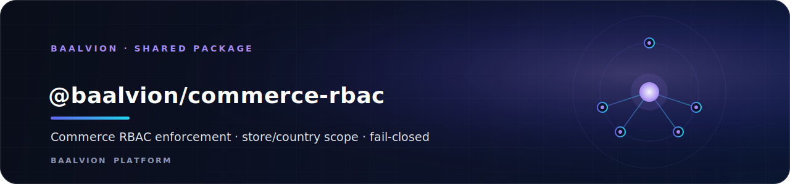
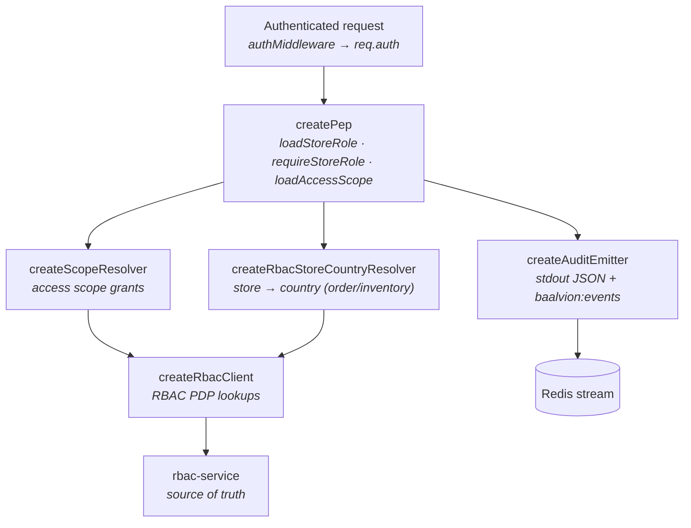

<div align="center">



<br/>
<br/>

**The single, shared commerce-domain RBAC Policy Enforcement Point — the store/country authorization layer that `commerce-service`, `order-service`, and `inventory-service` share so none of them duplicate enforcement logic.**

<p>
  
  
  
  
</p>

<sub><a href="#overview">Overview</a> · <a href="#architecture">Architecture</a> · <a href="#installation">Installation</a> · <a href="#wiring">Wiring</a> · <a href="#capability-ladder">Capability ladder</a> · <a href="#api">API</a> · <a href="#guarantees">Guarantees</a> · <a href="#testing">Testing</a> · <a href="#notes">Notes</a></sub>

</div>

---

## Overview

`@baalvion/commerce-rbac` is the **single, shared commerce-domain RBAC Policy
Enforcement Point (PEP)**. The RBAC service (`rbac-service`) remains the source of
truth for the admin hierarchy and store-team roles; this package holds the
*enforcement* logic **once** so `commerce-service`, `order-service`, and
`inventory-service` never duplicate it.

The RBAC Policy Decision Point matches scope by **exact string + `'*'`** with no
tenant-tree expansion at decision time, and has no concept of a "store". The PEP
owns the hierarchy: for an addressed store it checks the scope chain
`['*' (platform), countryCode, storeId]`. A `country_admin` grant
(`scope_id = countryCode`) therefore authorizes **only** stores in that country —
automatic country isolation. Services that don't own the store table (order,
inventory) resolve a store's country **from the RBAC tenant tree**
(`createRbacStoreCountryResolver`), so no commerce-DB dependency is needed.

- **Package:** `@baalvion/commerce-rbac` `1.0.0` (private workspace package)
- **Module system:** CommonJS — pure JS, **no build step** (like
  `@baalvion/auth-node`)
- **Entry:** `index.js`; enforcement logic under `src/`
- **No declared runtime `dependencies`** — callers inject their own error class,
  cache, and Redis client

## Architecture



Mount `authMiddleware` (authn) **before** `pep.loadStoreRole` (authz).
`requireStoreRole` compares against the **0–100 capability ladder**.

## Installation

Private workspace package — depend on it through the monorepo workspace:

```jsonc
// service package.json
{
  "dependencies": {
    "@baalvion/commerce-rbac": "workspace:*"
  }
}
```

```bash
pnpm install
```

## Wiring

```js
const {
  createRbacClient, createScopeResolver, createPep, createAuditEmitter,
  createRbacStoreCountryResolver,
} = require('@baalvion/commerce-rbac');

const rbacClient = createRbacClient({ ...config.rbac, AppError });        // inject your error class
const audit = createAuditEmitter({ service: 'order-service', redis });    // stdout + baalvion:events
const scope = createScopeResolver({ rbacClient, cache, config: config.rbac, audit, keyPrefix: 'orders' });

// store→country: order/inventory use the RBAC tenant resolver; commerce injects a DB resolver.
const resolveStoreScope = createRbacStoreCountryResolver({ rbacClient, cache });

const pep = createPep({ scope, resolveStoreScope, config: config.rbac, AppError, audit });
// → pep.loadStoreRole, pep.requireStoreRole(level), pep.loadAccessScope
```

## Capability ladder

`requireStoreRole` compares a caller's resolved role against the same frozen
0–100 ladder every commerce service shares. The store-team roles (RBAC custom
roles, scope = organization, assigned at `scope_id = storeId`):

| Role | Capability | Description |
|------|------------|-------------|
| `store_admin` | `100` | Full control of a single store, incl. team management |
| `product_manager` | `80` | Manage the full product catalogue incl. publish/delete |
| `ops_manager` | `60` | Inventory, fulfilment, and order operations |
| `seo_manager` | `50` | SEO configuration and product content editing |
| `store_viewer` | `20` | Read-only access to a single store |

Hierarchy roles (`super_admin`, `country_admin`, `organization_admin`) map to full
store-admin capability within their scope. The capability map is a **translation
table, never an authority** — RBAC stays the source of truth for who holds a role
where.

## API

| Member | Purpose |
|--------|---------|
| `createRbacClient({ ...rbac, AppError })` | RBAC PDP client; inject your error class |
| `createScopeResolver({ rbacClient, cache, config, audit, keyPrefix })` | Resolve a caller's access scope |
| `createRbacStoreCountryResolver({ rbacClient, cache })` | Resolve a store's country from the RBAC tenant tree (order/inventory) |
| `createPep({ scope, resolveStoreScope, config, AppError, audit })` | Build the PEP: `loadStoreRole`, `requireStoreRole`, `loadAccessScope` |
| `createAuditEmitter({ service, redis })` | Emit audit events (stdout JSON + `baalvion:events` Redis stream) |
| `CAPABILITY` | Capability vocabulary; also `COMMERCE_STORE_ROLES`, `RBAC_ROLE_TO_CAPABILITY`, `STORE_ROLE_LEVEL`, `normCountry` |
| `NOOP_AUDIT` / `AUDIT_STREAM_KEY` | No-op audit sink / the Redis stream key |
| `PepError` / `makeErrorFactory` / `isUnreachable` | Error types and helpers |

## Guarantees

- **Fail-closed by default** (`RBAC_FAIL_MODE=closed`): an RBAC outage denies
  access. A narrow, audited `super_admin`-JWT **break-glass** prevents
  platform-owner lockout.
- **No silent service-key fallback:** the `X-Internal-Key` service key is used
  only with explicit `internal: true`; a missing caller token never escalates to a
  trusted internal call.
- **Audited:** `commerce.cross_scope_attempt` (boundary breach),
  `commerce.access_denied` (insufficient privilege), `commerce.rbac_breakglass` →
  stdout JSON (guaranteed) + best-effort `baalvion:events` Redis stream. Role
  changes are audited at the source (`rbac-service`, `rbac.role_change`).

## Testing

```bash
pnpm --filter @baalvion/commerce-rbac test
# runs: node --test tests/*.test.js
```

Covers cross-country / store isolation, role boundaries, and RBAC-outage
(fail-closed) behaviour.

## Notes

- **RBAC remains the source of truth.** This package enforces decisions; it does
  not own roles. Do not relocate role storage here.
- **Automatic country isolation:** a `country_admin` grant authorizes only stores
  in that country via the `['*', countryCode, storeId]` scope chain.
- **Dependency injection by design:** callers pass their own `AppError`, `cache`,
  and `redis` so the package stays dependency-free and service-agnostic.

---

<div align="center">
<sub>Part of the <a href="../../../README.md">Baalvion Platform</a> · centralized identity · domain-driven monorepo</sub>
</div>
