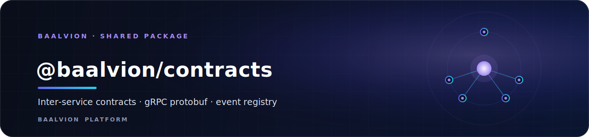
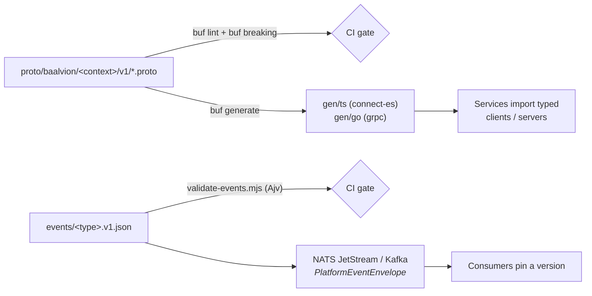

<div align="center">



<br/>
<br/>

**The single source of truth for the integration surface between Baalvion bounded contexts — gRPC protobuf APIs and a JSON Schema event registry, governed by `buf` lint, breaking-change detection, and CI schema validation.**

<p>
  
  
  
  
  
</p>

<sub><a href="#overview">Overview</a> · <a href="#architecture">Architecture</a> · <a href="#governance-ci-gates">Governance</a> · <a href="#commands">Commands</a> · <a href="#versioning">Versioning</a> · <a href="#bounded-contexts">Bounded contexts</a> · <a href="#project-structure">Structure</a> · <a href="#ownership">Ownership</a></sub>

</div>

---

## Overview

`@baalvion/contracts` is the **single source of truth** for the integration
surface between bounded contexts. A service depends on these contracts, never on
another service's internals. Two kinds of contract live here:

| Kind | Path | Transport | Style |
|------|------|-----------|-------|
| **Synchronous** gRPC APIs | `proto/baalvion/<context>/v<n>/*.proto` | gRPC over mTLS | request/response |
| **Asynchronous** domain events | `events/<type>.v<n>.json` | NATS JetStream / Kafka | publish/subscribe |

- **Package:** `@baalvion/contracts` `1.0.0` (private workspace package)
- **Toolchain (dev):** `@bufbuild/buf` `^1.47.2`, `ajv` `^8.17.1`
- **No runtime code** — this package is contracts + governance scripts; generated
  clients/servers are produced into `gen/` by `buf generate`

## Architecture



Every event rides a common `PlatformEventEnvelope` (`events/_envelope.json`):
required `id` (uuid), `type`, `payload`, `timestamp` (date-time), and `traceId`;
optional `orgId` / `userId`. The `payload` is constrained per event type.

## Governance (CI gates)

- **`buf lint`** — proto style (STANDARD ruleset, `Service` suffix, enum
  zero-value `_UNSPECIFIED`). Configured in `buf.yaml`.
- **`buf breaking --against main`** — a breaking proto change is a **blocking**
  review gate (FILE-level breaking rules). Backward-compatible evolution only:
  add fields, never renumber/remove.
- **`node scripts/validate-events.mjs`** — compiles every event schema with Ajv
  (catching malformed schemas) and validates a golden sample for each. Drift
  between schema and producer fails CI.
- **Codegen** — `buf generate` emits typed TS (connect-es) + Go stubs into `gen/`.
  No service hand-writes a wire client.

## Commands

```bash
pnpm --filter @baalvion/contracts lint              # buf lint
pnpm --filter @baalvion/contracts breaking          # buf breaking --against '.git#branch=main'
pnpm --filter @baalvion/contracts generate          # buf generate → gen/ts + gen/go
pnpm --filter @baalvion/contracts validate:events   # node scripts/validate-events.mjs
```

Codegen targets (`buf.gen.yaml`): connect-es + bufbuild/es into `gen/ts`,
protocolbuffers/go + grpc/go into `gen/go` (`paths=source_relative`). gRPC over
mTLS is the synchronous transport (ADR-0005).

## Versioning

- Proto packages are versioned in the path (`v1`, `v2`). A new major version is a
  **new package**, served alongside the old until consumers migrate.
- Events are versioned in the filename (`.v1.json`). Producers may emit multiple
  versions during a migration window; consumers pin the version they understand.
- **Compatibility rule:** producers MAY add optional fields within a version; any
  required-field or semantic change is a new version.

## Bounded contexts

gRPC services defined here:

| Context | Package | Service | Purpose |
|---------|---------|---------|---------|
| `identity` | `baalvion.identity.v1` | `IdentityService` | The platform trust anchor — token verify, service tokens, RBAC principals |
| `billing` | `baalvion.billing.v1` | `BillingService` | Shared billing platform — subscription, usage ingestion, quota |
| `proxy` | `baalvion.proxy.v1` | `OrchestrationService` | Proxy division orchestration — allocate, outcome, provider state |

Add a context by creating `proto/baalvion/<context>/v1/` plus its event schemas,
then wiring an entry in the service catalog (`catalog/`).

## Project Structure

| Path | Purpose |
|------|---------|
| `proto/baalvion/<context>/v<n>/*.proto` | gRPC service + message definitions per bounded context |
| `events/_envelope.json` | The common `PlatformEventEnvelope` schema |
| `events/<type>.v<n>.json` | Per-event JSON Schema (e.g. `org.created.v1.json`, `billing.invoice.generated.v1.json`, `proxy.session.started.v1.json`) |
| `scripts/validate-events.mjs` | Ajv schema-registry validator (CI gate) |
| `buf.yaml` / `buf.gen.yaml` | buf lint/breaking config and codegen plugin targets |

The event registry currently spans identity/tenant lifecycle, billing/commission,
proxy sessions and provider health, abuse actions, sanctions screening, agent
certification/payout, and report scheduling.

## Ownership

Each `proto/baalvion/<context>` directory is owned by that context's team (see the
root `CODEOWNERS`). A PR touching another context's contract requires that team's
review — this is how bounded-context boundaries are enforced in code review.

---

<div align="center">
<sub>Part of the <a href="../../../README.md">Baalvion Platform</a> · centralized identity · domain-driven monorepo</sub>
</div>
