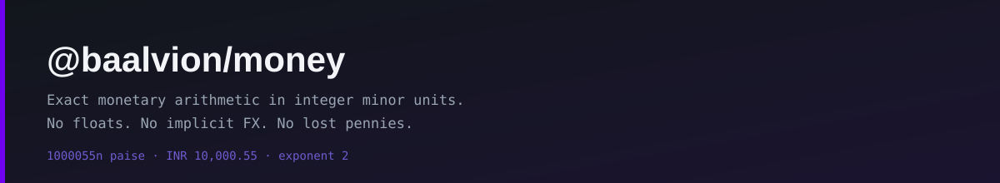

<div align="center">



<br/>
<br/>

**Exact monetary arithmetic in integer minor units — the platform's only sanctioned money representation. No floats, no implicit FX, no lost pennies.**

<p>
  
  
  
</p>

<sub><a href="#why">Why</a> · <a href="#the-rules">The rules</a> · <a href="#usage">Usage</a> · <a href="#api">API</a> · <a href="#psp-boundaries">PSP boundaries</a> · <a href="#migrating-a-service">Migrating</a></sub>

</div>

---

## Why

A monetary value stored as `DECIMAL(14,2)` comes back from the `pg` driver as a **string**,
precisely so no precision is lost. The moment it becomes a JS `number` it is an IEEE-754
double, and decimal amounts stop being exact:

```js
10000.55 * 100          // 1000054.9999999999
Math.round(1.005 * 100) // 100  — not 101; a lost paisa
0.1 + 0.2               // 0.30000000000000004
```

Summing forty invoice lines of `249.99` gives `9999.599999999993`. A 17.5% discount on
`10000.55` leaves `8250.449999999999`. Neither is catastrophic on its own — but you cannot
*compare* those values, so comparison code grows tolerances:

```js
if (Math.abs(paid - total) > 0.01)   // accepts a real 1-paisa short-payment, every capture
if (amount > captureAmount + 1e-9)   // lets a refund exceed the capture by a sliver
```

A tolerance is a hole. With integers the question has a yes/no answer and the tolerances go away.

**`$10,000` is not the problem.** `Number.MAX_SAFE_INTEGER` paise is roughly ₹90.07 trillion,
so magnitude is never the issue at our scale. The issue is *penny drift in comparison and
allocation*, which surfaces as reconciliation mismatches — the failure mode that is expensive
precisely because it is quiet.

## The rules

1. **Money is an integer count of minor units.** Paise for INR, cents for USD, whole yen for JPY.
2. **The exponent comes from the currency**, never from a hardcoded `* 100`. `JPY` has none;
   `KWD` has three. A hardcoded 100 is a 100x overcharge on the first zero-decimal currency added.
3. **Floats are rejected, not rounded.** `Money.fromDecimal` takes a string. A number throws.
4. **No implicit FX.** Adding INR to USD throws; conversion goes through `fx-service`.
5. **Rounding is always explicit.** Any operation that could lose a fraction of a minor unit
   demands a `RoundingMode`, because that choice is a business decision.
6. **Splits are penny-perfect.** `allocate` distributes the remainder so the parts always sum
   back to exactly the original.

## Usage

```js
const { Money, toRazorpayAmount, checkCapturedAmount } = require('@baalvion/money');

// Straight out of a DECIMAL column — exact, because the driver hands back a string.
const total = Money.fromDatabaseValue(order.totalAmount, order.currencyCode);

total.toDecimalString();   // '10000.55'
total.minor;               // 1000055n
total.format();            // 'INR 10,00,000.55' (lakh/crore grouping for INR)

// Charge
toRazorpayAmount(total);   // 1000055  — paise, integer

// Verify what actually came back, exactly
const match = checkCapturedAmount(total, webhook.amount, webhook.currency);
if (!match.ok) reject(match.difference.toDecimalString()); // e.g. '-0.01'

// Split a payout without losing a paisa
total.allocate([70, 20, 10]).map((p) => p.toDecimalString());
// ['7000.39', '2000.11', '1000.05']  — sums back to 10000.55 exactly
```

## API

| Construction | |
|---|---|
| `Money.of(minorUnits, currency)` | From an integer count of minor units. Rejects a float. |
| `Money.fromDecimal(str, currency, opts?)` | From a major-unit **string**. Extra precision throws unless a mode is given. |
| `Money.fromDatabaseValue(value, currency, mode?)` | For DECIMAL columns: exact for strings, lossy fallback for numbers. |
| `Money.fromLegacyFloat(n, currency, mode?)` | Migration shim — deliberately greppable. |
| `Money.zero(currency)` · `Money.fromJSON(json)` | |

| Arithmetic | |
|---|---|
| `add` · `subtract` · `negate` · `abs` | Same-currency only. |
| `multiply(whole)` | Exact scaling — quantity × unit price. |
| `multiplyRatio(num, den, mode)` | Scale by a rational with explicit rounding. |
| `percentage('17.5', mode)` | Rate parsed exactly, never as `17.499999999999998`. |
| `allocate(weights)` · `split(n)` | Penny-perfect distribution, correct for negatives. |

| Comparison & output | |
|---|---|
| `equals` · `compare` · `greaterThan` · `lessThan` · `isZero` · `isPositive` · `isNegative` | Exact; no epsilon. |
| `toDecimalString()` | `'10000.55'` — safe to write back to a DECIMAL column. |
| `toSafeNumber()` | Minor units as a number; throws past `MAX_SAFE_INTEGER`. |
| `format({ grouping, symbol })` | `'western'` or `'indian'` (lakh/crore). Defaults to Indian for INR. |
| `toJSON()` | `{ amount: '1000055', currency: 'INR', exponent: 2 }` — amount stays a string on the wire. |

## PSP boundaries

Each gateway has its own idea of an "amount", and getting it wrong is silent — both sides
consider the wrong number valid. These adapters are the only place the conversion may happen.

| Adapter | Gateway expects |
|---|---|
| `toRazorpayAmount` | Smallest unit, integer (paise). |
| `toStripeAmount` | Smallest unit, integer. Enforces Stripe's multiple-of-ten rule for three-decimal currencies. |
| `toPayUAmount` / `toCashfreeAmount` | Major units as the exact signed string. |
| `checkCapturedAmount(expected, seenMinor, seenCurrency)` | Exact capture verification; returns the signed `difference`. |

## Migrating a service

1. Add `"@baalvion/money": "workspace:*"` and `pnpm install --filter <service>`.
2. Replace `Math.round(Number(x) * 100)` with `Money.fromDatabaseValue(x, currency)` at the
   PSP and ledger boundaries.
3. Delete every epsilon (`> 0.01`, `+ 1e-9`) and compare `Money` objects directly.
4. Stop passing `Number(row.decimalColumn)` between functions — pass the column value or a `Money`.
5. `grep fromLegacyFloat` afterwards: each hit is a call site whose source still needs fixing.

`order-service` is the reference migration.
