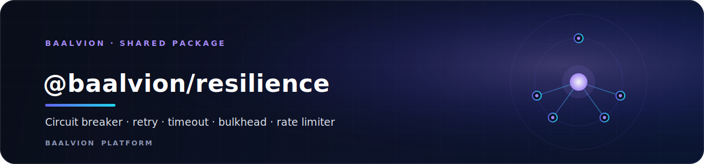
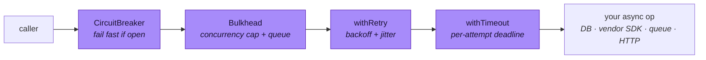

<div align="center">



<br/>
<br/>

**Transport-agnostic resilience primitives — wrap any async operation so a failing or slow dependency degrades gracefully instead of cascading.**

<p>
  
  
  
  
  
</p>

<sub><a href="#overview">Overview</a> · <a href="#primitives">Primitives</a> · <a href="#getting-started">Getting started</a> · <a href="#distributed-rate-limiting">Rate limiting</a> · <a href="#configuration">Configuration</a> · <a href="#error--http-mapping">Errors</a> · <a href="#api">API</a> · <a href="#testing">Testing</a></sub>

</div>

---

## Overview

`@baalvion/resilience` is the platform's reusable core for **fault tolerance**. It wraps
**any** async operation — a DB query, a vendor SDK call, a queue publish, an outbound HTTP
request — with circuit breaking, retry/backoff, timeouts, bulkheads, and rate limiting, so a
failing or slow dependency degrades gracefully instead of cascading across the service fleet.

It is a shared library inside the Baalvion **pnpm + Turborepo monorepo** (`Backend/packages/resilience`).
Being a package, it has no port or domain of its own — it is consumed by services across every
bounded context.

- **Package:** `@baalvion/resilience` `v1.0.0` (workspace, `private`)
- **Module format:** plain **CommonJS** (`require`-able from the JS service fleet), with TypeScript declarations
- **Runtime dependencies:** **none** — Redis is reached through an injected client, not a hard dependency
- **Entry point:** `src/index.js` (types: `src/index.d.ts`)

> The platform's `@baalvion/sdk` already ships an HTTP-specific breaker for its
> service-to-service client. This package is the reusable core for everything that is
> **not** HTTP (and for building your own resilient clients).

## Primitives

| Export | What it does |
| --- | --- |
| `CircuitBreaker` | closed → open → half-open; fail fast when a dependency is down |
| `withRetry` | exponential backoff + full jitter; pluggable `retryable` predicate |
| `withTimeout` | hard per-attempt deadline; aborts the op via `AbortSignal` |
| `Bulkhead` | concurrency cap + bounded queue; sheds load with `BulkheadFullError` |
| `RateLimiter` | distributed (Redis) or in-memory fixed-window limiter + Express middleware |
| `createResilient` | composes all of the above into one wrapped callable |

## Architecture

`createResilient` layers the primitives in a fixed order around a single async operation.
The outermost layer is checked first, so a tripped breaker or a full bulkhead fails fast
before the (potentially slow) work is even attempted.



Each layer is injectable on its own, so you can compose just the pieces you need or build
a custom resilient client.

## Getting Started

`@baalvion/resilience` is a workspace package; depend on it from any service in the monorepo
and install from the root.

```bash
# From the monorepo root
pnpm install
```

```js
const { createResilient } = require('@baalvion/resilience');

// Wrap a flaky vendor call once; call it everywhere.
const charge = createResilient((payload) => razorpay.charge(payload), {
  timeoutMs: 4000,
  retry: { retries: 3, retryable: (e) => e.statusCode >= 500 || e.code === 'ECONNRESET' },
  circuitBreaker: { failureThreshold: 5, resetTimeoutMs: 15_000 },
  bulkhead: { maxConcurrent: 20, maxQueue: 100 },
});

const receipt = await charge({ amount: 1917_50, currency: 'INR' });
```

Each primitive is also usable on its own:

```js
const { CircuitBreaker, withRetry, withTimeout, Bulkhead } = require('@baalvion/resilience');

const breaker = new CircuitBreaker({ name: 'opensanctions', failureThreshold: 5 });
const screen = () => breaker.exec(() => sanctions.screen(name));
```

## Distributed rate limiting

`@baalvion/security`'s limiter is in-memory and per-process. Across many replicas you need a
**shared** counter so the limit is global:

```js
const Redis = require('ioredis');
const { RateLimiter } = require('@baalvion/resilience');

const limiter = new RateLimiter({ windowMs: 60_000, max: 1000, redis: new Redis(process.env.REDIS_URL) });
app.use('/v1', limiter.middleware()); // keys by org → user → ip; sets RateLimit-* headers
```

The counter is incremented with an atomic Lua script (`INCR` + `PEXPIRE`), so there is no
read-modify-write race between replicas. The middleware **fails open**: a Redis outage must
not take the API down.

## Configuration

All resilience behaviour is configured in code per call site — there are no environment
variables. Common options:

| Concern | Option | Notes |
| --- | --- | --- |
| Timeout | `timeoutMs` | hard per-attempt deadline; aborts via `AbortSignal` |
| Retry | `retry.retries`, `retry.retryable` | exponential backoff + full jitter; pluggable predicate |
| Circuit breaker | `circuitBreaker.failureThreshold`, `circuitBreaker.resetTimeoutMs` | trip + half-open recovery |
| Bulkhead | `bulkhead.maxConcurrent`, `bulkhead.maxQueue` | concurrency cap + bounded queue |
| Rate limiter | `windowMs`, `max`, `redis` | fixed window; `redis` client → distributed, omit → in-memory |

The only external input is an **injected** Redis client (e.g. `ioredis`) for distributed rate
limiting. `now`, `sleep`, and `random` are also injectable for deterministic testing.

## Error → HTTP mapping

Every thrown error carries `code` + `statusCode` so the central error boundary
(`@baalvion/errors`) maps it without special-casing:

| Error | `code` | HTTP |
| --- | --- | --- |
| `CircuitOpenError` | `CIRCUIT_OPEN` | 503 |
| `TimeoutError` | `TIMEOUT` | 504 |
| `BulkheadFullError` | `BULKHEAD_FULL` | 429 |
| rate-limited (middleware) | `RATE_LIMITED` | 429 |

## API

Exported from `@baalvion/resilience` (`src/index.js`):

| Export | Kind | Purpose |
| --- | --- | --- |
| `createResilient` | factory | composes breaker + bulkhead + retry + timeout into one wrapped callable |
| `CircuitBreaker` | class | closed → open → half-open breaker; `.exec(fn)` |
| `CircuitOpenError` | error | thrown when the breaker is open (`CIRCUIT_OPEN`, 503) |
| `CIRCUIT_STATES` | constant | the breaker state enum |
| `withRetry` | function | retry with exponential backoff + full jitter |
| `AbortError` | error | propagated abort signal |
| `withTimeout` | function | hard per-attempt deadline via `AbortSignal` |
| `TimeoutError` | error | thrown on deadline (`TIMEOUT`, 504) |
| `Bulkhead` | class | concurrency cap + bounded queue |
| `BulkheadFullError` | error | thrown when the queue is full (`BULKHEAD_FULL`, 429) |
| `RateLimiter` | class | fixed-window limiter + Express `.middleware()` |
| `MemoryStore` | class | per-process counter store (default) |
| `RedisStore` | class | distributed counter store (atomic Lua) |
| `FIXED_WINDOW_LUA` | constant | the atomic `INCR` + `PEXPIRE` Lua script |

## Project Structure

```
resilience/
├── src/
│   ├── index.js          # public surface (re-exports every primitive)
│   ├── index.d.ts        # TypeScript declarations
│   ├── circuit-breaker.js # CircuitBreaker, CircuitOpenError, CIRCUIT_STATES
│   ├── retry.js          # withRetry, AbortError
│   ├── timeout.js        # withTimeout, TimeoutError
│   ├── bulkhead.js       # Bulkhead, BulkheadFullError
│   ├── rate-limit.js     # RateLimiter, MemoryStore, RedisStore, FIXED_WINDOW_LUA
│   └── resilient.js      # createResilient composition
└── package.json
```

## Testing

```sh
node --test        # 28 unit tests, deterministic (injectable clock/sleep/random)
pnpm run type-check # tsc --noEmit
```

Clocks (`now`), `sleep`, and `random` are all injectable, so the suite runs with zero real
delay and no flakiness.

## Security

- **Fails open by design** where availability matters most: the rate-limit middleware does
  not take the API down if Redis is unreachable.
- **No read-modify-write races** across replicas — the distributed counter uses an atomic Lua
  script (`INCR` + `PEXPIRE`).
- **Zero runtime dependencies** — no transitive supply-chain surface; the Redis client is
  injected by the caller.

---

<div align="center">
<sub>Part of the <a href="https://github.com/baalvionservice/Baalvion-Project-Infra">Baalvion Platform</a> · centralized identity · domain-driven monorepo</sub>
</div>
