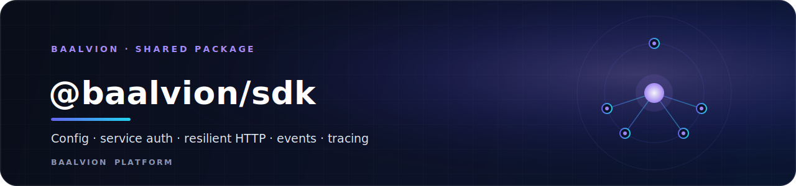
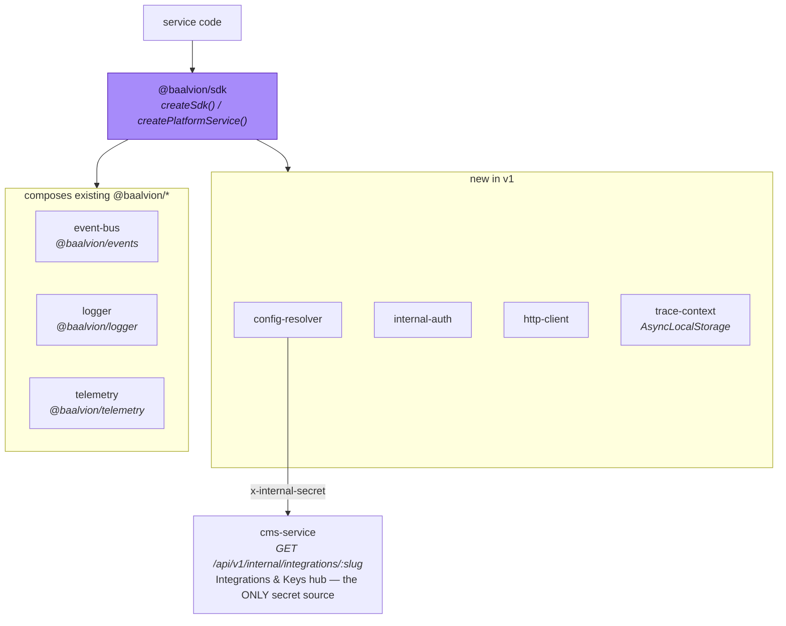

<div align="center">



<br/>
<br/>

**The single, standard way every Baalvion service interacts with the platform — config, service auth, resilient HTTP, events, logging, and tracing wired correct-by-construction behind one factory.**

<p>
  
  
  
  
  
</p>

<sub><a href="#overview">Overview</a> · <a href="#why-this-package-exists">Why</a> · <a href="#architecture">Architecture</a> · <a href="#usage">Usage</a> · <a href="#public-api">API</a> · <a href="#configuration">Configuration</a> · <a href="#governance">Governance</a> · <a href="#build">Build</a></sub>

</div>

---

## Overview

`@baalvion/sdk` is the **single, standard way** every Baalvion service interacts with the
platform. One import, one factory, six cross-cutting concerns wired correct-by-construction:

| # | Concern | Module | Status in v1 |
|---|---------|--------|--------------|
| 1 | Config & secret resolution (CMS hub) | `config-resolver` | **NEW** — the gap |
| 2 | Service-to-service auth + signing | `internal-auth` | **NEW** — standardizes ad-hoc `x-internal-secret` |
| 3 | Resilient inter-service HTTP | `http-client` | **NEW** — retry / timeout / circuit breaker |
| 4 | Event bus (one canonical schema) | `event-bus` | facade over `@baalvion/events` |
| 5 | Structured logging | `logger` | facade over `@baalvion/logger` (pino + redaction) |
| 6 | End-to-end trace context | `trace-context` | **NEW** glue over `@baalvion/telemetry` |

It is a shared library inside the Baalvion **pnpm + Turborepo monorepo**
(`Backend/packages/sdk`). Being a package it has no port or domain of its own — services
depend on it; it is the layer through which they reach identity, the CMS hub, the event bus,
and each other.

- **Package:** `@baalvion/sdk` `v1.0.0` (workspace, `private`)
- **Build output:** `dist` — CJS (`dist/index.js`), ESM (`dist/index.mjs`), and `dist/index.d.ts` (via **tsup**)
- **Runtime dependency:** `@baalvion/types` only — every other `@baalvion/*` is an **optional peer**
- **Optional peers:** `@baalvion/events`, `@baalvion/logger`, `@baalvion/telemetry`, `@baalvion/service-kit`, `@baalvion/cache`, `express` (`^4 || ^5`)

> **Design rule:** the SDK **composes** the existing `@baalvion/*` packages; it does not
> reinvent them. Services depend **only** on `@baalvion/sdk` — never on the pieces directly.
> If something conflicts, the SDK wins.

## Why this package exists

The foundation already existed — `@baalvion/service-kit`, `config`, `events`, `logger`,
`telemetry`, `rbac` — but was **adopted by ~0 services**. Every service rolls its own
`config/appConfig.js`, its own logging, its own internal-auth. *That* is the fragmentation.
The SDK exists to make adoption a one-liner and to fill the three concerns that genuinely had
no home: **CMS-hub config resolution, service-to-service auth, and a resilient HTTP client.**

## Architecture



One `traceId` + `tenantId` is bound per request (trace-context) and flows automatically into
**logs**, **outbound HTTP headers**, and **emitted events**.

### Canonical event envelope

```ts
interface SdkEvent<T> {
  eventType: string;     // → PlatformEvent.type
  tenantId:  string|null;// → PlatformEvent.orgId
  timestamp: string;
  traceId:   string;
  payload:   T;
}
```

Maps onto `@baalvion/types` `PlatformEvent`, so the SDK interoperates with the existing bus.
New event types should be added to the `EventType` union in `@baalvion/types` for first-class
typing.

## Usage

Example wiring in a service (payments-service):

```ts
import { createPlatformService } from '@baalvion/sdk';

const svc = await createPlatformService({
  service: 'payments-service',
  version: '1.0.0',
  port: 3014,
  jwksUrl: process.env.JWKS_URL,                    // central identity (RS256)
  cms: {
    baseUrl: process.env.CMS_BASE_URL!,             // http://cms-service:3018/api/v1
    internalSecret: process.env.INTERNAL_SERVICE_SECRET!,
  },
  internalAuth: { secret: process.env.INTERNAL_SERVICE_SECRET!, scheme: 'hmac' },
  eventBus: { transport: 'nats', nats: { servers: process.env.NATS_URL } },
  http: { defaultTimeoutMs: 8000, defaultRetries: 2 },
});

const { app, sdk } = svc;

// Charge using the tenant's OWN keys from the CMS hub — no hardcoded env per site.
app.post('/v1/charge', async (req, res) => {
  const tenant = sdk.forTenant(req.trace.tenantId);          // tenant-scoped view

  const pay = await tenant.getPaymentProvider();             // razorpay | stripe | payu
  if (!pay) return res.status(409).json({ error: 'no payment provider configured' });

  // pay.secrets.keySecret / pay.config.mode resolved live from the console.
  const charge = await chargeWithProvider(pay, req.body);

  // Signed + traced internal call to the ledger.
  await sdk.http.post('http://ledger-service:3014/v1/entries', charge.ledgerEntry, {
    internal: true,
  });

  // One canonical event → analytics + notifications subscribe to it.
  await tenant.events.publish('billing.payment.succeeded', {
    chargeId: charge.id, amount: charge.amount, provider: pay.provider,
  });

  sdk.logger.info({ chargeId: charge.id }, 'charge captured');  // auto traceId+tenant
  res.json({ ok: true, chargeId: charge.id });
});

await svc.listen();
```

Everything above is **traceable end-to-end**, uses the **CMS hub as the only secret source**,
emits **one event schema**, and contains **zero duplicated integration logic**.

## Public API

Exported from `@baalvion/sdk` (`src/index.ts`):

| Export | Kind | Purpose |
| --- | --- | --- |
| `createSdk(config)` | factory | wires the whole SDK from one config → `Promise<PlatformSdk>` |
| `createPlatformService(config)` | factory | golden path (service-kit + SDK) → `Promise<PlatformService>` |
| `createConfigResolver` | factory | CMS-hub config/secret resolver (+ cache) |
| `createInternalAuth` | factory | sign/verify service-to-service requests |
| `createHttpClient` | factory | resilient client (retry/timeout/circuit-breaker, auto trace + internal headers) |
| `CircuitOpenError` | error | thrown by the HTTP client when its breaker is open |
| `createSdkEventBus` | factory | canonical-envelope event bus over `@baalvion/events` |
| `createBaseLogger`, `wrapLogger` | factories | trace-stamped logging over `@baalvion/logger` |
| `createTraceProvider` | factory | AsyncLocalStorage trace context + middleware |
| `TRACE_HEADER`, `TENANT_HEADER` | constants | propagated correlation headers |
| `SECRET_HEADER`, `SERVICE_HEADER`, `TS_HEADER`, `SIG_HEADER` | constants | internal-auth headers |
| `createMemoryCache` | factory | in-process cache for the config resolver |
| `PlatformServiceConfig`, `PlatformService`, `RawLogger`, plus `./types` | types | full interface surface |

The handle returned by `createSdk()` exposes: `sdk.config`, `sdk.internalAuth`, `sdk.http`,
`sdk.events`, `sdk.logger`, `sdk.trace`, `sdk.forTenant(slug)`, and `sdk.close()`. See
`src/types.ts` for the complete interface surface.

## Configuration

`createSdk` / `createPlatformService` are configured by the object passed to them; values
typically come from the service's own environment:

| Field | Purpose |
| --- | --- |
| `service`, `version`, `port` | service identity + listen port (service path) |
| `jwksUrl` | central identity JWKS for RS256 verification |
| `cms.baseUrl`, `cms.internalSecret`, `cms.cacheTtlSeconds` | the CMS Integrations & Keys hub (the only secret source) + cache TTL |
| `internalAuth.secret`, `internalAuth.scheme` | service-to-service signing (`hmac`) |
| `eventBus.transport`, `eventBus.nats`, `eventBus.kafka` | event-bus transport (`nats` / `kafka`); omit → no-op |
| `http.defaultTimeoutMs`, `http.defaultRetries`, `http.circuitBreaker` | resilient HTTP-client defaults |
| `logLevel`, `cache` | log level; injectable cache for the config resolver |

## Project Structure

```
sdk/
├── src/
│   ├── index.ts            # public surface (re-exports)
│   ├── create-sdk.ts       # createSdk() — wires every module to one trace + logger
│   ├── types.ts            # full interface surface (SdkConfig, PlatformSdk, …)
│   ├── config-resolver/    # CMS-hub config & secret resolution
│   ├── internal-auth/      # service-to-service signing/verification
│   ├── http-client/        # resilient HTTP (retry/timeout/circuit breaker)
│   ├── event-bus/          # canonical envelope over @baalvion/events
│   ├── logger/             # trace-stamped logging over @baalvion/logger
│   ├── trace-context/      # AsyncLocalStorage trace provider + middleware
│   ├── service/            # createPlatformService golden path
│   ├── memory-cache.ts     # in-process cache for the resolver
│   ├── load-optional.ts    # lazy/optional peer loading
│   └── id.ts               # id generation
├── docs/
└── package.json
```

## Adoption (Step 2 — not done in v1)

Each service migrates by: install `@baalvion/sdk`, replace `appConfig.js`/manual logging/manual
internal calls with the SDK, route all secret reads through
`sdk.forTenant(slug).getSecret(...)`, emit via `sdk.events`. No service may bypass the SDK once
migrated.

## Governance

Known items to resolve during rollout:

- **Tenant identity:** CMS keys by website **slug**; events/`orgId` use **uuid**. The platform
  must standardize one tenant identifier (slug↔orgId map) — the SDK exposes `tenantId` as the
  seam.
- **EventType union** is closed in `@baalvion/types`; extend it as new domains emit.
- **Cache invalidation:** wire an `integration.updated` event from cms-service to
  `sdk.config.invalidate(slug)` so key changes propagate instantly.

## Security

- **CMS hub is the only secret source.** Per-tenant provider keys are resolved live from the
  Integrations & Keys hub — no hardcoded per-site env, no secrets in service code.
- **Service-to-service calls are signed** (`internal-auth`, HMAC scheme) and verifiable, with
  RS256 identity verification via the central JWKS.
- **Correlation is automatic and end-to-end** — one `traceId` + `tenantId` flows into logs,
  outbound headers, and events, so cross-service requests stay auditable.

## Build

```bash
pnpm --filter @baalvion/sdk build      # tsup → dist (cjs + esm + d.ts)
pnpm --filter @baalvion/sdk type-check # tsc --noEmit
pnpm --filter @baalvion/sdk dev        # tsup --watch
pnpm --filter @baalvion/sdk clean      # rimraf dist
```

---

<div align="center">
<sub>Part of the <a href="https://github.com/baalvionservice/Baalvion-Project-Infra">Baalvion Platform</a> · centralized identity · domain-driven monorepo</sub>
</div>
