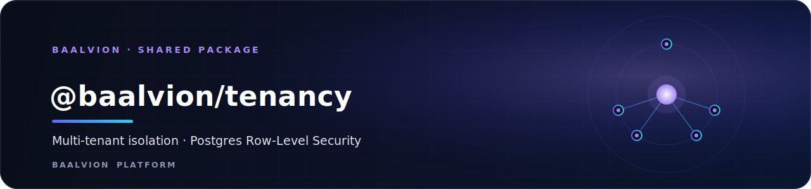
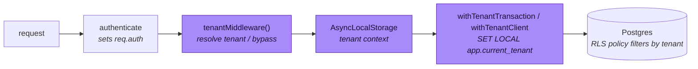

<div align="center">



<br/>
<br/>

**Platform-wide multi-tenant isolation via Postgres Row-Level Security — every service enforces `tenant_id` isolation at the database, not ad-hoc in app code.**

<p>
  
  
  
  
</p>

<sub><a href="#overview">Overview</a> · <a href="#the-1-rls-footgun">RLS footgun</a> · <a href="#how-it-works">How it works</a> · <a href="#getting-started">Getting started</a> · <a href="#api">API</a> · <a href="#rollout-playbook">Rollout</a> · <a href="#security">Security</a></sub>

</div>

---

## Overview

`@baalvion/tenancy` gives the platform **one consistent mechanism** so **every** service
enforces `tenant_id` isolation **at the database**, not ad-hoc in app code. It is built on
Postgres **Row-Level Security (RLS)**: a policy on each tenant table filters every row by the
active tenant, set per-request.

It is a shared library inside the Baalvion **pnpm + Turborepo monorepo**
(`Backend/packages/tenancy`). Being a package it has no port or domain of its own — it is the
isolation primitive consumed by every service that owns tenant-scoped data. Each domain still
owns its own isolated Postgres schema; this package enforces tenant isolation *within* those
schemas.

- **Package:** `@baalvion/tenancy` `v1.0.0` (workspace, `private`)
- **Module format:** plain **CommonJS** (`require`-able from the service fleet)
- **Entry point:** `index.js`, which re-exports `roles`, `sql`, `context`, `middleware`, `sequelize`, and `pg`
- **Mechanism, not policy:** flipping RLS on is a per-service migration (see the rollout playbook)

## The #1 RLS footgun — read this first

> RLS is **silently ignored** for:
> - **Superusers** — *always*, regardless of `FORCE`.
> - The **table owner** — unless `FORCE ROW LEVEL SECURITY` is set (this package emits it).

The default Docker Postgres makes `POSTGRES_USER` a **superuser**, so if your service connects
as that role, **RLS does nothing**. For real enforcement:

```sql
-- one-time, per database
CREATE ROLE baalvion_app LOGIN PASSWORD '...' NOSUPERUSER NOBYPASSRLS;
GRANT USAGE ON SCHEMA <schema> TO baalvion_app;
GRANT SELECT, INSERT, UPDATE, DELETE ON ALL TABLES IN SCHEMA <schema> TO baalvion_app;
ALTER DEFAULT PRIVILEGES IN SCHEMA <schema> GRANT SELECT,INSERT,UPDATE,DELETE ON TABLES TO baalvion_app;
```

Point `DB_USER` at `baalvion_app`. Run **migrations** as the owner/superuser (which bypasses
RLS, so migrations aren't blocked).

## How it works

Two session GUCs drive a fail-closed policy:

- `app.current_tenant` — the active tenant id (text)
- `app.tenant_bypass` — `'on'` to read across tenants (super_admin / system jobs)

No tenant + no bypass ⇒ **zero rows visible, inserts rejected**.



## Getting Started

`@baalvion/tenancy` is a workspace package; depend on it from any service and install from the
monorepo root. Adopt it per service in three steps:

**1. Migration — enable RLS on each tenant table:**

```js
const { enableRlsSql } = require('@baalvion/tenancy');
await sequelize.query(enableRlsSql('rbac', 'role_assignments', { tenantColumn: 'tenant_id' }));
```

**2. App — wire the middleware after auth:**

```js
const { tenantMiddleware } = require('@baalvion/tenancy');
app.use(authenticate);          // sets req.auth
app.use(tenantMiddleware());    // tenant from X-Tenant-Id / req.auth.orgId; super_admin → bypass
```

**3. Run DB work inside a tenant transaction** (GUCs are `SET LOCAL`, so they must be in a
transaction — pooled connections are shared):

```js
const { withTenantTransaction } = require('@baalvion/tenancy');
// Sequelize
await withTenantTransaction(sequelize, async (t) => Order.findAll({ transaction: t }));

// raw pg
const { withTenantClient } = require('@baalvion/tenancy');
await withTenantClient(pool, (client) => client.query('SELECT * FROM orders'));
```

Tenant defaults to the request's AsyncLocalStorage context; override per call:
`withTenantTransaction(sequelize, { tenantId: 'org-9' }, fn)` or `{ bypass: true }`.

## API

| Export | Purpose |
|---|---|
| `enableRlsSql(schema, table, {tenantColumn, policyName})` | migration SQL (ENABLE + FORCE + policy) |
| `disableRlsSql(...)` | rollback SQL |
| `tenantMiddleware({resolve, bypassRoles})` | Express: set per-request tenant context |
| `requireTenant` | guard: 400 if no tenant and no bypass |
| `withTenantTransaction(sequelize, [opts], fn)` | Sequelize tx with tenant GUC set |
| `withTenantClient(pool, [opts], fn)` | raw pg tx with tenant GUC set |
| `setTenantOnTransaction(sequelize, t, ctx)` | set GUC on an existing tx |
| `runWithTenant(ctx, fn)` / `getTenantContext()` | low-level ALS context |
| `SESSION` | `{ tenant:'app.current_tenant', bypass:'app.tenant_bypass' }` |

## Project Structure

```
tenancy/
├── index.js        # public surface (re-exports every module)
├── roles.js        # role / bypass definitions
├── sql.js          # enableRlsSql / disableRlsSql policy builders
├── context.js      # AsyncLocalStorage tenant context (runWithTenant / getTenantContext)
├── middleware.js   # tenantMiddleware / requireTenant
├── sequelize.js    # withTenantTransaction / setTenantOnTransaction
├── pg.js           # withTenantClient (raw pg)
├── test.smoke.js   # smoke test
├── tests/          # *.test.mjs unit tests
└── package.json
```

## Rollout playbook

Incremental, per bounded context — each requires that context's owner review:

1. Create the `baalvion_app` non-superuser role + grants (above); switch the service's `DB_USER`.
2. Add a migration calling `enableRlsSql(...)` for every table with a tenant column.
3. Add `tenantMiddleware()` after auth; wrap DB access in `withTenantTransaction` / `withTenantClient`.
4. Verify: a tenant-A token cannot read tenant-B rows; super_admin (bypass) can; no context ⇒ empty.
5. Repeat per service. Cross-context changes require that context's review (CODEOWNERS).

> This package is the **mechanism**; flipping it on is a per-service migration. Verified live
> with a non-superuser role (see the package's RLS proof).

## Testing

```sh
pnpm test          # node --test test.smoke.js tests/*.test.mjs
```

## Security

- **Fail-closed by default:** no tenant context and no bypass ⇒ zero rows visible, inserts
  rejected — a missing context never silently leaks cross-tenant data.
- **Enforced at the database**, not in app code, so a forgotten `WHERE tenant_id = ?` cannot
  bypass isolation.
- **`FORCE ROW LEVEL SECURITY` is emitted** by the policy builder so the table owner is also
  subject to RLS — but the connecting role **must** be a non-superuser (`baalvion_app`) or RLS
  is silently ignored.
- **Bypass is explicit and scoped** to super_admin / system jobs via `app.tenant_bypass`.

---

<div align="center">
<sub>Part of the <a href="https://github.com/baalvionservice/Baalvion-Project-Infra">Baalvion Platform</a> · centralized identity · domain-driven monorepo</sub>
</div>
