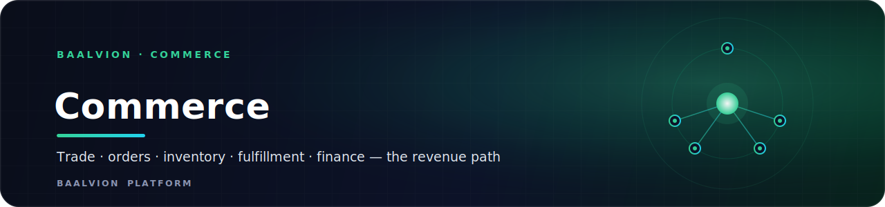
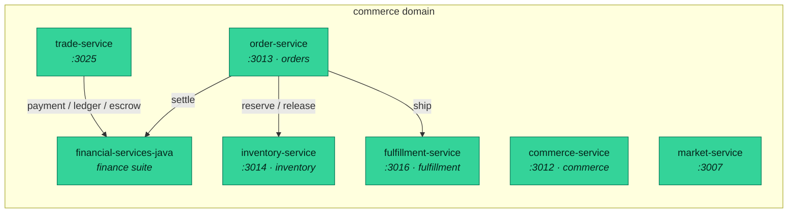

 
 

**The revenue path — trade, orders, inventory, fulfillment, marketplace and finance, each an independently deployable bounded context with its own Postgres schema.**

  
  
  
  

<a href="#overview">Overview</a> · <a href="#services">Services</a> · <a href="#domain-rules">Domain rules</a>

---

## Overview

`commerce` is a **bounded context** in the Baalvion **pnpm + Turborepo monorepo**
(`Backend/services/commerce`). It owns the platform's revenue path: cross-border trade,
the order lifecycle, inventory and fulfillment, the investment/trade marketplaces, and the
finance system of record. Each service is independently deployable, owns its own isolated
Postgres schema, and communicates across contexts via contracts and events — never shared
tables (rule **D1**).

## Services

| Service | Port | Schema | Bounded context |
|---|---|---|---|
| [`trade-service`](trade-service/) | `3025` | — | Global trade execution — marketplace/RFQ, orders, escrow, shipments, customs, compliance, logistics, finance facade (independent git repo) |
| [`order-service`](order-service/) | `3013` | `orders` | Order lifecycle management |
| [`commerce-service`](commerce-service/) | `3012` | `commerce` | Commerce aggregate / checkout |
| [`inventory-service`](inventory-service/) | `3014` | `inventory` | Stock & catalog inventory |
| [`fulfillment-service`](fulfillment-service/) | `3016` | `fulfillment` | Fulfillment & shipping |
| [`market-service`](market-service/) | `3007` | — | Portfolio management, watchlists, trades & alerts |
| [`financial-services-java`](financial-services-java/) | — | per-service | Java finance suite — double-entry ledger, payments, escrow, settlement, FX, invoicing, risk (21 modules) |

## Domain rules

- **One DB per service (D1):** each service owns an isolated Postgres schema; cross-service
  totals come via contracts and events, not shared tables.
- **Centralized identity:** RS256 via `@baalvion/auth-node` — do not hand-roll JWT verification
  or introduce a second issuer.
- **Tenant isolation:** tenant-scoped tables enforce `tenant_id` at the database via
  `@baalvion/tenancy` (Postgres Row-Level Security), not ad-hoc in app code.
- **Finance system of record** is `financial-services-java`; Node services integrate through
  its resource servers and the finance-events webhook — they do not duplicate money state.
- Changes to another bounded context's contract require that context's review (see
  [CODEOWNERS](../../../CODEOWNERS)).

---

Part of the <a href="https://github.com/baalvionservice/Baalvion-Project-Infra">Baalvion Platform</a> · centralized identity · domain-driven monorepo

