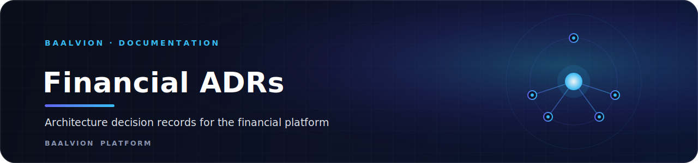

 
 

**Architecture Decision Records for the Baalvion financial platform — each ADR states the context, the decision, and the consequences (including what is deliberately deferred and how to adopt it later).**

  
  
  

---

## Records

| ADR | Decision |
|-----|----------|
| [0001](0001-effectively-once-outbox-inbox.md) | Effectively-once messaging via transactional outbox + inbox dedup + idempotent producers (instead of Kafka EOS transactions) |
| [0002](0002-secure-by-default-resource-server.md) | Secure-by-default RS256 resource server; tenant derived from the JWT, never the header |
| [0003](0003-pluggable-scheme-adapters.md) | Pluggable scheme adapters behind a resilience boundary |
| [0004](0004-settlement-file-transport.md) | Settlement file delivery behind a transport port (SFTP/email/S3) |
| [0005](0005-document-store-and-search.md) | MongoDB (documents) & Elasticsearch (search) — seams now, adopt with infra |
| [0006](0006-secret-management.md) | Secrets via K8s Secrets + External Secrets Operator (Vault optional) |
| [0007](0007-webhook-delivery.md) | HMAC-SHA256-signed outbound webhook delivery with retry/DLQ (in audit-service) |
| [0008](0008-rate-limit-backends.md) | Pluggable rate-limit backend: in-memory Bucket4j (default) + Redis fixed-window |
| [0009](0009-iso8583-scheme-integration.md) | ISO 8583 codec + ASCII link + Interswitch/NIP adapters (config-gated); live connectivity certification-gated |
| [0010](0010-sftp-settlement-transport.md) | Production SFTP settlement-file transport (sshj) with mandatory host-key verification |
| [0011](0011-kyc-document-vault.md) | Encrypted KYC document vault (Postgres + AES-256-GCM); Mongo/S3 as drop-in store |
| [0012](0012-inbound-advice-ingestion.md) | Inbound advice ingestion via scheduled poller + AdviceSource (local/SFTP); Camel evaluated, deferred |

> Operational procedures live in [../runbooks/](../runbooks/).

---

Part of the <a href="../../../../../../README.md">Baalvion Platform</a> · centralized identity · domain-driven monorepo

