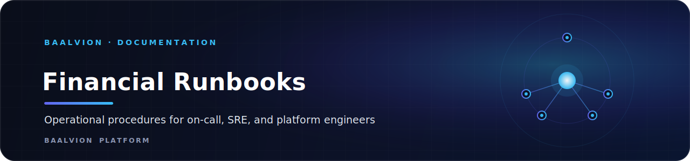

 
 

**Operational procedures for the Baalvion financial platform. Audience: on-call / SRE / platform engineers.**

  
  
  
  

---

Architecture context is in [../adr/](../adr/) and `INTEGRATION_SUMMARY.md`.

## Runbooks

| Runbook | When to use |
|---------|-------------|
| [deployment.md](deployment.md) | Deploying, promoting, and rolling back a release |
| [incident-response.md](incident-response.md) | An alert fired (see `deploy/observability/prometheus-alerts.yml`) |
| [dlq-replay.md](dlq-replay.md) | Dead-letter messages present; replay or discard |
| [backup-restore.md](backup-restore.md) | Backups, point-in-time restore, restore validation |
| [failover.md](failover.md) | DB / Kafka / Redis / region failover |

## Service map (ports / schemas)

account 3016 `accounts` · ledger 3014 `ledger` · payment 3015 `payments` · escrow 3017 `escrow` ·
settlement 3018 `settlement` · reconciliation 3019 `reconciliation` · audit 3020 `audit` ·
reporting 3024 `reporting` · risk 3035 `risk`. All share one PostgreSQL database (`baalvion`),
isolated by schema + RLS, each with its own Flyway history table `flyway_history_<svc>`.

## Health & metrics

- Liveness: `GET /actuator/health/liveness` · Readiness: `GET /actuator/health/readiness`
- Metrics: `GET /actuator/prometheus` (Micrometer) — dashboard `deploy/observability/grafana-financial-overview.json`

---

Part of the <a href="../../../../../../README.md">Baalvion Platform</a> · centralized identity · domain-driven monorepo

