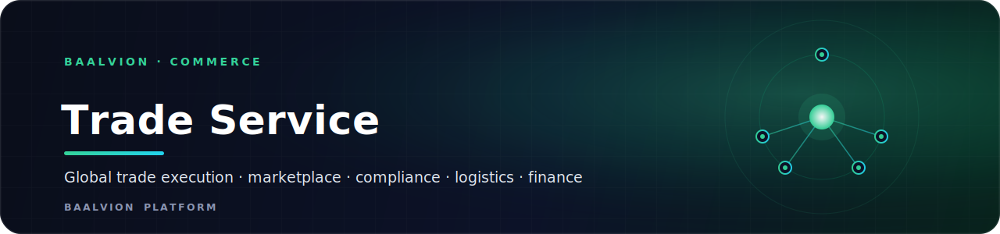
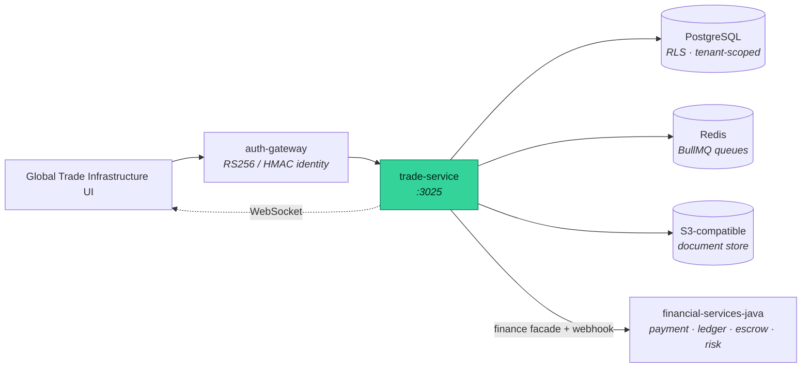

<div align="center">



<br/>
<br/>

**The backend that powers the Baalvion Global Trade OS — marketplace and RFQ, trade execution, compliance screening, logistics and the finance facade, behind one tenant-isolated REST API.**

<p>
  
  
  
  
  
</p>

<sub><a href="#overview">Overview</a> · <a href="#capabilities">Capabilities</a> · <a href="#architecture">Architecture</a> · <a href="#getting-started">Getting started</a> · <a href="#api-surface">API</a> · <a href="#configuration">Configuration</a> · <a href="#structure">Structure</a> · <a href="#security">Security</a></sub>

</div>

---

## Overview

`trade-service` is the backend that powers the **Baalvion Global Trade Operating System** — the
platform for cross-border trade execution, finance, compliance and logistics. It exposes the REST
APIs the Global Trade Infrastructure frontend consumes, and integrates with the
`financial-services-java` suite as the money system of record.

- **Runtime:** Node + **Express 5** + **Sequelize** + **PostgreSQL** (CommonJS)
- **Port:** `3025` (override with `PORT`)
- **Async I/O:** **BullMQ** queues + **ioredis**, a **WebSocket** realtime channel (`ws`), and
  Prometheus metrics via `prom-client` (`/metrics`)
- **Document engine:** secure upload → S3-compatible storage → versioning → virus scan →
  AES-256-GCM envelope encryption
- **Schema:** evolved by 41 SQL migrations (`migrations/`), including RLS policies (migration `020`)

> This service lives in its own git repository (it is nested under `Backend/services/commerce`
> as an independent repo / submodule).

## Capabilities

- **Marketplace & RFQ** — listings, requests for quote, quotations and chat
- **Trade execution** — deals, orders, escrow and document workflows
- **Logistics** — carriers, freight marketplace, shipments, bills of lading, customs entries,
  certificates of origin, insurance and multi-leg **route optimization**
- **Compliance** — sanctions/restricted-goods screening engine, a hybrid rule + AI compliance
  agent, and customs submission gateways
- **Trade finance** — a finance facade to the Java payment / ledger / escrow / settlement / risk
  services, plus wallets, FX and an HMAC-verified finance-events webhook
- **Secure by default** — centralized RS256 identity, gateway-signed island auth, and
  tenant-aware (RLS) data access

## Architecture



## Getting Started

```bash
# install dependencies (workspace package — install from the monorepo root)
pnpm install

# configure environment
cp .env.example .env        # set DB_*, JWT_ACCESS_SECRET, GATEWAY_SIGNING_SECRET, etc.

# apply migrations (run as the owner role; RLS is bypassed for the owner during DDL)
npm run migrate             # npm run migrate:status to inspect applied migrations

# optionally seed reference data
npm run seed                # + seedCompliance / seedFreight / seedHsCodes / seedTradeOps

# run the development server
npm run dev                 # nodemon — boots on :3025  (npm start for production)
```

| Script | Action |
|---|---|
| `npm start` / `npm run dev` | start service / nodemon watch |
| `npm run migrate` · `migrate:status` | apply SQL migrations / show status |
| `npm run seed` | seed reference data |
| `npm test` | Jest (`--forceExit --runInBand`) |
| `npm run bench` | load test (`bench/loadtest.js`) |

> Requires Node.js, PostgreSQL and Redis. Authentication verifies tokens issued by the platform's
> centralized RS256 identity service — **do not introduce a second issuer.**

### Health & observability

| Endpoint | Purpose |
|---|---|
| `GET /health` | service liveness summary |
| `GET /health/live` | liveness probe |
| `GET /health/ready` | readiness (dependency checks) |
| `GET /metrics` | Prometheus metrics (`prom-client`) |

## API Surface

REST under `/v1`. Highlights:

| Area | Routes |
|---|---|
| Marketplace & RFQ | `/marketplace_listings` · `/rfqs` · `/quotations` · `/chat_messages` |
| Trade execution | `/deals` · `/orders` · `/escrows` · `/documents` · `/disputes` |
| Logistics | `/shipments` · `/carriers` · `/freight` · `/bills_of_lading` · `/customs_entries` · `/certificates_of_origin` · `/carbon_footprints` · `/insurance_policies` · `/route_optimizations` |
| Compliance | `/compliance` · `/compliance_screening` · `/compliance_agent` · `/customs_submissions` |
| Trade finance | `/payments` · `/wallets` · `/fx` · `/internal` (finance-events webhook) |
| Trade docs | `/trade_documents` · `/document_validations` · `/hs_codes` · `/shipment_readiness` |
| Platform | `/auth` · `/organizations` · `/notifications` · `/admin` · `/audit` · `/queues` · `/dashboard` · `/platform_stats` · `/providers/health` |

## Configuration

Configuration is environment-driven (`config/appConfig.js`) and **fails fast** outside development
when a critical secret is missing or still set to a known dev placeholder.

| Variable | Default (dev) | Purpose |
|---|---|---|
| `PORT` | `3025` | HTTP listen port |
| `NODE_ENV` | `development` | Runtime environment |
| `DB_HOST` / `DB_PORT` / `DB_NAME` / `DB_USER` / `DB_PASSWORD` | `localhost` / `5432` / `baalvion_db` / `baalvion` / — | PostgreSQL connection |
| `JWT_ACCESS_SECRET` | — (required) | Access-token secret |
| `GATEWAY_SIGNING_SECRET` | dev placeholder | HMAC secret for gateway-signed identity (required in prod) |
| `ISLAND_AUTH_MODE` | `hybrid` (dev) | Auth mode; must be `strict` / `rs256_only` outside dev |
| `RLS_READ_PATH` | `false` | Pin per-request DB connection carrying tenant RLS GUCs (enable atomically with `DB_USER=baalvion_app`) |
| `DOC_STORAGE_PROVIDER` | `local` | `local` or `s3` document storage driver |
| `DOCUMENT_ENCRYPTION_KEY` | — | base64 32-byte key for AES-256-GCM envelope encryption |
| `DOC_VIRUS_SCAN_PROVIDER` | `none` | `clamav` (real, lazy) or `none` (still rejects EICAR) |
| `FINANCE_WEBHOOK_SECRET` | dev placeholder | HMAC for the Java → Node finance webhook (required in prod) |
| `FINANCE_ENABLED` / `SVC_*` | `false` / localhost | Toggle + base URLs for the Java finance suite |

## Structure

```
trade-service/
├── index.js                # Express boot, RLS GUC bridge, /health*, /metrics, listen :3025
├── config/appConfig.js     # env-driven config + fail-fast secret guards
├── routes/ · controller/   # v1 route mounts + request handlers
├── services/ · service/    # domain logic (compliance engine + agent, logistics optimizer, …)
├── models/                 # Sequelize models + tenant GUC bridge
├── migrations/             # 41 SQL migrations (000_baseline … 020 RLS …)
├── middleware/             # auth, tenantContext, tenantConnection, rateLimit, metrics, errors
├── providers/              # external integrations (S3, finance facade, …)
├── queue/                  # BullMQ connection + workers
├── realtime/               # WebSocket channel
├── observability/          # auth-trace + telemetry hooks
├── lib/ · utils/ · cache/  # shared helpers
├── seed*.js                # reference-data seeders (compliance, freight, hs-codes, tradeops)
├── tests/ · bench/         # Jest tests + load test
└── package.json
```

## Security

- **Centralized identity:** RS256 via `@baalvion/auth-node`; gateway-signed island auth — no HS256,
  no second issuer. `ISLAND_AUTH_MODE` fails fast on `hybrid`/`legacy` outside development.
- **Tenant isolation at the database:** Postgres RLS (migration `020`); `index.js` stamps
  `app.current_tenant` / `app.tenant_bypass` onto every managed transaction from the request ALS
  context, so the service is safe to run as the non-superuser `baalvion_app` role.
- **Secret hygiene:** critical secrets fail fast in non-dev environments if missing or set to a
  known dev placeholder.
- **Document safety:** uploads pass a virus-scan gate (rejects EICAR even with the placeholder
  engine) and are stored with optional AES-256-GCM envelope encryption.
- **Hardened HTTP:** `helmet`, explicit CORS allow-list, per-IP and per-account rate limiting,
  and HMAC-verified finance webhooks.

---

<div align="center">
<sub>Part of the <a href="https://github.com/baalvionservice/Baalvion-Project-Infra">Baalvion Platform</a> · centralized identity · domain-driven monorepo</sub>
</div>
