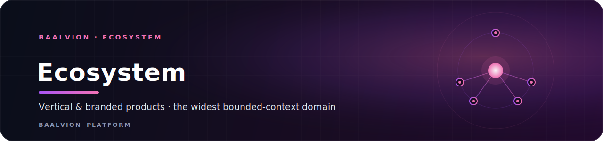
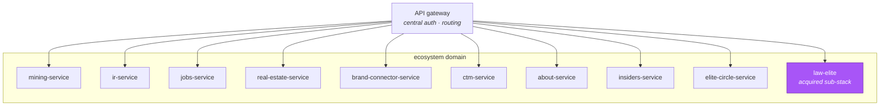

 
 

**Vertical and branded products plus acquired sub-stacks — the widest bounded-context domain, where most new verticals land.**

<a href="#overview">Overview</a> · <a href="#services">Services</a> · <a href="#domain-rules">Domain rules</a>

---

## Overview

`ecosystem` is one of the bounded-context domains of the Baalvion **pnpm + Turborepo
monorepo** (`Backend/services/<domain>/<service>/`). It is the catch-all for
customer-facing verticals and branded products — new verticals default here unless
they belong to a more specific context (`identity`, `commerce`, `knowledge`, etc.).

Each service owns an isolated Postgres schema, verifies tokens through the central
identity stack (RS256/JWKS via `@baalvion/auth-node` — no second issuer), and is
deployed independently.

## Services

| Service | Bounded context | Notes |
|---|---|---|
| `mining-service` | mining vertical | |
| `ir-service` | investor relations | |
| `jobs-service` | jobs portal | |
| `real-estate-service` | real estate vertical | |
| `brand-connector-service` | brand connector | |
| `ctm-service` | control-the-market | |
| `about-service` | about / corporate-site backend | |
| `insiders-service` | investors & founders circle | Supabase-compatible adapter |
| `elite-circle-service` | elite circle | byte-identical twin of `insiders-service` |
| `law-elite` | Law Elite Network | **acquired sub-stack**: own gateway + user/case services |

## Domain rules

- New verticals default here. Reserved contexts: `reseller-service`,
  `affiliate-service`, `whitelabel-service`.
- `law-elite` keeps its internal gateway + services structure as an acquired
  sub-monorepo; it is **not** flattened into the rest of `ecosystem`.
- Services migrate into this folder per `Backend/MIGRATION.md`.

---

Part of the <a href="https://github.com/baalvionservice/Baalvion-Project-Infra">Baalvion Platform</a> · centralized identity · domain-driven monorepo

