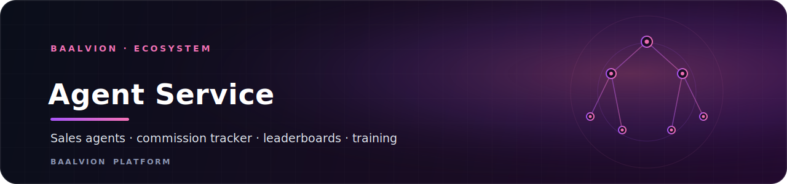
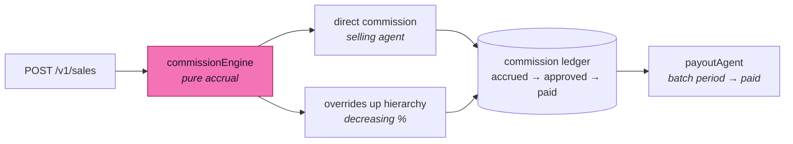

<div align="center">



<br/>
<br/>

**Agent Management for the Baalvion platform — sales/partner agents, a commission accrual tracker with multi-level overrides, leaderboards, and training/certification.**

<p>
  
  
  
  
  
</p>

<sub><a href="#overview">Overview</a> · <a href="#domain-model">Domain model</a> · <a href="#key-flows">Key flows</a> · <a href="#api">API</a> · <a href="#getting-started">Getting started</a> · <a href="#configuration">Configuration</a> · <a href="#security">Security</a></sub>

</div>

---

## Overview

`agent-service` is the **Agent Management** service in the `ecosystem` domain of the
Baalvion **pnpm + Turborepo monorepo** (`Backend/services/ecosystem/agent-service`).
It tracks sales and partner agents, accrues commissions through a pure engine that
pays the selling agent plus decreasing overrides up the agent hierarchy, ranks agents
on leaderboards, and runs training courses that issue certificates on passing.

- **Port:** `3044` (`PORT`) · **Schema:** `agent` (`DB_SCHEMA`) · **Domain:** ecosystem
- **Runtime:** Node.js + Express 5 + Sequelize over PostgreSQL, with Redis available
- **Auth:** verify-only RS256/JWKS via `@baalvion/auth-node` — no second issuer
- **Module format:** CommonJS; entry point `index.js` (exports the Express `app`)
- **Events:** emits `commission.accrued`, `agent.payout`, `agent.certified`
- **API surface:** mounted at both `/v1` and `/api/v1`

## Domain model

| Entity | Description |
|---|---|
| **Agent** | A sales/partner agent with a unique `code`, a `tier`, an optional `parent_agent_id` (override hierarchy), and a `commission_plan_id`. |
| **Commission plan** | A `flat` \| `percent` \| `tiered` rate plus `recurring_pct` and `override_pcts` — decreasing percentages paid up the agent chain. |
| **Sale** | A deal attributed to an agent (amount, currency, `new`/`recurring`, period bucket). |
| **Commission** | The accrual ledger — one row per earner per sale (the direct agent plus override ancestors), moving `accrued → approved → paid`. |
| **Training** | Courses → ordered modules → agent enrollments with progress, and a certificate issued on passing. |

## Key flows



- **Commission tracker** — `POST /v1/sales` attributes a sale and accrues commissions
  via the pure `commissionEngine`: the selling agent's direct commission **plus**
  decreasing overrides up the hierarchy (capped by `AGENT_MAX_OVERRIDE_LEVELS`,
  default 3). `GET /v1/commissions/summary` gives per-agent totals by status;
  `POST /v1/agents/:id/payout` batches a period to `paid`.
- **Leaderboard** — `GET /v1/leaderboard?metric=sales|commission|deals&period=YYYY-MM`
  ranks agents; `GET /v1/agents/:id/rank` returns one agent's standing.
- **Training** — create a course and modules, enrol an agent, track module
  completion, and submit a score; passing issues a certificate.

## API

All routes are mounted under `/v1` (and mirrored at `/api/v1`).

| Area | Routes |
|---|---|
| Plans | `POST/GET /plans` |
| Agents | `POST/GET /agents`, `GET/PATCH /agents/:id`, `GET /agents/:id/rank`, `POST /agents/:id/payout`, `GET /agents/:id/certifications` |
| Sales | `POST/GET /sales` |
| Commissions | `GET /commissions`, `GET /commissions/summary`, `POST /commissions/transition` |
| Leaderboard | `GET /leaderboard` |
| Training | `POST/GET /courses`, `GET /courses/:id`, `POST /courses/:id/modules`, `.../enroll`, `.../progress`, `.../score`, `.../enrollments` |

Service probes: `GET /` (service descriptor) and `GET /health` (status, RS256 flag, Redis availability).

## Getting Started

Install from the monorepo root (workspace), then run the service against the shared
Postgres (`5432`) and Redis (`6379`).

```bash
pnpm install                # from the monorepo root

# from this directory:
npm run migrate             # 001_agent_schema.sql + 002_rls_tenant_isolation.sql
npm start                   # node index.js → :3044
npm run dev                 # nodemon (watch mode)
npm run smoke               # node scripts/smoke.mjs
```

The smoke test exercises commissions, the override chain, payout, the leaderboard,
and certification.

## Configuration

Configuration is read from the environment (see `config/appConfig.js`); defaults are
suitable for local development.

| Variable | Default | Purpose |
|---|---|---|
| `PORT` | `3044` | HTTP port |
| `DB_HOST` / `DB_PORT` | `localhost` / `5432` | Postgres connection |
| `DB_NAME` / `DB_USER` / `DB_PASSWORD` | `baalvion_db` / `baalvion` / — | Postgres credentials |
| `DB_SCHEMA` | `agent` | Isolated schema for this service |
| `REDIS_HOST` / `REDIS_PORT` / `REDIS_PASSWORD` | `localhost` / `6379` / — | Redis connection |
| `CORS_ORIGINS` | localhost dev origins | Comma-separated allowed origins |
| `EVENT_BUS_STREAM` | `baalvion:events` | Event stream name |
| `AGENT_DEFAULT_CURRENCY` | `USD` | Default sale currency |
| `AGENT_MAX_OVERRIDE_LEVELS` | `3` | Max override levels paid up the hierarchy |
| `IP_RATE_LIMIT_MAX` | `1000` | Per-IP requests / minute |

## Security

- **Centralized auth:** tokens are verified RS256/JWKS via `@baalvion/auth-node`
  (HS256 dev fallback) — no second JWT issuer.
- **Hardened HTTP layer:** `helmet` headers, CORS restricted to configured origins,
  and a global per-IP rate limiter (`express-rate-limit`) with a generous DoS ceiling.
- **Tenant isolation:** migration `002_rls_tenant_isolation.sql` enables Postgres
  Row-Level Security on the schema's tenant tables.
- **Graceful shutdown:** Redis and the DB connection are drained on `SIGTERM`/`SIGINT`
  via `@baalvion/graceful-shutdown`.

---

<div align="center">
<sub>Part of the <a href="https://github.com/baalvionservice/Baalvion-Project-Infra">Baalvion Platform</a> · centralized identity · domain-driven monorepo</sub>
</div>
