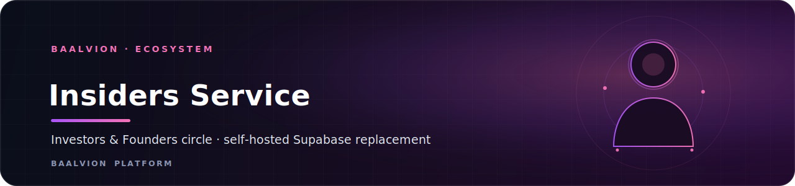

<div align="center">



<br/>
<br/>

**Self-hosted backend for the Baalvion Insiders (Investors &amp; Founders) circle — a single Express + Sequelize service that replaces the app's former Supabase backend, surface-for-surface.**

<p>
  
  
  
  
</p>

<sub><a href="#overview">Overview</a> · <a href="#supabase-replacement-map">Supabase map</a> · <a href="#api">API</a> · <a href="#getting-started">Getting started</a> · <a href="#configuration">Configuration</a> · <a href="#security">Security</a></sub>

</div>

---

## Overview

`insiders-service` is the backend for the **Baalvion Insiders** frontend
(`Frontend/For Invstors and Founders`) in the `ecosystem` domain. It replaces that
app's former Supabase backend — Auth, Postgres + RLS, Realtime, Storage, RPC, and
Edge Functions — with one Express + Sequelize service following the `trade-service`
conventions. The frontend talks to it through a Supabase-compatible adapter at
`src/integrations/supabase/client.ts`; the rest of the frontend is unchanged.

`elite-circle-service` is a byte-identical twin of this service in the same domain.

- **Port:** `3050` (`PORT`) · **Schema:** `insiders` (`DB_SCHEMA`) · **Domain:** ecosystem
- **Runtime:** Node.js + Express 4 + Sequelize over PostgreSQL
- **Auth:** JWT access + rotating refresh tokens; the access secret is required at boot
  via `@baalvion/auth-node` (`requireEnv('JWT_ACCESS_SECRET')`) — fail-closed, no default
- **Module format:** CommonJS; entry point `index.js` (exports the Express `app`)
- **API surface:** mounted at both `/v1` and `/api/v1`

## Supabase replacement map

| Supabase feature | Replacement |
|---|---|
| Auth (email/password) | JWT access + rotating refresh tokens, bcrypt, brute-force lockout |
| Postgres + RLS | `insiders` schema + a generic query engine with per-table authorization policies |
| `.from().select()` etc. | `POST /v1/db/query` (PostgREST-compatible spec, including embedded joins) |
| RPC functions | `POST /v1/rpc/:fn` (`has_role`, `increment_thread_views`, `create_notification`) |
| Realtime | Polling (frontend `NotificationBell`) + DB notification triggers |
| Storage (`elite-proofs`) | `POST /v1/storage/:bucket/upload` → local disk, served at `/storage/…` |
| Edge Functions | `POST /v1/functions/{ai-chat, scheduled-tag-report, update-report-schedule, send-notification, …}` |

## API

All routes are mounted under `/v1` (and mirrored at `/api/v1`).

| Area | Routes |
|---|---|
| Auth | `/v1/auth/*` (register, login, refresh, password reset) |
| Identity probe | `GET /v1/whoami` — returns the local `users.id`, roles, and profile for a gateway-authenticated caller |
| Public reads (SEO) | `GET /v1/public/founders`, `/v1/public/founders/:id`, `/v1/public/investors`, `/v1/public/investors/:id` |
| Generic data layer | `POST /v1/db/query` (optional auth; per-table authorization replaces RLS) |
| RPC | `POST /v1/rpc/:fn` |
| Storage | `POST /v1/storage/:bucket/upload` |
| Billing (BFF) | `/v1/billing/*` — gateway checkout via the SDK-native payment-service |
| Edge functions | `POST /v1/functions/{ai-chat, scheduled-tag-report, update-report-schedule, send-notification, checkout, profile-score, ai-analyze, match-investors, payment-tiers, payment-order, payment-confirm}` |

Service probes: `GET /` (descriptor), `GET /health` (status + port), `GET /health/ready` (DB readiness).

> The `/v1/billing` BFF (SDK-native payment-service) supersedes the legacy
> `/functions/payment-*` handlers, which read provider keys from the environment.

## Getting Started

Requires the shared `baalvion-postgres` container (DB `baalvion_db`).

```bash
cp .env.example .env        # adjust if needed
npm install
npm run migrate             # applies migrations/*.sql into the `insiders` schema
npm run dev                 # http://localhost:3050   (or: npm start)
npm run seed                # optional sample data
```

Frontend: `cd "../../../Frontend/For Invstors and Founders" && npm run dev`
(`http://localhost:8080`); it defaults to `VITE_API_URL=http://localhost:3050/v1`.

### Make a user an admin

Roles live in `insiders.user_roles`. After registering, grant admin and re-login to
refresh the token:

```sh
docker exec baalvion-postgres psql -U baalvion -d baalvion_db -c \
  "insert into insiders.user_roles(user_id, role) select id,'admin' from insiders.users where email='you@example.com' on conflict do nothing;"
```

## Configuration

Configuration is read from the environment (see `config/appConfig.js`).

| Variable | Default | Purpose |
|---|---|---|
| `PORT` | `3050` | HTTP port |
| `DB_HOST` / `DB_PORT` / `DB_NAME` | `localhost` / `5432` / `baalvion_db` | Postgres connection |
| `DB_USER` / `DB_PASSWORD` | `baalvion` / — | Postgres credentials |
| `DB_SCHEMA` | `insiders` | Isolated schema for this service |
| `JWT_ACCESS_SECRET` | **required** | Access-token secret (fail-closed at boot) |
| `JWT_ACCESS_TTL` / `JWT_REFRESH_TTL_DAYS` | `24h` / `30` | Token lifetimes |
| `RATE_LIMIT_IP_MAX` | `300` | Per-IP request ceiling |
| `LOGIN_MAX_ATTEMPTS` / `LOGIN_LOCKOUT_MINUTES` | `5` / `15` | Brute-force lockout |
| `UPLOAD_DIR` / `PUBLIC_BASE_URL` | `uploads` / `http://localhost:3050` | Local storage |
| `AI_API_KEY` / `AI_BASE_URL` / `AI_MODEL` | — / Lovable gateway / `google/gemini-2.5-flash` | AI assistant (graceful stub without a key) |
| `TIER_FOUNDER` / `TIER_INVESTOR_PARTNER` | `299` / `499` (USD) | Membership tier prices |
| `RAZORPAY_*` / `PAYU_*` / `STRIPE_*` / `CRYPTO_*` | — | Payment gateway keys (demo mode when unset) |

## Security

- **Fail-closed auth secret:** `JWT_ACCESS_SECRET` is required at boot via
  `@baalvion/auth-node` — the service will not start without it.
- **Account protection:** bcrypt password hashing plus brute-force login lockout
  (`LOGIN_MAX_ATTEMPTS` / `LOGIN_LOCKOUT_MINUTES`).
- **Authorization in the query engine:** what Supabase RLS used to enforce now lives
  in `controller/queryController.js` (`POLICIES`) — review it when adding tables.
- **Hardened HTTP layer:** `helmet`, CORS restricted to configured origins, and a
  per-IP rate limiter; uploads are served with a cross-origin resource policy.
- **Graceful shutdown:** the DB connection is drained on `SIGTERM`/`SIGINT` via
  `@baalvion/graceful-shutdown`.

## Notes

- Accounts are auto-verified on registration (no email service wired). In dev, password
  reset returns the token in the response so the flow is testable.
- Payment gateways run in demo mode until real keys are supplied; drop keys into `.env`
  to go live.
- The AI assistant (`POST /v1/functions/ai-chat`) is provider-agnostic
  (OpenAI-compatible) and returns a graceful stub when `AI_API_KEY` is absent.

---

<div align="center">
<sub>Part of the <a href="https://github.com/baalvionservice/Baalvion-Project-Infra">Baalvion Platform</a> · centralized identity · domain-driven monorepo</sub>
</div>
