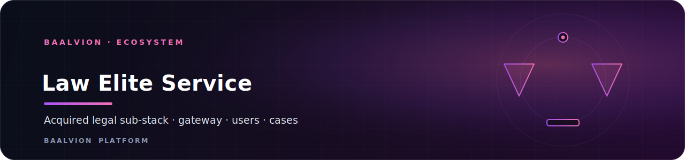
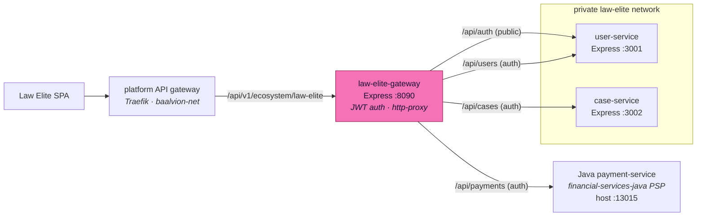

<div align="center">



<br/>
<br/>

**Acquired legal sub-stack for the Law Elite Network — a self-contained microservices cluster (gateway + user + case services) reached only through the platform API gateway.**

<p>
  
  
  
  
</p>

<sub><a href="#overview">Overview</a> · <a href="#architecture">Architecture</a> · <a href="#services">Services</a> · <a href="#getting-started">Getting started</a> · <a href="#configuration">Configuration</a> · <a href="#security">Security</a> · <a href="#notes--follow-ups">Notes</a></sub>

</div>

---

## Overview

`law-elite` is an **acquired sub-stack** in the `ecosystem` domain — a self-contained
microservices cluster with its own internal API gateway. Per the domain rules it keeps
its internal gateway + services structure and is **not** flattened into the rest of
`ecosystem`. It was relocated from `Frontend/Law-Elite-Network-main/backend/` so that
frontends contain only frontend code and all backends live under `Backend/`.

The platform reaches the cluster **only** through the central API gateway, which routes
`/api/v1/ecosystem/law-elite` → `law-elite-gateway:8090` (see
`Backend/infra/api-gateway/dynamic.yml`). Internal services (user, case) are **not**
published to the host and live on a private `law-elite` Docker network; only the gateway
joins the shared `baalvion-net` so Traefik can reach it.

## Architecture



- The **gateway** terminates auth (`gateway/src/middleware/auth.middleware.js`, JWT via
  `@baalvion/auth-node`) and proxies to the services with `http-proxy-middleware`.
- `/api/auth` is public (proxied to the user-service); `/api/users`, `/api/cases`, and
  `/api/payments` are auth-protected.
- Each service is independently built (own `Dockerfile`) and runs `node src/server.js`.

## Services

| Service | Path | Runtime | Port | Gateway route | Exposure |
|---|---|---|---|---|---|
| gateway | `gateway/` | Node + Express 4 | `8090` | — (entry) | published; joins `baalvion-net` |
| user-service | `services/user-service/` | Node + Express 4 | `3001` | `/api/auth` (public), `/api/users` (auth) | internal only |
| case-service | `services/case-service/` | Node + Express 4 | `3002` | `/api/cases` (auth) | internal only |
| payment-service | — (external) | Java / Spring Boot | `13015` | `/api/payments` (auth) | canonical platform PSP (`PAYMENT_SERVICE_URL`) |

> The original in-cluster payment stub was **removed** in the finance consolidation. The
> gateway now proxies `/api/payments` to the canonical Java payment-service
> (`financial-services-java`), defaulting to `host.docker.internal:13015`.

## Getting Started

The shared Docker network must exist first; the gateway's JWT secret has no insecure
default and must be set.

```bash
docker network create baalvion-net          # one-time (shared platform net)
export LAW_ELITE_JWT_SECRET=<random>         # required — no default
cd Backend/services/ecosystem/law-elite
docker compose up --build                    # gateway :8090 + user :3001 + case :3002
```

Point `PAYMENT_SERVICE_URL` at the platform payment-service if it is not reachable at
the default `host.docker.internal:13015`.

## Configuration

Set on the gateway via `docker-compose.yml` / the environment:

| Variable | Default | Purpose |
|---|---|---|
| `PORT` | `8090` | Gateway HTTP port |
| `LAW_ELITE_JWT_SECRET` | **required** | Gateway JWT secret (no default) |
| `USER_SERVICE_URL` | `http://user-service:3001` | Internal user-service target |
| `CASE_SERVICE_URL` | `http://case-service:3002` | Internal case-service target |
| `PAYMENT_SERVICE_URL` | `http://host.docker.internal:13015` | Canonical Java payment-service |
| `IP_RATE_LIMIT_MAX` | `1000` | Per-IP requests / minute |

## Security

- **Reached only via the platform gateway:** user and case services are never published
  to the host and live on a private Docker network; only the gateway joins `baalvion-net`.
- **No insecure default secret:** the gateway requires `LAW_ELITE_JWT_SECRET` — Compose
  refuses to start without it.
- **Auth at the edge:** the gateway terminates JWT auth (`@baalvion/auth-node`) and only
  `/api/auth` is public; all other routes require a valid token.
- **Rate limiting:** a global per-IP limiter (`express-rate-limit`) guards the gateway.
- **Centralized payments:** payment traffic is delegated to the canonical Java PSP rather
  than a local stub.

## Notes / follow-ups

- The Law-Elite frontend may run on mock services (`USE_MOCK=true` in
  `src/services/*Service.ts`); point it at the platform gateway route to use this backend.
- Overlaps with the top-level `Backend/law-service` (a separate Express 5 service for the
  same domain). These should eventually be consolidated to satisfy the "one centralized
  backend / no duplicate systems" rule.

---

<div align="center">
<sub>Part of the <a href="https://github.com/baalvionservice/Baalvion-Project-Infra">Baalvion Platform</a> · centralized identity · domain-driven monorepo</sub>
</div>
