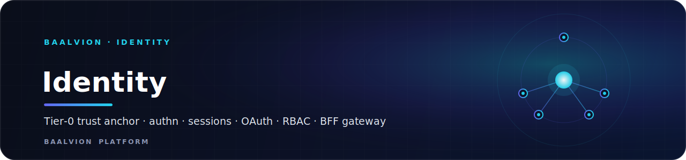
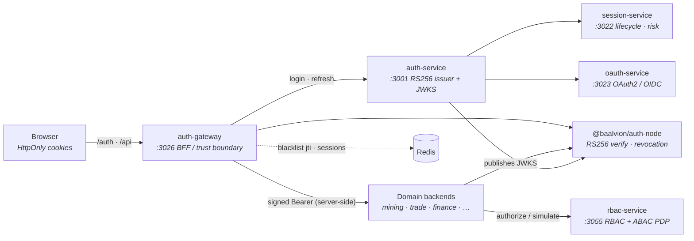

 
 

**The platform's trust anchor — authentication, sessions, OAuth/OIDC, authorization, and the browser-facing cookie gateway. Tier-0: the critical path every other domain depends on.**

  
  
  
  
  

<a href="#architecture">Architecture</a> · <a href="#services">Services</a> · <a href="#domain-rules">Domain rules</a>

---

## Architecture

The browser never holds a JWT: it talks to the **auth-gateway** over HttpOnly
cookies. The gateway verifies against the **auth-service** RS256 authority,
injects a server-side Bearer to domain backends, and every consumer verifies the
same RS256 tokens through `@baalvion/auth-node`. **rbac-service** answers
authorization questions; **session-service** and **oauth-service** extend the
identity surface.

## Services

| Service | Port | Bounded context | Notes |
|---|---|---|---|
| [`auth-service`](auth-service) | `3001` | Login / token issuance | Central SSO; RS256 issuer + JWKS endpoint |
| [`session-service`](session-service) | `3022` | Session lifecycle | Geo enrichment, device fingerprinting, risk scoring |
| [`oauth-service`](oauth-service) | `3023` | OAuth2 / OIDC | Authorization server (`openid profile email offline_access`) |
| [`auth-gateway`](auth-gateway) | `3026` | BFF / trust boundary | HttpOnly cookie sessions; signed identity injection to backends |
| [`rbac-service`](rbac-service) | `3055` | Authorization | Multi-tenant hierarchical RBAC + ABAC policy decision point |

## Domain rules

- **One verification scheme.** Every service verifies tokens via
  `@baalvion/auth-node` (RS256) — never hand-rolls JWT logic and never introduces
  a second issuer (rule A1; enforced by `catalog/enforce.mjs` C3).
- **No JWT in the browser.** Browser-facing apps authenticate through the
  auth-gateway over HttpOnly cookies; raw tokens stay server-side.
- **Authorization is centralized.** Access decisions resolve through
  `rbac-service` (RBAC + ABAC PDP), not per-service ad-hoc role checks.
- **Schema isolation.** Identity services own isolated Postgres schemas
  (`rbac-service` → `rbac`); cross-context contract changes require this domain's
  review (see [`CODEOWNERS`](../../../CODEOWNERS)).

> Services migrate into this folder per `Backend/MIGRATION.md`. Until a service's
> batch lands, its code may still live at `Backend/<service>`.

---

Part of the <a href="../../../README.md">Baalvion Platform</a> · centralized identity · domain-driven monorepo

