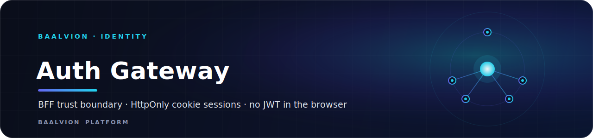
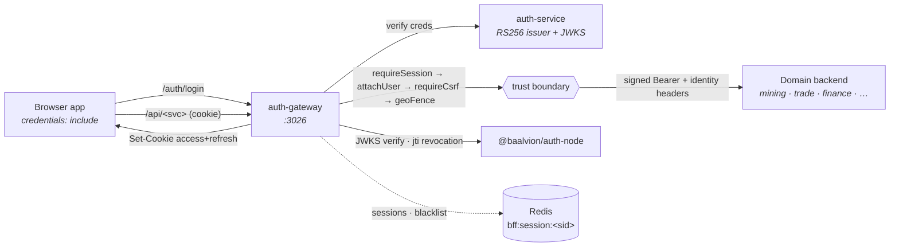

<div align="center">



<br/>
<br/>

**The Backend-for-Frontend and trust boundary for Baalvion — it issues HttpOnly cookie sessions backed by the auth-service RS256 authority, so no JWT ever reaches the browser, and injects signed server-side identity to every domain backend.**

<p>
  
  
  
  
</p>

<sub><a href="#overview">Overview</a> · <a href="#architecture">Architecture</a> · <a href="#cookie-strategy">Cookies</a> · <a href="#sessions">Sessions</a> · <a href="#routes">Routes</a> · <a href="#configuration">Configuration</a> · <a href="#running-locally">Running</a> · <a href="#security--notes">Security &amp; Notes</a></sub>

</div>

---

## Overview

`@baalvion/auth-gateway` is the **browser-facing edge of the identity domain**. It
is an additive Backend-for-Frontend (BFF) that terminates the browser session in
**HttpOnly cookies** rather than localStorage, and acts as the **trust boundary**
between untrusted clients and the platform's domain backends.

Two properties define it:

- **No JWT in the browser.** Login and refresh set cookies via `Set-Cookie`
  only — a token is never written to the response body, so it is never readable
  by JavaScript and never lands in localStorage (XSS-safe).
- **Signed identity injection.** Data calls hit `/api/*` with the cookie; the
  gateway verifies the session server-side and forwards the request to the
  matching domain backend with a server-side `Authorization: Bearer` and HMAC-
  signed identity headers the backend trusts.

It coexists with every legacy auth path (localStorage Bearer, island HS256,
Supabase/Firebase adapters) — nothing is removed, so rollout is incremental and
rollback-safe.

- **Package:** `@baalvion/auth-gateway` `1.0.0` (private workspace package)
- **Module system:** CommonJS — `index.js`, no build step
- **Default port:** `3026` (`PORT`)
- **Depends on:** auth-service (RS256 issuer + JWKS) and Redis (sessions +
  revocation), verified through `@baalvion/auth-node`

## Architecture



The `/api/*` pipeline is the trust boundary: `requireSession()` →
`attachUser` → `requireCsrf` → `geoFence()` → signed-identity proxy. The proxy
maps `/api/<svc>/...` to a domain backend from a configurable `TARGETS` table
(`routes/proxy.js`), extended via `SVC_*` env vars as services are onboarded.

## Cookie strategy

| Cookie | Contents | Flags | Default lifetime |
|---|---|---|---|
| `access_token` | RS256 JWT (short-lived) | **HttpOnly**, Secure (prod), SameSite=Lax, Path=/ | 15m |
| `refresh_token` | auth-service refresh token | **HttpOnly**, Secure (prod), SameSite=Lax, Path=/ | 7d |
| `csrf_token` | double-submit CSRF token | **non-HttpOnly** (readable by JS), Secure (prod) | session |

- **HttpOnly ⇒ unreadable by JS** → satisfies "no JWT in the JS runtime".
- `SameSite=Lax` allows top-level login navigation; set `COOKIE_DOMAIN=.baalvion.com`
  for cross-subdomain SSO.
- State-changing `/api` calls are CSRF-protected via the non-HttpOnly
  `csrf_token` double-submit cookie (`requireCsrf`).

## Sessions

Server-side sessions live in Redis, keyed by the JWT `sid` claim:

```
key:   bff:session:<sid>
value: { sessionId, userId, orgId, roles[], source, createdAt, expiresAt }
TTL:   = refresh-token lifetime (self-expires)
```

- `requireSession()` requires **both** a valid (JWKS + blacklist) `access_token`
  **and** an existing `bff:session:<sid>`.
- **Revoke** = blacklist the `jti` (`auth:blacklist:<jti>`) + delete the session
  → every consumer (gateway + islands) rejects instantly.
- Sessions are fingerprint-bound: a User-Agent mismatch rejects in production
  (warns in dev); IP mismatch is a soft warning.

## Routes

```
GET  /health                       liveness + redis + enforcement mode
GET  /auth-capability-check        internal-only readiness probe (requireInternalKey)

POST /auth/login                   verify creds → Set-Cookie → { user }
POST /auth/register                self-service registration
POST /auth/refresh                 rotate access cookie (cookie-driven)
POST /auth/logout                  revoke jti + delete session + clear cookies
GET  /auth/me                      current profile from the session
GET  /auth/.well-known/session     session descriptor
POST /auth/forgot-password         password reset request
POST /auth/reset-password          password reset completion
POST /auth/mfa-challenge           MFA challenge
POST /auth/mfa-enroll/start        begin MFA enrollment
POST /auth/mfa-enroll              complete MFA enrollment
POST /auth/step-up                 step-up authentication (requireSession)
GET  /auth/step-up/status          step-up status (requireSession)
POST /auth/invite                  issue an invite (requireSession)
GET  /auth/validate-invite         validate an invite token
POST /auth/accept-invite           accept an invite
POST /auth/onboarding-application  public onboarding submission

ALL  /api/<svc>/...                trust-boundary proxy to a domain backend
```

> `/auth/*` is JSON-parsed; `/api/*` is intentionally **not** body-parsed so the
> proxy streams the request body straight through to the backend.

## Configuration

`config/appConfig.js` (env-driven; production fails closed on missing secrets):

| Variable | Default | Purpose |
|---|---|---|
| `PORT` | `3026` | Listen port |
| `AUTH_SERVICE_URL` | `http://localhost:3001/v1/auth` | auth-service base |
| `JWKS_URI` | `http://localhost:3001/.well-known/jwks.json` | RS256 public keys |
| `JWT_ISSUER` / `JWT_AUDIENCE` | `baalvion-auth` / `baalvion-platform` | Claim validation |
| `CORS_ORIGINS` | `http://localhost:3030` | Comma-separated allowed origins |
| `BFF_ENFORCEMENT_MODE` | `hybrid` | `hybrid` (also inject Bearer) or `strict` (signed identity headers only) |
| `GATEWAY_SIGNING_SECRET` | — (**required**) | HMAC secret for signed identity headers (fail-closed) |
| `INTERNAL_SERVICE_SECRET` | dev placeholder | Guards internal-only endpoints (required in prod) |
| `REDIS_HOST` / `REDIS_PORT` / `REDIS_PASSWORD` | `localhost` / `6379` / — | Session + revocation store |
| `COOKIE_DOMAIN` | — | Set to `.baalvion.com` for cross-subdomain SSO |
| `COOKIE_SAMESITE` | `lax` | Cookie SameSite policy |
| `COOKIE_ACCESS_MAX_AGE` / `COOKIE_REFRESH_MAX_AGE` | `900` / `604800` | Cookie TTLs (seconds) |
| `SVC_*` | per-service localhost ports | `/api/<svc>` proxy targets (`routes/proxy.js`) |

In production the gateway refuses to start if `GATEWAY_SIGNING_SECRET` or
`INTERNAL_SERVICE_SECRET` is unset or still the dev placeholder.

## Running locally

```bash
cp .env.example .env          # set GATEWAY_SIGNING_SECRET (+ INTERNAL_SERVICE_SECRET)
pnpm install                  # from the monorepo root
pnpm --filter @baalvion/auth-gateway start   # or: dev
```

Requires Redis and a reachable auth-service. The gateway listens on
`:3026` and exposes `/health`. If `http-proxy-middleware` is unavailable the
`/api` proxy degrades to `503` while `/auth/*` keeps serving.

## Security & Notes

- **Fail-closed secrets.** Production exits at boot without a real
  `GATEWAY_SIGNING_SECRET` / `INTERNAL_SERVICE_SECRET`.
- **RS256-only, revocation-aware.** Sessions are validated via JWKS through
  `@baalvion/auth-node` with a `jti` blacklist check; a revoked token is rejected
  everywhere.
- **CSRF + geo-fence.** State-changing `/api` calls require the double-submit
  `csrf_token`; geo enforcement runs in `log` / `warn` / `enforce` modes
  (`GEO_ENFORCEMENT`).
- **Internal endpoints** are gated by `requireInternalKey` — trusted
  loopback/private-network callers or a constant-time `INTERNAL_SERVICE_SECRET`.
- **Additive & rollback-safe.** Every app keeps its legacy auth path; disabling
  the gateway falls back to direct Bearer mode with no code change.
- **One issuer.** This is a verifier and proxy — it never mints user tokens and
  introduces no second issuer (per `CLAUDE.md`).

---

<div align="center">
<sub>Part of the <a href="../../../../README.md">Baalvion Platform</a> · centralized identity · domain-driven monorepo</sub>
</div>
