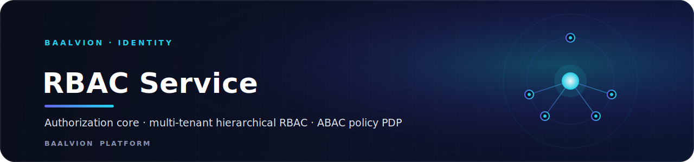
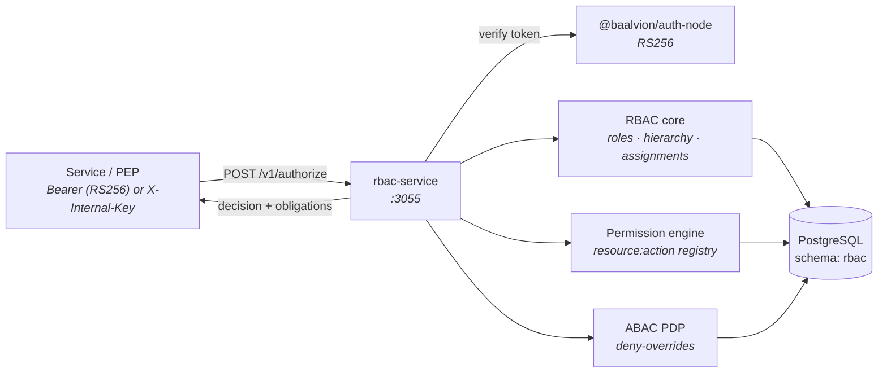

<div align="center">



<br/>
<br/>

**The single authorization authority for Baalvion — a multi-tenant, hierarchical RBAC engine with an ABAC policy decision point layered on top, so every website, dashboard, CMS, and internal platform shares one consistent access-control model.**

<p>
  
  
  
  
</p>

<sub><a href="#overview">Overview</a> · <a href="#the-model">Model</a> · <a href="#architecture">Architecture</a> · <a href="#api-surface">API</a> · <a href="#authorization">Authorization</a> · <a href="#running-locally">Running</a> · <a href="#security--notes">Security &amp; Notes</a></sub>

</div>

---

## Overview

`rbac-service` is the platform's **authorization core**. It answers one question —
*may this subject perform this action on this resource in this scope?* — for every
surface in the platform: many public websites, a centralized dashboard, a CMS, and
the internal company platform, all sharing one consistent model.

It is a **verify-only** consumer of identity: tokens are verified through
`@baalvion/auth-node` (RS256). The service **never** mints user tokens and
introduces **no second issuer** (per `CLAUDE.md`).

- **Domain:** `identity` · **Port:** `3055` (`PORT`) · **Schema:** `rbac` (isolated, in `baalvion_db`)
- **Stack:** Node + Express 5 + Sequelize/pg
- **Model:** hierarchical RBAC + an ABAC policy decision point (PDP)

## The model

### Tenancy (multi-tenant tree)

```
platform ─► country ─► organization
```

Exactly one **platform** tenant (the root). Countries hang off it; organizations
hang off a country (or the platform). **Each tenant owns its own roles**, so a
custom role in one org never leaks into another.

### Role hierarchy (the four canonical system roles)

```
super_admin (400, platform)
   └─ country_admin (300, country)
         └─ organization_admin (200, organization)
               └─ end_user (100, organization)
```

`level` is the rank (higher = more privileged); `parent_role_id` encodes
**inheritance** — a role inherits every permission of the roles below it. Custom
roles slot in at any level between these bands.

### Three layers (built in phases, one coherent service)

1. **RBAC core** — roles, hierarchy, and assignment of roles to users per scope.
2. **Permission engine** — a global permission registry (`resource:action`) mapped
   onto roles, with optional per-grant ABAC `constraints`.
3. **ABAC policy engine (PDP)** — attribute-based policies evaluated dynamically to
   decide **allow / deny / limit**, returning **obligations** to the caller.
   Combination strategy is **deny-overrides**.

## Architecture



## API surface

All routes are under `/v1` (also mounted at `/api/v1`) and require a `Bearer`
token (canonical RS256). `GET /health` reports liveness and RS256 status.

### Roles  `/v1/roles`

| Method | Path | Purpose |
|---|---|---|
| `POST` | `/roles` | Create role |
| `GET` | `/roles?tenantId=&scopeType=&key=` | List roles |
| `GET` | `/roles/:id` | Get one role |
| `PATCH` | `/roles/:id` | Update role |
| `DELETE` | `/roles/:id` | Delete role (system roles protected) |
| `PUT` | `/roles/:id/parent` | Maintain hierarchy (set/clear parent) |
| `GET` | `/roles/hierarchy?tenantId=` | Role tree for a tenant |

### Assignments  `/v1/assignments`

| Method | Path | Purpose |
|---|---|---|
| `POST` | `/assignments` | Assign a role to a user in a scope |
| `DELETE` | `/assignments/:id` | Revoke an assignment |
| `GET` | `/assignments?userId=&roleId=&scopeId=` | List assignments |
| `GET` | `/users/:userId/roles` | A user's active roles |
| `GET` | `/users/:userId/effective` | Effective roles + level + RBAC permissions |

### Permissions  `/v1/permissions` (Phase 2)

`POST /permissions`, `GET /permissions`, `DELETE /permissions/:id`, plus role
mapping: `POST|GET|DELETE /roles/:roleId/permissions[...]` and
`GET /roles/:roleId/permissions/effective` (incl. inherited).

### Policies & attributes  `/v1/policies`, `/v1/users/:userId/attributes` (Phase 3)

CRUD over ABAC policies; declare subject attributes for ABAC inputs.

### PDP  `/v1/authorize` (and `/v1/simulate`)

```http
POST /v1/authorize
{
  "action": "publish",
  "resource": { "type": "cms.content", "id": "a1", "attributes": { "orgId": "org-9" } },
  "scopeId": "org-9",
  "tenantId": "<uuid>",
  "context": { "ip": "1.2.3.4" }
}
→ { "decision": "allow", "allow": true, "obligations": {}, "reasons": [...], "matched": {...} }
```

Subject defaults to the caller; trusted callers (super_admin, or a PEP presenting
`X-Internal-Key`) may ask about another subject.

## Authorization

Writes to the management APIs are guarded by **scoped** checks that bridge the
token and this service's DB:

- **super_admin** (from the token's `roles[]` **or** a platform `super_admin`
  assignment) → manages everything.
- **country_admin** → manages its country tenant and every organization beneath it.
- **organization_admin** → manages its own organization.

## Running locally

```bash
cp .env.example .env                          # set JWT_PUBLIC_KEY to the auth-service public PEM
pnpm install                                  # from the monorepo root
pnpm --filter rbac-service migrate            # runs migrations 001–004 via psql ($DATABASE_URL)
pnpm --filter rbac-service seed               # platform tenant + system roles + base perms/policies
pnpm --filter rbac-service dev                # nodemon (or: start)
pnpm --filter rbac-service test               # engine unit tests (vitest, no DB needed)
```

See [`RBAC.md`](RBAC.md) for the condition grammar and decision algorithm.

## Security & Notes

- **Fail-closed in production.** Boot aborts if no RS256 public key source
  (`JWT_PUBLIC_KEY` / `JWT_PUBLIC_KEYS` / `JWT_KEYS_DIR`) is configured, or if
  `JWT_ACCESS_SECRET` is a known dev/default literal — preventing a silent HS256
  fallback.
- **RS256-only verification.** Access tokens are verified exclusively via
  `@baalvion/auth-node`; there is no HS256 acceptance path.
- **Tenant isolation.** Roles are scoped per tenant; migration `004` applies
  Row-Level Security for tenant isolation. The `rbac` schema is isolated from
  other domains.
- **Deny-overrides PDP.** When policies conflict, deny wins; the response carries
  `reasons` and `obligations` so callers can enforce limits.
- **Internal PDP calls** may use a shared `INTERNAL_API_KEY` (`X-Internal-Key`);
  empty disables it, requiring every caller to present a user token.

---

<div align="center">
<sub>Part of the <a href="../../../../README.md">Baalvion Platform</a> · centralized identity · domain-driven monorepo</sub>
</div>
