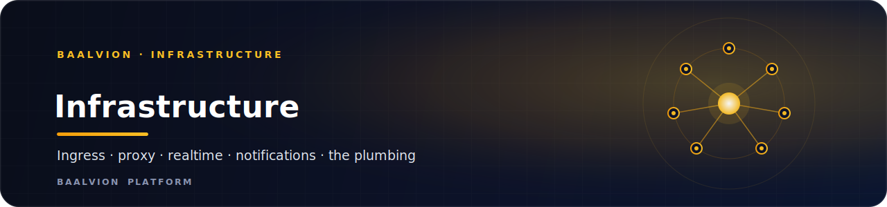
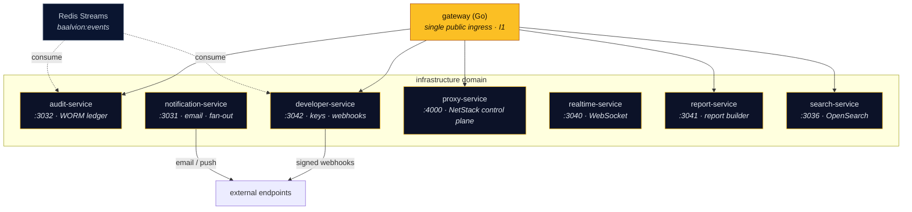

 
 

**The `infrastructure` bounded context — platform plumbing: public ingress, the proxy/NetStack control plane, realtime transport, notifications, audit, search, reporting, and the developer platform.**

<a href="#services">Services</a> · <a href="#domain-topology">Topology</a> · <a href="#domain-rules">Domain rules</a> · <a href="#conventions">Conventions</a>

---

## Services

Each service owns an isolated PostgreSQL schema (where it persists) and verifies RS256 tokens
via `@baalvion/auth-node` — there is no second issuer. Ports below are the in-repo defaults
(`PORT` in each service's `.env`).

| Service | Port | Bounded context | Notes |
|---------|------|-----------------|-------|
| [`audit-service`](audit-service/) | `3032` | Immutable audit trail | WORM + hash-chained; aggregates platform-wide events |
| [`developer-service`](developer-service/) | `3042` | Developer platform | API keys, signed webhooks, OpenAPI catalog, sandbox |
| [`notification-service`](notification-service/) | `3031` | Notifications / fan-out | Email + webhooks via BullMQ workers (Nodemailer/Resend) |
| [`proxy-service`](proxy-service/) | `4000` | Proxy / NetStack control plane | Multi-tenant SaaS backend (was `backend-Proxy-BaalvionStack`) |
| [`realtime-service`](realtime-service/) | `3040` | WebSocket / realtime transport | Socket.IO + Redis; remote-JWKS edge verifier |
| [`report-service`](report-service/) | `3041` | Reporting | Parameterized read-only reports → CSV/Excel/PDF/JSON/HTML |
| [`search-service`](search-service/) | `3036` | Search | Tenant-scoped HTTP wrapper over `@baalvion/search` (OpenSearch) |

> The Go API **`gateway`** is the platform's single public ingress. It is the one
> `ingress: public` descriptor (rule **I1**) and lives at `Backend/gateway/`, *not*
> under `services/`, because it is the front door rather than a business service.
> Its catalog domain is `infrastructure`.

## Domain topology

The platform **event bus** is Redis Streams (`baalvion:events`). `audit-service` and
`developer-service` consume it automatically, so most services do not integrate audit or
webhooks directly — they just emit domain events.

## Domain rules

- **I1 — single public ingress.** The Go `gateway` is the only `ingress: public` descriptor.
  Business services in this domain sit behind it.
- **Reserved contexts.** `proxy-platform` / `proxy-gateway` / `edge-service` /
  `asn-allocation-service` are reserved bounded contexts for the proxy/edge buildout.
- **Service migration.** Services migrate into this folder per
  [`Backend/MIGRATION.md`](../../MIGRATION.md).

## Conventions

- **Auth.** Verify-only RS256 (JWKS) via `@baalvion/auth-node`. `proxy-service` is a *sanctioned
  temporary self-issuer* with its own kid-based RS256 keys (see its
  [`RBAC.md`](proxy-service/RBAC.md)), slated for retirement — do not add a third issuer.
- **Tenancy.** Each persisting service ships an RLS migration
  (`002_rls_tenant_isolation.sql`) for fail-closed tenant isolation.
- **Schema isolation.** One PostgreSQL schema per bounded context.
- **Commits.** Conventional Commits with the service/package name as scope
  (e.g. `feat(audit-service): …`).

---

Part of the <a href="https://github.com/baalvionservice/Baalvion-Project-Infra">Baalvion Platform</a> · centralized identity · domain-driven monorepo

