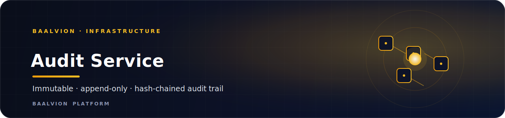
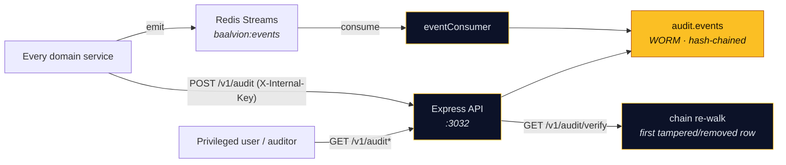

<div align="center">



<br/>
<br/>

**The platform's single immutable, append-only, tamper-evident audit trail — a WORM, hash-chained ledger that aggregates audit events from every domain via the event bus and direct writes.**

<p>
  
  
  
  
  
</p>

<sub><a href="#overview">Overview</a> · <a href="#tamper-evidence">Tamper-evidence</a> · <a href="#capture">Capture</a> · <a href="#api">API</a> · <a href="#getting-started">Getting started</a> · <a href="#environment-variables">Env</a> · <a href="#notes--gotchas">Notes</a></sub>

</div>

---

## Overview

**audit-service** is the platform's single **immutable, append-only, tamper-evident** audit trail.
It *aggregates* audit events from every domain — it does **not** replace the local audit each
service already keeps (`auth.audit_logs`, `rbac.decision_logs`, etc.). It is the cross-domain,
verifiable system of record.

- **Domain:** `infrastructure`
- **Port:** `3032` (`PORT`)
- **Schema:** `audit` (isolated PostgreSQL schema)
- **Auth:** verify-only RS256 via `@baalvion/auth-node` — no second issuer
- **Event bus:** Redis Streams consumer on `baalvion:events`

## Architecture



## Tamper-evidence

- **WORM (write-once, read-many).** Postgres triggers reject every `UPDATE` / `DELETE` /
  `TRUNCATE` on `audit.events` — even for the table owner.
- **Hash chain.** Each row stores `hash = SHA256(prev_hash + canonical(row))`, chained to the
  previous row. `GET /v1/audit/verify` re-walks the chain and reports the **first tampered or
  removed row** — catching both content edits and inserted/deleted rows.

## Capture

- **Event bus (primary).** A Redis-Streams consumer on `baalvion:events` records *every*
  platform event automatically — no per-service integration needed.
- **Direct writes.** `POST /v1/audit` (and `/audit/batch`) for high-value synchronous events,
  from services (`X-Internal-Key`) or privileged users.

## API

All routes are mounted under both `/v1` and `/api/v1`.

| Method | Path | Auth | Purpose |
|--------|------|------|---------|
| `POST` | `/audit` | internal key / privileged user | append one event |
| `POST` | `/audit/batch` | internal key / privileged user | append many (chained) |
| `GET` | `/audit` | audit-reader | query (actor / action / resource / service / severity / time + pagination) |
| `GET` | `/audit/:seq` | audit-reader | one event |
| `GET` | `/audit/verify?fromSeq=&toSeq=` | audit-reader | verify chain integrity |
| `GET` | `/audit/export` | audit-reader | CSV export |
| `GET` | `/health`, `/healthz` | none | liveness probe |

**Audit-reader** = a `super_admin` / `admin` / `owner` / `auditor` / `compliance` role, or an
`audit:read` / `*` permission, or a service principal.

## Tech Stack

| Concern | Choice |
|---------|--------|
| Runtime / framework | Node.js + Express `^5` |
| ORM / driver | Sequelize `^6` + `pg` `^8` (+ `pg-hstore`) |
| Cache / event bus | `ioredis` (Redis Streams `baalvion:events`) |
| Auth | `@baalvion/auth-node` (verify-only RS256) |
| Validation | `zod` |
| Logging | `pino` + `pino-http` |
| Hardening | `helmet`, `cors`, `express-rate-limit` |
| Telemetry / lifecycle | `@baalvion/telemetry`, `@baalvion/graceful-shutdown` |

## Getting Started

### Prerequisites

- Node.js + **pnpm** (workspace package; `@baalvion/*` resolve via `workspace:*`)
- PostgreSQL (`DATABASE_URL`) and Redis (`baalvion:events`)

### Install, migrate, run

```bash
cp .env.example .env
pnpm install                              # from the monorepo root (preferred)
pnpm --filter audit-service migrate       # 001_audit_schema.sql + 002_rls_tenant_isolation.sql
pnpm --filter audit-service dev           # nodemon → :3032

# production
pnpm --filter audit-service start         # node index.js
```

### Smoke test

```bash
node scripts/smoke.mjs                     # live end-to-end check (service must be running)
```

> The `smoke` npm script points at `scripts/smoke.js`, but the file on disk is
> `scripts/smoke.mjs`. Invoke it directly as shown above.

## Environment Variables

> `.env*` is gitignored. **Never commit secrets.** See `.env.example` for the full list.

| Variable | Purpose |
|----------|---------|
| `PORT` | HTTP port (default `3032`) |
| `DATABASE_URL` | PostgreSQL connection (schema `audit`); also used by the `migrate` script |
| `REDIS_URL` / Redis settings | Event-bus stream consumer (`baalvion:events`) |
| `X-Internal-Key` (header) | Service-to-service auth for direct writes |
| RS256 / JWKS settings | Token verification via `@baalvion/auth-node` |

## Security

- **Append-only by construction** — DB triggers block mutation/deletion regardless of caller.
- **Verifiable integrity** — the hash chain makes tampering detectable, not merely discouraged.
- **Verify-only RS256** — no local token issuance; reads gated by audit-reader roles/permissions.
- **Fail-closed tenancy** — `002_rls_tenant_isolation.sql` enforces row-level tenant isolation.
- Standard hardening: `helmet`, CORS allowlist, per-route rate limiting.

## Notes / Gotchas

- This is the **aggregate** trail — services keep their own local audit; this is the
  cross-domain, tamper-evident system of record.
- The chain verifier reports the **first** divergence; a single edit invalidates every
  subsequent row's hash by design.

### Deferred

- **ClickHouse** analytics mirror (the old `audit-platform` descriptor) — Postgres + hash-chain
  is the source of truth; ClickHouse is a Phase-2 high-volume read model.
- Per-event-id dedup for exactly-once event capture.
- Provider / event delivery receipts.

---

<div align="center">
<sub>Part of the <a href="https://github.com/baalvionservice/Baalvion-Project-Infra">Baalvion Platform</a> · centralized identity · domain-driven monorepo</sub>
</div>
