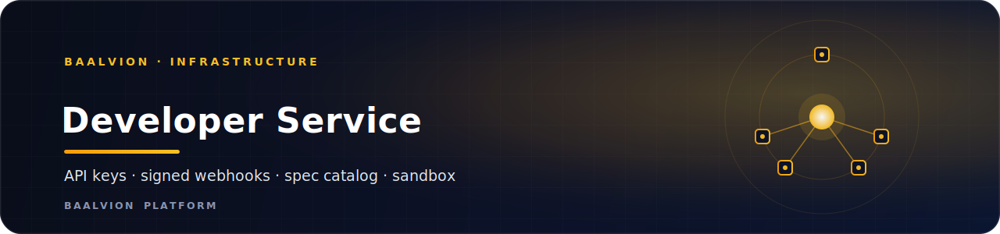
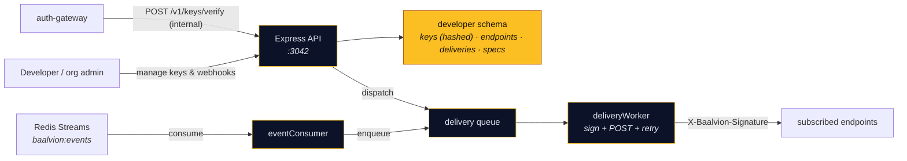

<div align="center">



<br/>
<br/>

**The Baalvion Developer Platform — the packaged, platform-wide home for everything an API consumer needs: API keys, signed webhooks with retry delivery, an OpenAPI spec catalog, and a test-mode sandbox.**

<p>
  
  
  
  
  
</p>

<sub><a href="#overview">Overview</a> · <a href="#capabilities">Capabilities</a> · <a href="#api">API</a> · <a href="#getting-started">Getting started</a> · <a href="#environment-variables">Env</a> · <a href="#security">Security</a> · <a href="#notes--gotchas">Notes</a></sub>

</div>

---

## Overview

**developer-service** is the **Developer Platform** — the packaged, platform-wide home for
everything an API consumer needs: **API keys**, **webhooks** (signed delivery + retries), an
**OpenAPI spec catalog**, and a **test-mode sandbox**. It generalizes the per-tenant
API-key / webhook bits that previously lived inside `proxy-service` (Cluster 9, *Developer
Platform*).

- **Domain:** `infrastructure`
- **Port:** `3042` (`PORT`)
- **Schema:** `developer` (isolated PostgreSQL schema)
- **Auth:** verify-only RS256 / JWKS via `@baalvion/auth-node` (HS256 dev fallback) — no second issuer
- **Event bus:** Redis Streams consumer on `baalvion:events`

## Architecture



## Capabilities

### API keys

Issue `bk_live_…` / `bk_test_…` keys (test = sandbox mode). The full key is shown **once**; only
its SHA-256 hash plus prefix/last4 are stored. Keys can be rotated, revoked, and scoped. The
gateway calls `POST /v1/keys/verify` (internal-key only) on the hot path: prefix lookup →
constant-time hash compare → scope/expiry gate.

### Webhooks

Org-scoped endpoints subscribe to event types (`*`, exact, or `prefix.*`). `dispatch()` fans an
event out as queued deliveries; the worker signs each with a **Stripe-style** header and POSTs
it, retrying with exponential backoff up to `WEBHOOK_MAX_ATTEMPTS`:

```
X-Baalvion-Signature: t=<unix>,v1=<hex HMAC-SHA256(secret, `${t}.${body}`)>
```

An **event-bus consumer** bridges every `baalvion:events` domain event to subscribed webhooks
automatically — services don't integrate webhooks directly.

### OpenAPI catalog

Services register their OpenAPI docs; the portal lists them and serves public specs raw at
`GET /v1/public/specs/:service` (no auth) for a docs site.

### Sandbox

`ALL /v1/sandbox/echo` plus `bk_test_` keys let a developer validate signing / keys end-to-end
without touching live data.

## API

Routes are mounted under both `/v1` and `/api/v1`.

| Area | Routes |
|------|--------|
| Keys | `POST /keys`, `GET /keys`, `GET /keys/:id`, `POST /keys/:id/rotate`, `POST /keys/:id/revoke`, `PATCH /keys/:id/scopes`, `POST /keys/verify` *(internal)* |
| Webhooks | `POST/GET /webhooks`, `GET/PATCH/DELETE /webhooks/:id`, `POST /webhooks/:id/roll-secret`, `POST /webhooks/:id/test`, `GET /webhooks/:id/deliveries` |
| Deliveries | `GET /deliveries`, `POST /deliveries/:id/redeliver` |
| Events | `POST /events/dispatch` *(service-to-service)*, `GET/POST /event-types` |
| Specs | `POST/GET /specs`, `GET/DELETE /specs/:service`, `GET /public/specs[/:service]` *(no auth)* |
| Sandbox | `ALL /sandbox/echo` |
| Health | `GET /health` |

## Tech Stack

| Concern | Choice |
|---------|--------|
| Runtime / framework | Node.js + Express `^5` |
| ORM / driver | Sequelize `^6` + `pg` `^8` (+ `pg-hstore`) |
| Cache / event bus / queue | `ioredis` (Redis Streams `baalvion:events` + delivery worker) |
| Auth | `@baalvion/auth-node` (verify-only RS256, HS256 dev fallback) |
| Validation | `zod` |
| Logging | `pino` + `pino-http` |
| Hardening | `helmet`, `cors`, `express-rate-limit` |
| Telemetry / lifecycle | `@baalvion/telemetry`, `@baalvion/graceful-shutdown` |

## Getting Started

### Prerequisites

- Node.js + **pnpm** (workspace package; `@baalvion/*` resolve via `workspace:*`)
- PostgreSQL (`DATABASE_URL`) and Redis (`baalvion:events` + delivery queue)

### Install, migrate, run

```bash
cp .env.example .env
pnpm install                                  # from the monorepo root (preferred)
pnpm --filter developer-service migrate       # 001_developer_schema.sql + 002_rls_tenant_isolation.sql
pnpm --filter developer-service dev           # nodemon → :3042

# production
pnpm --filter developer-service start         # node index.js
```

The HTTP process also runs the **event consumer** and the **webhook delivery worker** in-process.

### Smoke test

```bash
node scripts/smoke.mjs    # keys + signed webhook delivery + catalog + sandbox (service must be running)
```

## Environment Variables

> `.env*` is gitignored. **Never commit secrets.** See `.env.example` for the full list.

| Variable | Purpose |
|----------|---------|
| `PORT` | HTTP port (default `3042`) |
| `DATABASE_URL` | PostgreSQL connection (schema `developer`); also used by the `migrate` script |
| `REDIS_URL` / Redis settings | Event-bus consumer + webhook delivery queue |
| `WEBHOOK_MAX_ATTEMPTS` | Max retry attempts for webhook delivery (exponential backoff) |
| `X-Internal-Key` (header) | Service-to-service auth (e.g. gateway `POST /keys/verify`) |
| RS256 / JWKS settings | Token verification via `@baalvion/auth-node` |

## Security

- **Keys are never stored in plaintext** — only the SHA-256 hash plus a prefix/last4 are
  persisted; the full key is shown once at creation.
- **Constant-time verification** on the hot path, with scope and expiry enforcement.
- **HMAC-signed, timestamped webhooks** (Stripe-style `t=,v1=`) let receivers verify
  authenticity and reject replays.
- **Public specs are intentionally unauthenticated** (`/public/specs`) — only register specs
  that are safe to publish.
- **Fail-closed tenancy** — `002_rls_tenant_isolation.sql` enforces row-level tenant isolation.
- Standard hardening: `helmet`, CORS allowlist, per-route rate limiting.

## Notes / Gotchas

- Services should emit domain events to `baalvion:events` rather than calling webhooks directly —
  the event consumer fans them out to subscribers.
- `bk_test_` keys activate **sandbox mode**; pair them with `/v1/sandbox/echo` to validate
  signing end-to-end without touching live data.

---

<div align="center">
<sub>Part of the <a href="https://github.com/baalvionservice/Baalvion-Project-Infra">Baalvion Platform</a> · centralized identity · domain-driven monorepo</sub>
</div>
