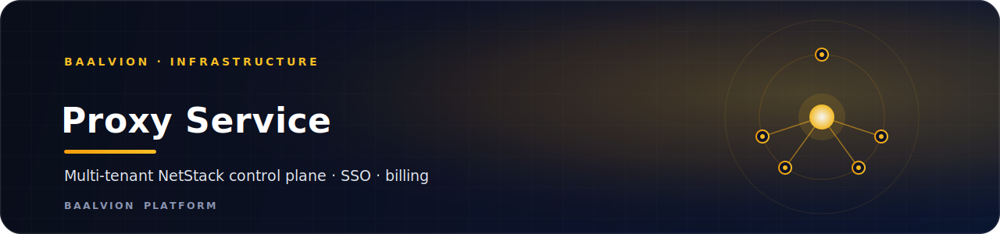
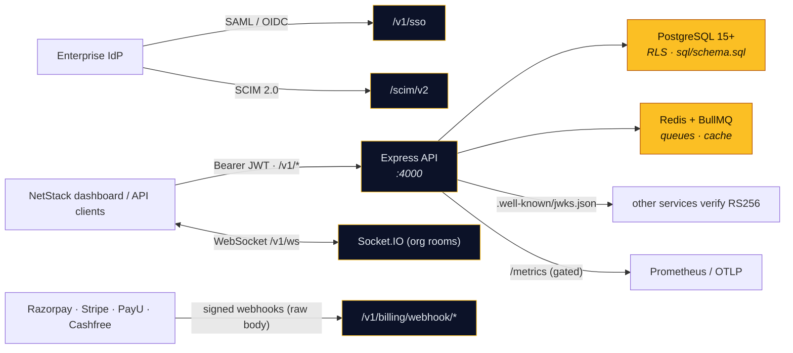

<div align="center">



<br/>
<br/>

**Baalvion NetStack — the production multi-tenant backend for the enterprise proxy SaaS: auth, organizations & RBAC, proxy/preset management, usage & analytics, billing across five payment providers, enterprise SSO/SCIM, and white-label.**

<p>
  
  
  
  
  
  
  
</p>

<sub><a href="#overview">Overview</a> · <a href="#architecture">Architecture</a> · <a href="#capabilities">Capabilities</a> · <a href="#api-surface">API</a> · <a href="#getting-started">Getting started</a> · <a href="#environment-variables">Env</a> · <a href="#security">Security</a> · <a href="#notes--gotchas">Notes</a></sub>

</div>

---

## Overview

**proxy-service** is the **Baalvion NetStack** backend — a production-ready, multi-tenant
backend for the enterprise proxy SaaS (formerly `backend-Proxy-BaalvionStack`). It owns tenant
auth, organizations & RBAC, proxy/preset management, usage metering & analytics, billing across
multiple payment providers, enterprise SSO/SCIM, white-label, and a realtime usage stream.

- **Domain:** `infrastructure`
- **Port:** `4000` (`PORT`)
- **API versions:** `/v1` (primary) and `/api/v1` (backward compatible)
- **WebSocket path:** `/v1/ws` (Socket.IO)
- **Datastore:** PostgreSQL 15+ (RLS schema in [`sql/`](sql/)); Redis + BullMQ; Socket.IO

> **Issuer status.** proxy-service is a **sanctioned temporary RS256 self-issuer** (its own
> kid-based keys in `config/keys`, its own login / SSO / API-key planes) *and* a consumer of its
> own tokens, slated for later retirement. Verification is **RS256-only**
> (`allowHs256Fallback:false`). See [`RBAC.md`](RBAC.md) for the full auth contract.

## Architecture



### Request & response model

A consistent envelope is used across the surface:

```jsonc
// success
{ "success": true, "data": { /* … */ }, "meta": { "requestId": "uuid", "timestamp": "ISO-8601", "latency": 12, "version": "v1" } }
// error
{ "success": false, "error": { "code": "VALIDATION_ERROR", "message": "…", "details": {}, "requestId": "uuid" } }
// paginated → data: { data: [], total, page, pageSize, totalPages, hasNext, hasPrev }
```

Tenant context is taken from the JWT (`org_id`); the `x-org-id` header is only a compatibility
fallback.

## Capabilities

| Cluster | Mount | What it does |
|---------|-------|--------------|
| **Auth** | `/v1/auth` | register, login, logout, refresh, forgot/reset/verify-email, TOTP MFA (enable/verify/disable) |
| **Users** | `/v1/users` | profile, change-password, list, invite, update, role change, suspend/delete |
| **Organizations & RBAC** | `/v1/org`, `/v1/org/members`, `/v1/org/roles` | org profile, members, invites, member roles, activity |
| **Proxies & presets** | `/v1/proxies`, `/v1/presets` | CRUD, test, export, rotate, per-proxy logs; reusable presets |
| **Usage & analytics** | `/v1/usage/*`, `/v1/analytics/*` | summary/history/realtime/stream, bandwidth, success-rate, geo heatmap, latency, anomalies, forecasts, SLA risk, export |
| **Billing** | `/v1/billing/*`, `/v1/payment` | subscription, plans, invoices, change/activate plan, orders, credit, payment methods, usage forecast |
| **Developer** | `/v1/developer` | per-tenant API keys (now generalized by [`developer-service`](../developer-service/)) |
| **Enterprise** | `/v1/enterprise/*` | SSO config, SCIM tokens, custom roles, policies, org-units, SLA, white-label + domains, audit export / SIEM sinks |
| **Marketplace / partner** | `/v1/marketplace/quote`, `/v1/partner/*` | reseller self-service: customers, sub-resellers, commissions, payouts |
| **Trust / privacy / KYC** | `/v1/account/*`, `/v1/kyc/*` | trust status, consent, GDPR export/delete, KYC start / access token |
| **Uploads** | `/v1/upload` | file upload (S3 via `@aws-sdk/client-s3` + presigned URLs) |
| **SSO (public)** | `/v1/sso` | enterprise SAML / OIDC login |
| **SCIM 2.0** | `/scim/v2` | user/group provisioning (own bearer auth + `scim+json` parser) |
| **Admin** | `/v1/admin` | platform-admin console operations |
| **Webhooks** | `/v1/billing/webhook/*`, `/v1/webhooks/kyc` | provider webhooks — verified against the **raw** request body |
| **Ops** | `/health`, `/.well-known/jwks.json`, `/metrics` | health, public JWKS, gated Prometheus metrics |

## Payments

Five providers are integrated, each with a webhook that verifies the **raw** request body before
the JSON parser runs:

| Provider | Webhook | Verification |
|----------|---------|--------------|
| Razorpay | `/v1/billing/webhook/razorpay` | HMAC signature (authoritative subscription activation) |
| Stripe | `/v1/billing/webhook/stripe` | `t=,v1=` signed payload (HMAC over `t.body`) |
| PayU | `/v1/billing/webhook/payu` | reverse-hash on the form-encoded callback |
| Cashfree | `/v1/billing/webhook/cashfree` | `base64(HMAC-SHA256(timestamp + body))` |
| KYC provider | `/v1/webhooks/kyc` | HMAC over the raw body |

## Tech Stack

| Concern | Choice |
|---------|--------|
| Runtime / framework | Node.js + Express `^5` |
| Data | PostgreSQL 15+ via Sequelize `^6` + `pg` `^8` (RLS in `sql/`) |
| Cache / queues | `ioredis` + `bullmq` |
| Realtime | `socket.io` (path `/v1/ws`, org rooms) |
| Auth | `@baalvion/auth-node` + own RS256 keys (`jsonwebtoken`); RS256-only verify |
| Enterprise SSO | `@node-saml/node-saml`, `openid-client` |
| MFA | `speakeasy` + `qrcode` (TOTP) |
| Payments | `stripe`, `razorpay` (+ PayU / Cashfree webhook handlers) |
| Storage | `@aws-sdk/client-s3` + `@aws-sdk/s3-request-presigner` |
| Email | `nodemailer` |
| Validation | `zod` |
| Resilience / observability | `opossum` (circuit breaker), `prom-client`, OpenTelemetry SDK |
| Lifecycle | `@baalvion/graceful-shutdown` |

## API surface

The exhaustive contract lives in:

- **[`openapi.yaml`](openapi.yaml)** — full OpenAPI 3 spec
- **[`Baalvion-API.postman_collection.json`](Baalvion-API.postman_collection.json)** — Postman collection
- **[`RBAC.md`](RBAC.md)** — auth contract, claims, and the role hierarchy

## Getting Started

### Prerequisites

- Node.js + **pnpm** (workspace package)
- PostgreSQL 15+ (`DATABASE_URL`) and Redis
- RS256 keypair in `config/keys` — generate one for local dev

### Install, keys, migrate, run

```bash
cp .env.example .env
pnpm install                              # from the monorepo root (preferred)
pnpm --filter proxy-service keys:generate # local RS256 keypair (config/keys)
pnpm --filter proxy-service migrate       # sql/schema.sql + sql/002_rls_tenant_isolation.sql
pnpm --filter proxy-service dev           # nodemon → :4000

# production / checks
pnpm --filter proxy-service start         # node index.js
pnpm --filter proxy-service lint          # node --check index.js
pnpm --filter proxy-service test          # node --test
```

Health check: `GET /health` → `{ "status": "ok", "timestamp": "…" }`.

## Environment Variables

> `.env*` is gitignored. **Never commit secrets.** Per-environment files exist
> (`.env.development`, `.env.production`); see `.env.example` for the full list.

| Variable | Purpose |
|----------|---------|
| `PORT` | HTTP port (default `4000`) |
| `NODE_ENV` | gates production fail-fasts (e.g. `METRICS_SECRET` enforcement) |
| `DATABASE_URL` | PostgreSQL connection (RLS schema); also used by the `migrate` script |
| `REDIS_URL` / Redis settings | cache + BullMQ queues |
| `CORS_ORIGINS` | comma-separated allowlist of browser origins |
| `METRICS_SECRET` | bearer/`?token=` secret guarding `/metrics` (required, non-default, in prod) |
| `METRICS_IP_ALLOWLIST` | additional IPs allowed to scrape `/metrics` (loopback always allowed) |
| Provider keys | Razorpay / Stripe / PayU / Cashfree API keys + webhook secrets |
| AWS S3 settings | bucket/region/credentials for uploads + presigned URLs |
| SSO settings | SAML / OIDC issuer, certs, client config |

## Security

- **RS256-only verification** across all JWT paths *and* the WebSocket handshake
  (`allowHs256Fallback:false`); HS256 tokens are rejected when RS256 keys are present.
- **DB-authoritative roles** — the effective role is resolved from `org_memberships` on each
  request, never trusting a stale token role (see [`RBAC.md`](RBAC.md)). Hierarchy:
  `viewer < member < editor < manager < admin < owner < super_admin`.
- **Raw-body webhook verification** — every PSP/KYC webhook is mounted *before* the JSON parser
  and verifies the provider signature over the unparsed body.
- **`/metrics` is gated** — loopback or a valid `METRICS_SECRET`; production refuses to boot with
  a missing or placeholder secret.
- **Public JWKS** at `/.well-known/jwks.json` lets other services verify tokens with no shared secret.
- **Fail-closed tenancy** — `sql/002_rls_tenant_isolation.sql` enforces row-level tenant isolation.
- Standard hardening: `helmet`, CORS allowlist, per-route rate limiting, Zod validation.

## Notes / Gotchas

- **Platform feature routes** currently use a seeded in-memory store for fast integration
  testing; the production PostgreSQL tables, indexes, and RLS policies live in `sql/schema.sql`.
- **Self-issuer scope.** proxy verifies its *own* canonical tokens, so the consumer-oriented
  `createAuthMiddleware`/JWKS model and a full `organizationId`→`orgId` property rename are
  **deferred** to its eventual issuer-retirement (documented in [`RBAC.md`](RBAC.md)); the
  JWT-claim-level requirements (canonical claims, RS256-only) are met today.
- The per-tenant API-key/webhook capability has been generalized into
  [`developer-service`](../developer-service/) (Cluster 9, *Developer Platform*).
- This folder ships its own `observability/`, `docs/`, `test/`, `seeders/`, and `workers/`.

---

<div align="center">
<sub>Part of the <a href="https://github.com/baalvionservice/Baalvion-Project-Infra">Baalvion Platform</a> · centralized identity · domain-driven monorepo</sub>
</div>
