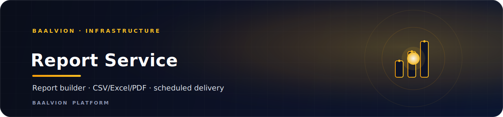
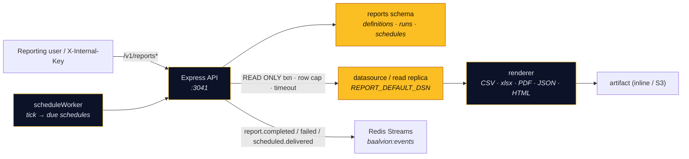

<div align="center">



<br/>
<br/>

**The platform report builder — define parameterized, read-only report queries and render them to CSV / Excel / PDF / JSON / HTML, on demand or on a schedule, with hardened query safety.**

<p>
  
  
  
  
  
</p>

<sub><a href="#overview">Overview</a> · <a href="#model">Model</a> · <a href="#query-safety">Query safety</a> · <a href="#api">API</a> · <a href="#getting-started">Getting started</a> · <a href="#environment-variables">Env</a> · <a href="#notes--gotchas">Notes</a></sub>

</div>

---

## Overview

**report-service** is the platform **report builder** — define parameterized, read-only report
queries and render them to **CSV / Excel (xlsx) / PDF / JSON / HTML**, on demand or on a
schedule. It is the live Node implementation of Cluster 9's *Reporting* capability (the Java
`reporting-service`, port `3024` / schema `reporting`, remains the finance-specific job scaffold).

- **Domain:** `infrastructure`
- **Port:** `3041` (`PORT`)
- **Schema:** `reports` (isolated PostgreSQL schema)
- **Auth:** verify-only RS256 / JWKS via `@baalvion/auth-node` (HS256 dev fallback) — no second issuer
- **Event bus:** emits `report.completed` / `report.failed` / `report.scheduled.delivered` on `baalvion:events`

## Architecture



## Model

- **Report definition** — name, category, a parameterized `SELECT` / `WITH` `query_template`
  (or `source_type: inline`), a `params_schema`, `columns` (labels / order), a `datasource` key,
  and a `default_format`.
- **Report run** — one execution: status, params, row count, the rendered artifact (inline for
  dev; offload to S3 in prod), timing, and errors.
- **Report schedule** — interval cadence (`hourly | daily | weekly | monthly`) with a computed
  `next_run_at`; the scheduler tick fires due schedules and emits a delivery event.

## Query safety

Queries run inside a **READ ONLY** transaction with a `statement_timeout` and a hard **row cap**.
Only a *single* `SELECT` / `WITH` statement is accepted (no `;`-chaining, no DDL/DML keywords);
named `:params` are bound as positional values — **never** string-interpolated. Point
`REPORT_DEFAULT_DSN` at a **read replica / analytics mirror** in production.

## API

All routes are mounted under both `/v1` and `/api/v1` and require a report role or `X-Internal-Key`.

| Method | Path | Purpose |
|--------|------|---------|
| `POST` | `/reports` | create a definition |
| `GET` | `/reports` | list definitions |
| `GET/PATCH/DELETE` | `/reports/:id` | read / update / delete |
| `POST` | `/reports/:id/run[?download=1]` | run → metadata (or stream the file) |
| `POST` | `/reports/:id/preview` | run without persisting → first 100 rows (JSON) |
| `GET` | `/reports/:id/runs` | run history |
| `GET` | `/runs/:runId` · `/runs/:runId/download` | run metadata / artifact |
| `POST/GET` | `/reports/:id/schedules` | create / list schedules |
| `GET/PATCH/DELETE` | `/schedules[/:id]` | list / update / delete schedules |
| `GET` | `/formats` · `/datasources` | supported formats / datasource keys |
| `GET` | `/health` | liveness (reports `scheduler: on/off`) |

## Tech Stack

| Concern | Choice |
|---------|--------|
| Runtime / framework | Node.js + Express `^5` |
| ORM / driver | Sequelize `^6` + `pg` `^8` (+ `pg-hstore`) |
| Cache / event bus | `ioredis` (Redis Streams `baalvion:events`) |
| Rendering (optional) | `exceljs` (xlsx), `pdfkit` (PDF) — `optionalDependencies` |
| Auth | `@baalvion/auth-node` (verify-only RS256, HS256 dev fallback) |
| Validation | `zod` |
| Logging | `pino` + `pino-http` |
| Hardening | `helmet`, `cors`, `express-rate-limit` |
| Telemetry / lifecycle | `@baalvion/telemetry`, `@baalvion/graceful-shutdown` |

## Getting Started

### Prerequisites

- Node.js + **pnpm** (workspace package; `@baalvion/*` resolve via `workspace:*`)
- PostgreSQL (`DATABASE_URL` + a read-replica DSN for `REPORT_DEFAULT_DSN` in prod) and Redis

### Install, migrate, run

```bash
cp .env.example .env
pnpm install                              # installs exceljs + pdfkit (optional) for xlsx/pdf
pnpm --filter report-service migrate      # 001_reports_schema.sql + 002_rls_tenant_isolation.sql
pnpm --filter report-service dev          # nodemon → :3041

# production
pnpm --filter report-service start        # node index.js
```

### Smoke test

```bash
node scripts/smoke.mjs    # exercises the full surface (service must be running)
```

## Environment Variables

> `.env*` is gitignored. **Never commit secrets.** See `.env.example` for the full list.

| Variable | Purpose |
|----------|---------|
| `PORT` | HTTP port (default `3041`) |
| `DATABASE_URL` | PostgreSQL connection (schema `reports`); also used by the `migrate` script |
| `REPORT_DEFAULT_DSN` | datasource the report queries run against — point at a **read replica / analytics mirror** in prod |
| `REDIS_URL` / Redis settings | event-bus emission (`baalvion:events`) |
| scheduler toggle | enables/disables the in-process schedule worker (health shows `scheduler: on/off`) |
| row cap / `statement_timeout` | query-safety limits |
| RS256 / JWKS settings | token verification via `@baalvion/auth-node` |

## Notes / Gotchas

- **Excel/PDF activate only when installed.** `exceljs` / `pdfkit` are `optionalDependencies`;
  when absent, those two formats return a clean `501` with an install hint. **CSV / JSON / HTML
  always work.**
- This is the **Node** reporting builder. The Java `reporting-service` (`:3024`, schema
  `reporting`) remains the separate finance-specific job scaffold.
- Always render reports against a **read replica** in production — the query engine is read-only
  and capped, but production read traffic should not hit the primary.

---

<div align="center">
<sub>Part of the <a href="https://github.com/baalvionservice/Baalvion-Project-Infra">Baalvion Platform</a> · centralized identity · domain-driven monorepo</sub>
</div>
