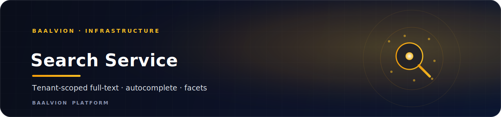
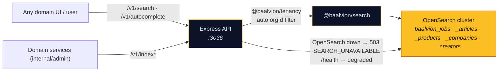

<div align="center">



<br/>
<br/>

**One search API for every domain — a deployable, tenant-scoped HTTP wrapper over `@baalvion/search` (OpenSearch): full-text + fuzzy search, autocomplete, facets, and indexing.**

<p>
  
  
  
  
</p>

<sub><a href="#overview">Overview</a> · <a href="#tenant-scoping">Tenant scoping</a> · <a href="#api">API</a> · <a href="#getting-started">Getting started</a> · <a href="#environment-variables">Env</a> · <a href="#notes--gotchas">Notes</a></sub>

</div>

---

## Overview

**search-service** is a deployable HTTP service over **`@baalvion/search`** (OpenSearch). It is
one search API for every domain — full-text + fuzzy, autocomplete, facets, and indexing — with
built-in **tenant scoping**. It is the stateless query/index layer; OpenSearch holds the data.

- **Domain:** `infrastructure`
- **Port:** `3036` (`PORT`)
- **Engine:** OpenSearch
- **Auth:** verify-only RS256 via `@baalvion/auth-node` — no second issuer
- **Tenancy:** automatic `orgId` scoping via `@baalvion/tenancy`

## Architecture



## Tenant scoping

Every index carries an `orgId` field. Search / facet requests are **automatically filtered to
the caller's tenant** (from `req.auth.orgId` / `X-Tenant-Id`); `super_admin` bypasses, and a
request may opt out with `scoped=false` for cross-tenant search.

## API

All routes are mounted under both `/v1` and `/api/v1`.

| Method | Path | Auth | Purpose |
|--------|------|------|---------|
| `GET` | `/search/:index?q=&from=&size=&fuzzy=&sort=field:asc&scoped=` | user | full-text search |
| `POST` | `/search/:index` | user | search (body: query / filters / sort / highlight / fuzzy) |
| `POST` | `/search/:index/facets` | user | faceted search (term aggregations) |
| `GET` | `/autocomplete/:index?field=&prefix=&size=` | user | typeahead |
| `GET` | `/indices` | user | list searchable indices |
| `POST` | `/index/:index` | internal / admin | index one doc `{ id, doc }` |
| `POST` | `/index/:index/bulk` | internal / admin | bulk index `{ items: [{ id, doc }] }` |
| `PATCH` | `/index/:index/:id` | internal / admin | partial update `{ doc }` |
| `DELETE` | `/index/:index/:id` | internal / admin | delete a doc |
| `POST` | `/admin/indices` | internal / admin | create / ensure all index mappings |
| `GET` | `/health` | none | liveness (`ok` / `degraded` when OpenSearch is unreachable) |

Indices (from `@baalvion/search`): `baalvion_jobs`, `baalvion_articles`, `baalvion_products`,
`baalvion_companies`, `baalvion_creators`.

## Tech Stack

| Concern | Choice |
|---------|--------|
| Runtime / framework | Node.js + Express `^5` |
| Search engine | OpenSearch via `@baalvion/search` (`workspace:*`) |
| Tenancy | `@baalvion/tenancy` (`workspace:*`) |
| Auth | `@baalvion/auth-node` (verify-only RS256) |
| Validation | `zod` |
| Logging | `pino` + `pino-http` |
| Hardening | `helmet`, `cors`, `express-rate-limit` |
| Telemetry / lifecycle | `@baalvion/telemetry`, `@baalvion/graceful-shutdown` |

## Getting Started

### Prerequisites

- Node.js + **pnpm** (workspace package; `@baalvion/*` resolve via `workspace:*`)
- An OpenSearch cluster (single-node is fine for dev)

### Install, build the package, run

```bash
cp .env.example .env

# bring up OpenSearch (dev, single-node, security off):
docker run -d --name baalvion-opensearch -p 9200:9200 \
  -e discovery.type=single-node -e DISABLE_SECURITY_PLUGIN=true \
  -e OPENSEARCH_JAVA_OPTS="-Xms512m -Xmx512m" opensearchproject/opensearch:2

pnpm install
pnpm --filter @baalvion/search build      # build the package this service consumes
pnpm --filter search-service dev          # nodemon → :3036

# production
pnpm --filter search-service start         # node index.js
```

### Tests & smoke

```bash
pnpm --filter search-service test          # node --test test/*.test.js (tenant-scope units; no OpenSearch needed)
node scripts/smoke.mjs                      # live E2E (needs OpenSearch + the service running)
```

## Environment Variables

> `.env*` is gitignored. **Never commit secrets.** See `.env.example` for the full list.

| Variable | Purpose |
|----------|---------|
| `PORT` | HTTP port (default `3036`) |
| OpenSearch URL / auth | cluster endpoint + credentials consumed by `@baalvion/search` |
| `X-Tenant-Id` (header) | tenant fallback when not derivable from the token |
| `X-Internal-Key` (header) | service-to-service auth for index/admin routes |
| RS256 / JWKS settings | token verification via `@baalvion/auth-node` |

## Notes / Gotchas

- **Boots even if OpenSearch is down.** `/health` reports `degraded` (HTTP `503`); search calls
  return `503 SEARCH_UNAVAILABLE` until OpenSearch is reachable again. The internal cluster URL
  is intentionally omitted from the health response.
- **No local datastore / migrations.** This is a stateless query/index layer — the real store is
  OpenSearch. The catalog records `datastores: []` because OpenSearch isn't in the catalog enum
  yet (postgres / redis / clickhouse / …).
- **Scale targets** (e.g. 50M docs, sub-50ms) are an OpenSearch **cluster-sizing** concern;
  this service stays the stateless layer in front of it.

---

<div align="center">
<sub>Part of the <a href="https://github.com/baalvionservice/Baalvion-Project-Infra">Baalvion Platform</a> · centralized identity · domain-driven monorepo</sub>
</div>
