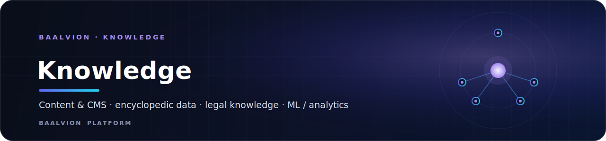
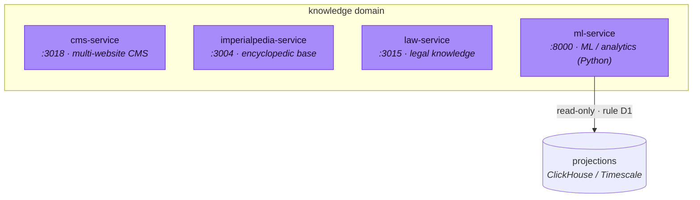

 
 

**The knowledge domain — content & CMS, encyclopedic data, legal knowledge, and ML / analytics serving.**

---

## Domain

The **knowledge** bounded context owns the platform's content and intelligence
surfaces: a multi-website CMS, the Imperialpedia financial-education base, the
legal-knowledge backend, and the ML/analytics serving tier. Per platform rule
**D1**, ML/analytics read from **projections** (e.g. ClickHouse / Timescale) and
never from another service's primary database.

## Services

| Service | Port | Bounded context | Notes |
|---|---|---|---|
| [`cms-service`](cms-service) | `3018` | content management | enterprise multi-website CMS |
| [`imperialpedia-service`](imperialpedia-service) | `3004` | encyclopedic knowledge base | financial education |
| [`law-service`](law-service) | `3015` | legal knowledge | Law Elite Network backend — distinct from the `law-elite` ecosystem sub-stack |
| [`ml-service`](ml-service) | `8000` | ML / analytics serving | Python / FastAPI; reads projections (ClickHouse / Timescale) |

## Domain rules

- **D1** — ML/analytics read from **projections**, never from another service's
  primary database.
- `analytics-platform` is the reserved bounded context for cross-domain analytics.
- Services migrate into this folder per `Backend/MIGRATION.md`.

---

Part of the <a href="https://github.com/baalvionservice/Baalvion-Project-Infra">Baalvion Platform</a> · centralized identity · domain-driven monorepo

