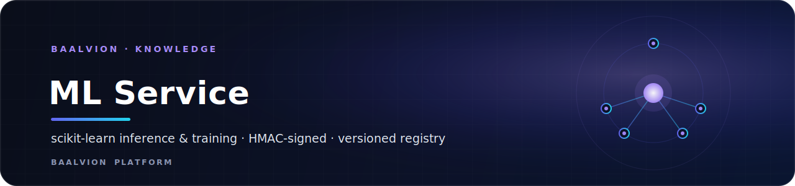
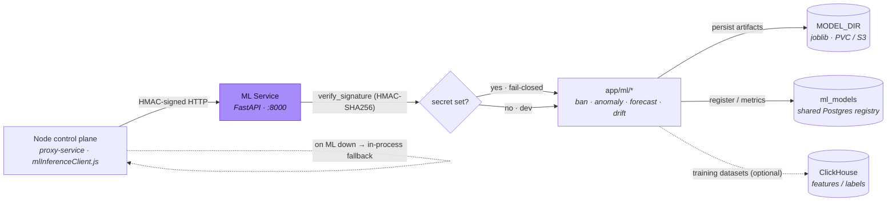

<div align="center">



<br/>
<br/>

**Real scikit-learn / statsmodels inference and training tier for the Baalvion network-intelligence platform — HMAC-signed, with a shared versioned model registry.**

<p>
  
  
  
  
  
  
</p>

<sub><a href="#overview">Overview</a> · <a href="#architecture">Architecture</a> · <a href="#tech-stack">Tech Stack</a> · <a href="#getting-started">Getting started</a> · <a href="#configuration">Configuration</a> · <a href="#project-structure">Structure</a> · <a href="#endpoints">Endpoints</a> · <a href="#model-registry">Model registry</a> · <a href="#security">Security</a> · <a href="#deploy">Deploy</a> · <a href="#notes--gotchas">Notes</a></sub>

</div>

---

## Overview

**Baalvion ML Service** (`Baalvion ML Service`, v1.0.0) is the real
scikit-learn / statsmodels inference and training tier of the platform's
network-intelligence stack. The Node control plane delegates heavier models to
this service over HMAC-signed HTTP, and **falls back to its in-process models when
this service is unavailable** — so the ML tier is an *accelerator, never a gate*.

It lives in the **knowledge** domain of the Baalvion monorepo at
`Backend/services/knowledge/ml-service`. The Node caller is
`mlInferenceClient.js` in
[`Backend/services/infrastructure/proxy-service`](../../infrastructure/proxy-service/service/mlInferenceClient.js),
whose HMAC signer this service mirrors byte-for-byte.

- **Listen port:** `:8000` (Uvicorn)
- **Runtime:** Python 3.11 · FastAPI · Uvicorn (`--workers 2` in the container)
- **Auth:** HMAC-SHA256 request signing (parity with the Node signer), **fail-closed**
  when a secret is set, open in unsigned dev mode
- **Registry:** writes into the platform's shared `ml_models` table
  (`framework='sklearn'`) so Node + Python models share one versioned catalogue
- **Resilience:** boots and serves without a database or ClickHouse — the registry
  falls back to an in-memory version counter

## Architecture

### Model

A thin FastAPI app (`app/main.py`) exposes liveness/readiness, a model catalogue,
four inference endpoints, and one training endpoint. Each non-health route depends
on `verify_signature` (HMAC). Inference and training are pure functions over the
`app/ml/*` model modules; persisted artifacts are `joblib` files under `MODEL_DIR`,
and model metadata is written to the shared Postgres `ml_models` registry.

### Request flow



### Models

| Module | Endpoint | Technique |
|---|---|---|
| `app/ml/ban_model.py` | `POST /predict/ban`, `POST /train/ban` | `LogisticRegression` pipeline (ban probability) |
| `app/ml/anomaly.py` | `POST /detect/anomaly` | robust-z + `IsolationForest` score |
| `app/ml/forecast.py` | `POST /forecast` | Holt-Winters (statsmodels), with trend/seasonal fallback |
| `app/ml/drift.py` | `POST /drift` | PSI + KS drift assessment |

## Tech Stack

| Concern | Choice | Version |
|---|---|---|
| Web framework | [FastAPI](https://fastapi.tiangolo.com) | `0.115.6` |
| ASGI server | `uvicorn[standard]` | `0.34.0` |
| Validation | `pydantic` | `2.10.4` |
| ML | `scikit-learn` | `1.6.0` |
| Forecasting | `statsmodels` | `0.14.4` |
| Numerics | `numpy` | `2.2.1` |
| Artifacts | `joblib` | `1.4.2` |
| Postgres driver | `psycopg2-binary` | `2.9.10` |
| Metrics | `prometheus-client` | `0.21.1` |
| Tests (dev) | `pytest`, `httpx` | `9.0.3` / `0.28.1` |
| Runtime | Python | `3.11-slim` (container) |

## Getting Started

**Prerequisites:** Python 3.11. A database and ClickHouse are **optional** — the
service boots without them (registry falls back to an in-memory counter; readiness
reports their presence).

```bash
# From this directory (Backend/services/knowledge/ml-service)
pip install -r requirements.txt

# Run on http://localhost:8000
uvicorn app.main:app --host 0.0.0.0 --port 8000

# Tests (pure-stat tests run on stdlib; the sklearn training test auto-skips if absent)
pip install -r requirements-dev.txt
pytest -q
```

## Configuration

Environment-driven (12-factor). In `production` the service **fails fast** at
startup if `ML_SERVICE_SECRET` is unset or matches a known dev placeholder.

| Variable | Default | Purpose |
|---|---|---|
| `ML_SERVICE_SECRET` | `""` | HMAC shared secret with the Node signer. Unset ⇒ unsigned dev mode |
| `ML_SIGNATURE_TTL_S` | `300` | Replay window (seconds) for signed requests |
| `DATABASE_URL` | `""` | Postgres for the `ml_models` registry (same DB as the platform) |
| `CLICKHOUSE_URL` | `""` | ClickHouse HTTP interface for training datasets / feature MVs (optional) |
| `CLICKHOUSE_DB` | `baalvion` | ClickHouse database name |
| `MODEL_DIR` | `/var/lib/baalvion/models` | Where `joblib` artifacts are stored (PVC / S3 mount) |
| `BAN_LABEL_THRESHOLD` | `0.15` | Label threshold for ban training |
| `MIN_TRAIN_ROWS` | `50` | Minimum rows before training proceeds |
| `PROMOTE_AUC` | `0.6` | AUC at/above which a newly trained model is auto-promoted to `active` |
| `APP_ENV` / `NODE_ENV` / `ENV` | — | Any one set to `production` enables the secret fail-fast |

## Project Structure

```
ml-service/
├── app/
│   ├── main.py            # FastAPI app: schemas, health/readiness, inference + training routes
│   ├── config.py          # 12-factor config + production secret fail-fast
│   ├── security.py        # HMAC-SHA256 verify_signature dependency (Node parity)
│   ├── features.py        # load_ban_training_set — feature/label assembly
│   ├── registry.py        # shared ml_models registry (Postgres) + in-memory fallback
│   └── ml/
│       ├── ban_model.py   # LogisticRegression pipeline (predict / train / persist / load)
│       ├── anomaly.py     # robust-z + IsolationForest
│       ├── forecast.py    # Holt-Winters (statsmodels) + fallback
│       └── drift.py       # PSI + KS drift
├── tests/test_ml.py       # feature order, robust-z, PSI, forecast, HMAC parity, ban training
├── requirements.txt · requirements-dev.txt
└── Dockerfile             # python:3.11-slim, non-root (uid 10001), HEALTHCHECK on /healthz
```

## Endpoints

All endpoints except `/healthz` and `/readyz` require a valid HMAC signature when
`ML_SERVICE_SECRET` is set.

| Method | Path | Purpose |
|---|---|---|
| `GET` | `/healthz` | Liveness |
| `GET` | `/readyz` | Readiness (reports ClickHouse / DB presence) |
| `GET` | `/models` | Model registry catalogue |
| `POST` | `/predict/ban` | Ban probability (LogisticRegression) |
| `POST` | `/detect/anomaly` | robust-z + IsolationForest anomaly score |
| `POST` | `/forecast` | Holt-Winters forecast (`series`, `horizon`, `period`) |
| `POST` | `/drift` | PSI + KS drift assessment (`reference` vs `recent`) |
| `POST` | `/train/ban` | Train, register, and (auto-)promote the ban model |

## Model Registry

`app/registry.py` writes model metadata into the platform's shared `ml_models`
table with `framework='sklearn'` and `params` pointing at the `joblib` artifact, so
Node and Python models share one versioned, promotable catalogue. On training,
`/train/ban` computes a new version, persists the artifact, and — if AUC ≥
`PROMOTE_AUC` — archives the previous `active` model and promotes the new one
(otherwise it is registered as `shadow`). Per-version metrics are recorded to
`ml_model_metrics`. With no `DATABASE_URL`, the registry uses an in-memory version
counter and reports `persisted: false`.

## Security

- **HMAC request signing** — `security.py` validates
  `HMAC_SHA256(secret, "{ts}.{rawBody}")` (hex) in `X-Baalvion-Signature` with
  `X-Baalvion-Ts`, enforcing a replay window (`ML_SIGNATURE_TTL_S`, default 5 min)
  and constant-time comparison. This mirrors the Node `mlInferenceClient.sign()`
  exactly. It **fails closed** when a secret is configured and open only when none
  is set (dev).
- **Production secret fail-fast** — booting with `APP_ENV`/`NODE_ENV`/`ENV` =
  `production` and an unset or placeholder `ML_SERVICE_SECRET` exits the process.
- **Container hardening** — the image runs as a non-root user (`uid 10001`) with a
  writable `MODEL_DIR` only, and ships a `/healthz` `HEALTHCHECK`.

## Deploy

The Kubernetes base manifest is
[`Backend/infra/k8s/base/ml-service.yaml`](../../../infra/k8s/base/ml-service.yaml)
— Deployment, PersistentVolumeClaim, Service, HorizontalPodAutoscaler, and a
PodDisruptionBudget. Build the image with:

```bash
docker build -t ghcr.io/baalvion/ml-service .
```

## Notes / Gotchas

- **The ML tier accelerates, it does not gate.** The Node control plane falls back
  to in-process models when this service is down — keep that contract intact.
- **No DB / ClickHouse required to run.** Both are optional; readiness reports their
  presence, and the registry degrades to an in-memory counter.
- **Signer parity is load-bearing.** The HMAC scheme must stay identical to the Node
  `mlInferenceClient` signer; both sides must share `ML_SERVICE_SECRET`.
- **Artifacts need durable storage in production.** Point `MODEL_DIR` at a PVC or
  S3-mounted path so promoted models survive restarts.

---

<div align="center">
<sub>Part of the <a href="https://github.com/baalvionservice/Baalvion-Project-Infra">Baalvion Platform</a> · centralized identity · domain-driven monorepo</sub>
</div>
