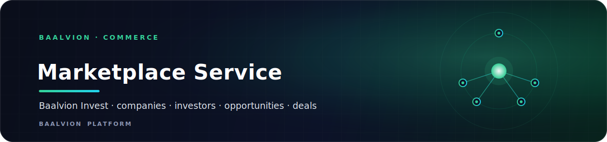
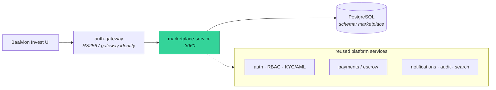

<div align="center">



<br/>
<br/>

**Baalvion Invest — the investment marketplace: companies, investors, opportunities and end-to-end deals (deal room, NDAs, due diligence, term sheets, e-signatures and escrow).**

<p>
  
  
  
  
</p>

<sub><a href="#overview">Overview</a> · <a href="#architecture">Architecture</a> · <a href="#getting-started">Getting started</a> · <a href="#api">API</a> · <a href="#configuration">Configuration</a> · <a href="#project-structure">Structure</a> · <a href="#security">Security</a></sub>

</div>

---

## Overview

`marketplace-service` is the **Baalvion Invest** domain service inside the Baalvion
**pnpm + Turborepo monorepo** (`Backend/services/marketplace`). It owns the data and workflows
for the investment marketplace: company and investor profiles, deal opportunities, and the full
deal lifecycle. Cross-cutting concerns — auth, RBAC, KYC/AML, payments/escrow, notifications,
audit, search, CMS — are **reused** from existing platform services rather than re-implemented here.

- **Runtime:** Node + **Express 5** + **Sequelize** + **PostgreSQL** (CommonJS)
- **Port:** `3060` (override with `PORT`)
- **Schema:** `marketplace` — 28 tables created by `migrations/001_init.sql`
- **Auth:** RS256 via `@baalvion/auth-node` — the verifier is created **lazily** on the first
  protected request, so the service still boots in dev without a key configured
- **Routes** are mounted at both `/v1` and `/api/v1`

## Architecture



The service connects as the non-superuser `baalvion_app` role; tenant isolation is enforced at
the database via Postgres Row-Level Security (`migrations/002_rls_tenant_isolation.sql`). Tables
are created and evolved by migrations only — `index.js` never auto-alters the schema.

## Getting Started

`marketplace-service` is a workspace package; install from the monorepo root.

```bash
pnpm install                 # from monorepo root (resolves workspace:* deps)
npm run migrate              # apply migrations/*.sql to the marketplace schema
npm start                   # boots on :3060  (npm run dev for nodemon watch)
```

| Script | Action |
|---|---|
| `npm start` | `node index.js` — start the service |
| `npm run dev` | `nodemon index.js` — watch mode |
| `npm run migrate` | `node scripts/migrate.js` — apply SQL migrations |
| `npm test` | `node --test` — run the unit suite (query · authz · validate · matching) |

> **pm2 note:** `ecosystem.config.js` points `NODE_PATH` at `ir-service`'s installed
> `node_modules` (its deps are a strict subset) so the service runs on-host without a dedicated
> install. Replace with a real `pnpm -F marketplace-service install` when promoting to CI/containers.

## API

All routes require a valid platform identity except public opportunity discovery.

| Mount | Resource | Notes |
|---|---|---|
| `/v1/companies` · `/api/v1/companies` | Company profiles | Full CRUD (`POST` · `GET` · `GET /:id` · `PATCH /:id` · `DELETE /:id` archive); profile/founders/documents sub-resources; cap table at `/:id/cap-table` |
| `/v1/investors` | Investor profiles | Full CRUD (`POST` · `GET` list · `GET /:id` · `PATCH /:id` · `DELETE /:id` archive); profile/preferences/accreditation |
| `/v1/opportunities` | Deal opportunities | Public discovery + `POST` · `PATCH /:id` (draft) · `DELETE /:id` (draft = delete, live = archive) · `/:id/publish`; AI matches at `/recommended` |
| `/v1/deals` | Deal lifecycle | Open, list, stage transitions |
| `/v1/deals/:dealId/messages` · `/members` | Deal room | Threaded messaging + membership |
| `/v1/deals/:dealId/nda` · `/documents` · `/access-grants` | Document room | NDA, document requests, access grants |
| `/v1/deals/:dealId/due-diligence` | Due diligence | Checklist items + status |
| `/v1/deals/:dealId/term-sheets` · `/signatures` | Term sheets | Versioned term sheets + e-signature flow |
| `/v1/deals/:dealId/escrow` | Escrow | Create, fund, release |
| `/v1/admin` | Admin | Platform administration |
| `GET /version` | Version discovery | `{ service, current, supported }` |
| `GET /health` | Liveness | `{ status, timestamp }` |

### Conventions

Cross-cutting request/response behavior is identical across every resource:

- **Validation** — request bodies are validated with **Zod** via the `validate` middleware
  (`middleware/validate.js`); schemas live per module in `modules/<x>/schemas.js`. A failure
  returns `400` `{ error: { code: "VALIDATION_ERROR", details } }` *before* any DB call.
- **Pagination** — list endpoints accept `?page` (1-based) and `?limit` (default `20`, max
  `100`; admin lists default `50`, max `200`). Responses carry
  `data: { items, total, page, limit, totalPages }`.
- **Sorting** — `?sort=<column>&order=asc|desc` (aliases `?sortBy` / `?dir`). Sortable columns
  are **allowlisted per resource** — an unknown column is a `400` `INVALID_SORT`, never an
  unguarded `ORDER BY`. Defaults: most resources `created_at DESC`, opportunities
  `published_at DESC`.
- **Versioning** — URI-based: the v1 router is mounted at `/v1` and `/api/v1`. Every response
  carries an `X-API-Version` header and `meta.version`; supported versions are advertised at
  `GET /version` and in `X-API-Supported-Versions`. Changes are additive within a version; a
  breaking revision mounts a new `/v2` prefix.
- **Layering** — routes are thin controllers (validate → delegate → shape response); all
  business logic and authorization live in `service/*Service.js`.

## Configuration

Configuration is environment-driven (`config/appConfig.js`); copy `.env` from the example.

| Variable | Default | Purpose |
|---|---|---|
| `PORT` | `3060` | HTTP listen port |
| `NODE_ENV` | `development` | Runtime environment |
| `CORS_ORIGINS` | `http://localhost:3000` | Comma-separated allowed origins |
| `DB_HOST` / `DB_PORT` | `127.0.0.1` / `5432` | PostgreSQL host / port |
| `DB_NAME` / `DB_USER` / `DB_PASSWORD` | `baalvion_db` / `baalvion` / — | Database credentials |
| `JWT_PUBLIC_KEY` | — | RS256 public key (or `BAALVION_JWKS_URI` for JWKS) |
| `JWT_ISSUER` / `JWT_AUDIENCE` | `baalvion-auth` / `baalvion-platform` | Token issuer / audience |

## Project Structure

```
marketplace-service/
├── index.js                # Express boot, helmet/cors, /health, /version, /v1 + /api/v1 mounts
├── config/appConfig.js     # env-driven config (port, schema, db, jwt, pagination, versions)
├── routes/v1.js            # mounts the domain modules
├── modules/                # companies · investors · opportunities · deals · admin · matching
│   └── <x>/                #   routes.js (thin controllers) + schemas.js (Zod validation)
├── service/                # domain logic: company · investor · opportunity · deal services
├── models/                 # Sequelize models (schema: marketplace)
├── middleware/             # validate (Zod) · apiVersion · authMiddleware · errorMiddleware
├── migrations/             # 001_init.sql (28 tables) · 002_rls_tenant_isolation.sql
├── scripts/migrate.js      # SQL migration runner
├── integrations/           # reused-service clients (KYC/AML)
├── utils/                  # query (pagination+sorting) · authz · response · errors
├── tests/                  # node --test unit tests (query · authz · validate · matching)
├── ecosystem.config.js     # pm2 process definition
└── package.json
```

## Security

- **Centralized identity:** RS256 via `@baalvion/auth-node` — no second JWT issuer.
- **Tenant isolation at the database:** Postgres RLS (`002_rls_tenant_isolation.sql`); the
  service connects as the non-superuser `baalvion_app` role so RLS is actually enforced.
- **Hardened HTTP:** `helmet` security headers, explicit CORS allow-list, 2 MB JSON body cap.
- **Schema is migration-owned:** the service never auto-alters tables at boot.

---

<div align="center">
<sub>Part of the <a href="https://github.com/baalvionservice/Baalvion-Project-Infra">Baalvion Platform</a> · centralized identity · domain-driven monorepo</sub>
</div>
