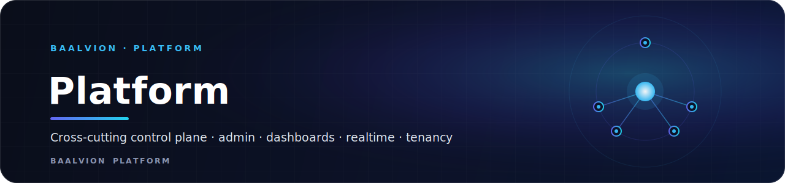
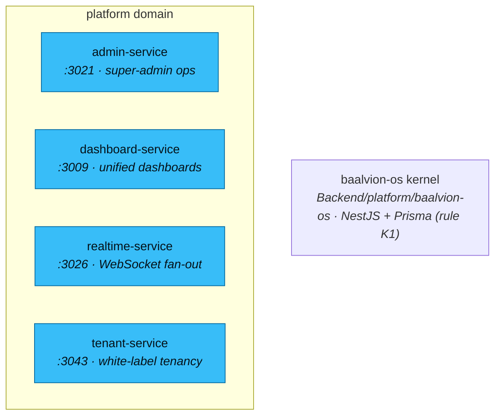

 
 

**The platform domain — the cross-cutting control plane: admin surfaces, unified dashboards, realtime fan-out, and white-label tenancy.**

---

## Domain

The **platform** bounded context is the platform's control plane — the
cross-cutting surfaces every other domain leans on rather than a single product.
It groups super-admin operations, the unified dashboards, the realtime event/metric
fan-out for the admin console, and the white-label tenant registry. All services
verify tokens against the central RS256/JWKS authority and never stand up a second
issuer.

## Services

| Service | Port | Bounded context | Notes |
|---|---|---|---|
| [`admin-service`](admin-service) | `3021` | platform administration | super-admin ops, impersonation issuer (allowlisted), platform stats |
| [`dashboard-service`](dashboard-service) | `3009` | unified dashboards | |
| [`realtime-service`](realtime-service) | `3026` | realtime metrics / event fan-out | hand-rolled RFC 6455 WebSocket for the admin console |
| [`tenant-service`](tenant-service) | `3043` | white-label tenancy | multi-tenant registry, per-app branding, custom-domain verification, entitlements |

## Domain rules

- The **`baalvion-os`** kernel (NestJS + Prisma) lives at
  `Backend/platform/baalvion-os/`. It is the **only** place Prisma is permitted
  (rule **K1**) and owns the relational schema lifecycle. `baalctl` (the developer
  CLI) lives at `Backend/platform/cli/`.
- `abuse-platform` / `audit-platform` / `notification-platform` are reserved
  bounded contexts for trust/safety, audit, and notification orchestration.
- Services migrate into this folder per `Backend/MIGRATION.md`.

---

Part of the <a href="https://github.com/baalvionservice/Baalvion-Project-Infra">Baalvion Platform</a> · centralized identity · domain-driven monorepo

