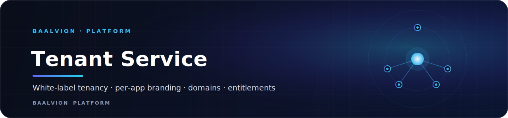
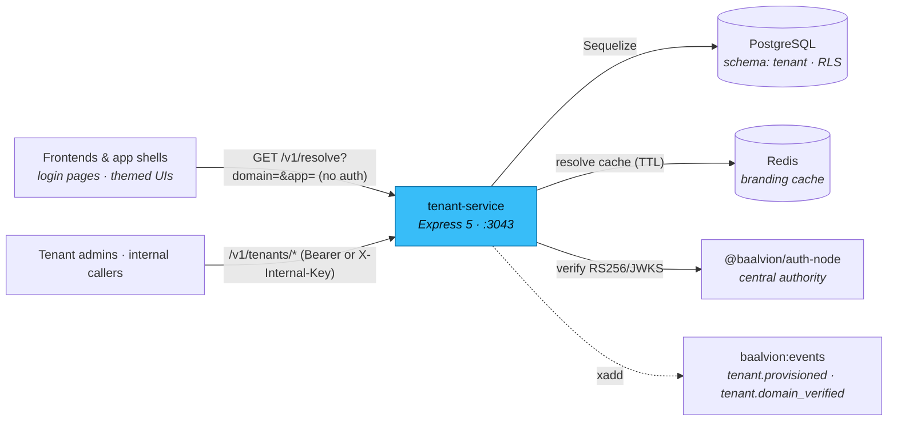

<div align="center">



<br/>
<br/>

**The platform white-label tenancy service — multi-tenant registry, per-app branding, custom-domain verification, and feature entitlements, built on the central Baalvion identity platform.**

<p>
  
  
  
  
  
  
</p>

<sub><a href="#overview">Overview</a> · <a href="#architecture">Architecture</a> · <a href="#data-model">Data model</a> · <a href="#tech-stack">Tech Stack</a> · <a href="#getting-started">Getting started</a> · <a href="#configuration">Configuration</a> · <a href="#project-structure">Structure</a> · <a href="#api-v1">API</a> · <a href="#security">Security</a> · <a href="#notes--gotchas">Notes</a></sub>

</div>

---

## Overview

**Baalvion Tenant / White-Label Service** (`tenant-service`, v1.0.0) is the
platform's white-label control plane. It generalizes the white-label config that
lived inside `proxy-service` into a platform-wide service every app can use —
a tenant registry, per-app branding, custom-domain verification, and feature
entitlements (Cluster 9, *White-Label Tenant*).

It lives in the **platform** domain of the Baalvion monorepo at
`Backend/services/platform/tenant-service`, verifies tokens against the central
RS256/JWKS authority via `@baalvion/auth-node`, and **does not stand up a second
issuer**. Its public `GET /v1/resolve` endpoint is what every frontend login page
and app shell calls to theme itself by domain.

- **Listen port:** `:3043` (`PORT`)
- **Schema:** `tenant` (own isolated PostgreSQL schema)
- **Auth:** verify-only RS256/JWKS via `@baalvion/auth-node` (rule R2 — RS256-only;
  fails closed in production with no public key)
- **Events:** emits `tenant.provisioned` and `tenant.domain_verified` onto the
  platform event bus (`baalvion:events`)

## Architecture

### Model

An Express 5 app (`index.js`) wires Helmet, CORS, a global IP rate limiter, request
context, and the `/v1` (also mounted at `/api/v1`) router. Routes are thin and
delegate to `services/*` (tenants, branding, domains, entitlements, events);
persistence is Sequelize over PostgreSQL; Redis caches public branding resolutions.
The data tables enforce **row-level security** per tenant (migration 002, using the
canonical `@baalvion/tenancy` policy).

### Request flow



## Data Model

| Entity | Purpose |
|---|---|
| **Tenant** | The white-label unit: slug, name, `status` (`active`/`suspended`/`archived`), `plan`, optional `parent_tenant_id` (reseller hierarchy), owner org/user |
| **Branding** | Per tenant **per app** (`default` + per-app overrides): brand name, logos, color tokens, login background, custom CSS, support/email-from |
| **Domain** | A custom domain with a DNS-TXT verification token; `verify()` runs a real `dns.resolveTxt` check before marking it verified (admins may force-verify in non-prod) |
| **Entitlement** | Feature flags + quotas per tenant; `check()` / `consume()` gate features and enforce limits atomically |

### Key flows

- **Provision** a complete white-label tenant in one call
  (`POST /v1/tenants/provision`): tenant + default branding + seed entitlements.
- **Resolve** branding by domain — the public, no-auth endpoint every login page /
  app shell calls to theme itself: `GET /v1/resolve?domain=acme.example.com&app=login`
  → brand / colors / CSS (cached briefly in Redis). This replaces the proxy's
  `resolveByDomain` and works for any app, not just proxy.

## Tech Stack

| Concern | Choice | Version |
|---|---|---|
| Runtime | Node.js | 20+ |
| Web framework | [Express](https://expressjs.com) | `^5.2.1` |
| ORM | `sequelize` (+ `pg`, `pg-hstore`) | `^6.37.8` |
| Database | PostgreSQL | schema `tenant` |
| Cache | `ioredis` | `^5.6.1` |
| Auth | `@baalvion/auth-node` (workspace, verify-only RS256/JWKS) | `workspace:*` |
| Telemetry | `@baalvion/telemetry`, `@baalvion/graceful-shutdown` | `workspace:*` |
| Security | `helmet`, `express-rate-limit`, `cors` | `^8.1.0` / `^7.5.0` / `^2.8.6` |
| Validation | `zod` | `^3.24.2` |
| Logging | `pino`, `pino-http` | `^10.3.1` / `^11.0.0` |
| IDs | `uuid` | `^11.1.0` |
| Dev | `nodemon` | `^3.1.14` |
| Package manager | pnpm (monorepo workspace) | — |

## Getting Started

**Prerequisites:** Node 20+, PostgreSQL (`:5432`) and Redis (`:6379`) reachable, and
the monorepo workspace installed (this service depends on workspace packages such as
`@baalvion/auth-node`).

```bash
# From the monorepo root
pnpm install

# Apply schema + RLS (uses $DATABASE_URL via psql)
pnpm --filter tenant-service migrate

# Run on :3043
pnpm --filter tenant-service start     # node index.js
pnpm --filter tenant-service dev       # nodemon

# End-to-end smoke: provision → branding → domain verify → resolve → quotas
pnpm --filter tenant-service smoke     # node scripts/smoke.mjs
```

Health: `GET /health` reports `rs256` and Redis status; `GET /` returns the service
surface.

## Configuration

Server-only configuration, env-driven (defaults from `config/appConfig.js`). In
`production` the service **fails fast** at startup if neither `JWT_PUBLIC_KEY` nor a
non-placeholder `JWT_ACCESS_SECRET` is set. Never commit real secrets.

| Variable | Default | Purpose |
|---|---|---|
| `PORT` | `3043` | Listen port |
| `NODE_ENV` | `development` | Enables the production secret fail-fast |
| `CORS_ORIGINS` | `localhost:3000,3030,8080` | Comma-separated allowed origins |
| `JWT_PUBLIC_KEY` / `JWT_ACCESS_SECRET` | — | RS256 verification material (one required in prod) |
| `JWT_ISSUER` / `JWT_AUDIENCE` | `baalvion-auth` / `baalvion-platform` | Expected token issuer / audience |
| `INTERNAL_API_KEY` | `""` | Shared key for the `X-Internal-Key` service-to-service path |
| `DB_HOST` / `DB_PORT` / `DB_NAME` / `DB_USER` / `DB_PASSWORD` | `localhost` / `5432` / `baalvion_db` / `baalvion` / `""` | PostgreSQL connection |
| `DB_SCHEMA` | `tenant` | Service schema |
| `REDIS_HOST` / `REDIS_PORT` / `REDIS_PASSWORD` | `localhost` / `6379` / `""` | Redis connection |
| `EVENT_BUS_STREAM` | `baalvion:events` | Redis Stream for emitted events |
| `DOMAIN_VERIFY_PREFIX` | `baalvion-verify` | DNS-TXT prefix used to prove custom-domain ownership |
| `RESOLVE_CACHE_TTL` | `60` | Public branding-resolve cache TTL (seconds) |
| `IP_RATE_LIMIT_MAX` | `1000` | Global IP rate limit (req/min) |
| `RESOLVE_RATE_LIMIT_MAX` | `120` | Rate limit for the public `/resolve` endpoint (req/min per IP) |

## Project Structure

```
tenant-service/
├── index.js                 # Express 5 app: Helmet, CORS, IP rate limit, /v1 (+ /api/v1), graceful shutdown
├── config/                  # appConfig (env + prod fail-fast), jwt (RS256 verify), redis
├── routes/                  # v1.js → tenantRoutes.js (public /resolve + admin-gated tenant ops)
├── controllers/             # tenantController.js (request parsing + responses)
├── services/                # tenantService, brandingService, domainService, entitlementService, events
├── models/                  # Sequelize: tenant, tenantBranding, tenantDomain, tenantEntitlement
├── middleware/              # authMiddleware (internalOrUser), guards (requireTenantAdmin), requestContext, errors
├── migrations/
│   ├── 001_tenant_schema.sql        # tenants / branding / domains / entitlements
│   └── 002_rls_tenant_isolation.sql # @baalvion/tenancy RLS (FORCE + tenant_isolation policy)
├── scripts/smoke.mjs        # full provision → resolve → quotas E2E
└── Dockerfile
```

## API (`/v1`)

Mounted at both `/v1` and `/api/v1`.

| Area | Routes |
|---|---|
| **Public** | `GET /resolve?domain=&app=` *(no auth, rate-limited)* |
| **Tenants** | `POST /tenants`, `POST /tenants/provision`, `GET /tenants`, `GET/PATCH/DELETE /tenants/:id`, `POST /tenants/:id/status` |
| **Branding** | `GET/PUT /tenants/:id/branding` |
| **Domains** | `GET/POST /tenants/:id/domains`, `POST /tenants/:id/domains/:domainId/verify`, `.../primary`, `DELETE …` |
| **Entitlements** | `GET/PUT /tenants/:id/entitlements`, `GET …/:featureKey/check`, `POST …/:featureKey/consume`, `DELETE …` |

Everything below `/resolve` requires a tenant-admin role (or a valid
`X-Internal-Key`).

## Security

- **Centralized, verify-only auth.** `config/jwt.js` verifies access tokens via
  `@baalvion/auth-node` and is **RS256-only** (rule R2 — non-RS256 algorithms are
  rejected); in production it **fails closed** if no RS256 public key is configured.
  No second issuer.
- **Layered authorization.** `internalOrUser` accepts either a Bearer token or the
  `X-Internal-Key`; `requireTenantAdmin` then requires a tenant-admin role or a
  `tenant:*` permission. Only `GET /v1/resolve` is public.
- **Row-level security.** Tenant tables enable and **FORCE** RLS with the canonical
  `@baalvion/tenancy` `tenant_isolation` policy (migration 002), scoping rows to
  `app.current_tenant` with a hardened bypass form.
- **Hardened HTTP surface.** Helmet, CORS allow-listing, a global IP rate limiter
  (default 1000 req/min) and a tighter limiter on the public `/resolve` endpoint
  (default 120 req/min) to block scraping / DNS enumeration. JSON body limit `2mb`.
- **Production secret fail-fast** at boot (see Configuration).

## Notes / Gotchas

- **`/resolve` is the public seam.** It is unauthenticated by design (every login
  page calls it) — keep it rate-limited and return only brand/colors/CSS, never
  tenant internals.
- **Domain verification is real.** `verify()` performs an actual `dns.resolveTxt`
  lookup for the `DOMAIN_VERIFY_PREFIX` token; force-verify is allowed only in
  non-production.
- **RLS depends on the app role.** The policy keys on `app.current_tenant` /
  `app.tenant_bypass` and is inert unless the connecting role is provisioned per the
  `@baalvion/tenancy` convention (non-superuser `baalvion_app`).
- **Run migrations before first boot.** `index.js` does `sync({ alter: false })`; it
  will not create the RLS policies — run `pnpm --filter tenant-service migrate`.
- **Events are best-effort.** Only `tenant.provisioned` and `tenant.domain_verified`
  are emitted; publishes are non-blocking and log-and-continue if Redis is down.

---

<div align="center">
<sub>Part of the <a href="https://github.com/baalvionservice/Baalvion-Project-Infra">Baalvion Platform</a> · centralized identity · domain-driven monorepo</sub>
</div>
