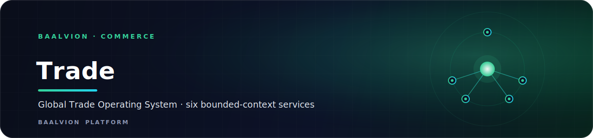
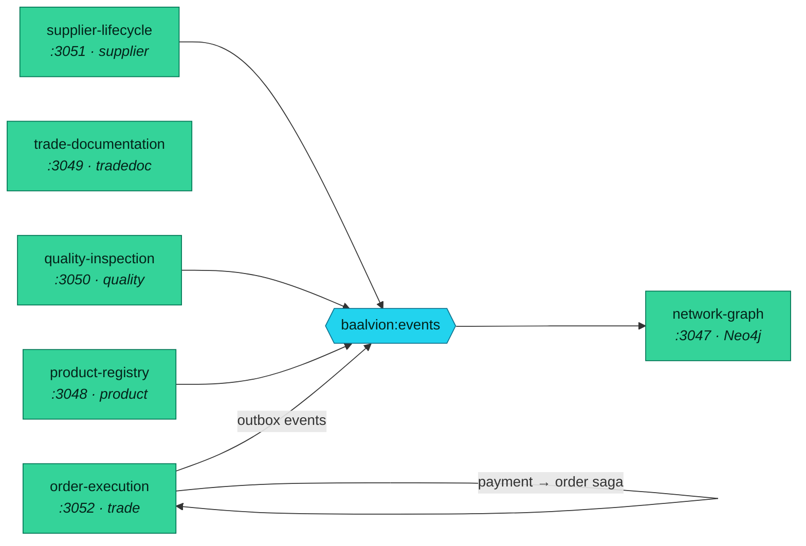

<div align="center">



<br/>
<br/>

**The Global Trade Operating System — six bounded-context services for product registry, trade documents, quality inspection, supplier lifecycle, order execution and the relationship graph.**

<p>
  
  
  
  
</p>

<sub><a href="#overview">Overview</a> · <a href="#services">Services</a> · <a href="#conventions">Conventions</a> · <a href="#run-locally">Run locally</a></sub>

</div>

---

## Overview

`trade` is the **GTOS (Global Trade Operating System)** bounded context in the Baalvion
**pnpm + Turborepo monorepo** (`Backend/services/trade`). It is six independently deployable
services scaffolded per the platform conventions of
[`commerce/trade-service`](../commerce/trade-service/) — Express 5 + Sequelize,
`@baalvion/auth-node` RS256-only auth, `@baalvion/tenancy` RLS, and `@baalvion/sdk` events
over the Redis Streams bus `baalvion:events`. It aligns to
`docs/architecture/GTOS/07-implementation-execution-plan.md`.



## Services

| Service | Port | Store | Schema | Purpose |
|---|---|---|---|---|
| [`network-graph-service`](network-graph-service/) | `3047` | Neo4j 5 | (graph) | Relationship graph, sanctions path-finding, visibility gating |
| [`product-registry-service`](product-registry-service/) | `3048` | Postgres | `product` | Product / HS-code master + document requirements |
| [`trade-documentation-service`](trade-documentation-service/) | `3049` | Postgres + S3 | `tradedoc` | Invoice / B-L / CoO / LC docs, e-sign, dossier |
| [`quality-inspection-service`](quality-inspection-service/) | `3050` | Postgres | `quality` | Inspection orders, AQL, defects, CAPA |
| [`supplier-lifecycle-service`](supplier-lifecycle-service/) | `3051` | Postgres | `supplier` | Onboarding → qualification → scorecard → offboarding |
| [`order-execution-service`](order-execution-service/) | `3052` | Postgres | `trade` | Order lifecycle state machine + transactional outbox + payment → order saga |

## Conventions

- **R1 — isolation:** every tenant table has `ENABLE + FORCE ROW LEVEL SECURITY`; services
  connect as `baalvion_app` (non-superuser). `models/index.js` patches `sequelize.transaction`
  to set `app.current_tenant` / `app.tenant_bypass` from the request ALS context.
- **R2 — auth:** `middleware/auth.js` accepts only RS256 (JWKS) or HMAC gateway identity — no HS256.
- **R3 — consistency:** `order-execution-service` writes the business row + `outbox_events` in one
  transaction; `outboxPublisher` is the sole publisher (publish-iff-commit); `processed_webhooks`
  gives crash-safe idempotency; the finance webhook + bus consumer cascade payment → order state.
- **Events:** `gtos.<domain>.<entity>.<verb>.<version>` over `baalvion:events`. Money-critical
  flows use the outbox; non-critical domain events use fire-and-forget `emitSafe` (fail-open).

### Folder layout (per service)

```
<service>/
├── package.json            workspace deps (@baalvion/auth-node|tenancy|sdk)
├── .env.example            full env schema
├── Dockerfile              repo-root turbo-prune build
├── ecosystem.config.js     pm2 process def
├── migrate.js              SQL runner (Postgres) / Cypher runner (graph)
├── index.js                Express boot + /health, /health/live, /health/ready
├── config/                 env-driven config (+ neo4j.js for the graph service)
├── middleware/             requestContext, error, auth, tenant (RLS), rateLimit
├── models/                 Sequelize models + GUC-bridge index.js (graph: graph/queries.js)
├── migrations/             001_init.sql (+ RLS policies) / 001_constraints.cypher
├── routes/ · controller/   v1 routes + zod-validated request handlers
├── services/               pure domain logic (saga, lifecycle, projection, outbox publisher)
├── platform/               sdk.js (single SDK instance) + events.js (producer catalog)
└── workers/                eventConsumer.js (idempotent, trace-scoped)
```

## Run locally

```bash
# 1. Prereq: app role + schemas. Migrations run as the privileged owner role.
psql "$ADMIN_DATABASE_URL" -v app_pw=... -f Backend/database/migrations/027_app_role.sql

# 2. Per service:
cd Backend/services/trade/<service>
cp .env.example .env
MIGRATION_DB_USER=baalvion node migrate.js   # owner role for DDL/RLS
node index.js                                # boots on its port

# Or all six via pm2:
pm2 start Backend/services/trade/ecosystem.gtos.config.js

# Or Docker (shared postgres + redis must be up):
docker compose -f Backend/services/trade/docker-compose.gtos.yml up -d
```

## Wiring TODO (post-scaffold)

- Register services in the service catalog + gateway routes (`/v1/network`, `/v1/products`,
  `/v1/trade-docs`, `/v1/quality`, `/v1/suppliers`, `/v1/orders`).
- Add to `pnpm-workspace.yaml` so `workspace:*` deps resolve.
- `trade-documentation`: implement S3 persistence of the issued snapshot (WORM at V2).
- `network-graph`: backfill nodes/edges from existing order/supplier/product rows.

---

<div align="center">
<sub>Part of the <a href="https://github.com/baalvionservice/Baalvion-Project-Infra">Baalvion Platform</a> · centralized identity · domain-driven monorepo</sub>
</div>
