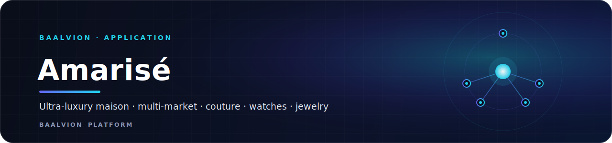
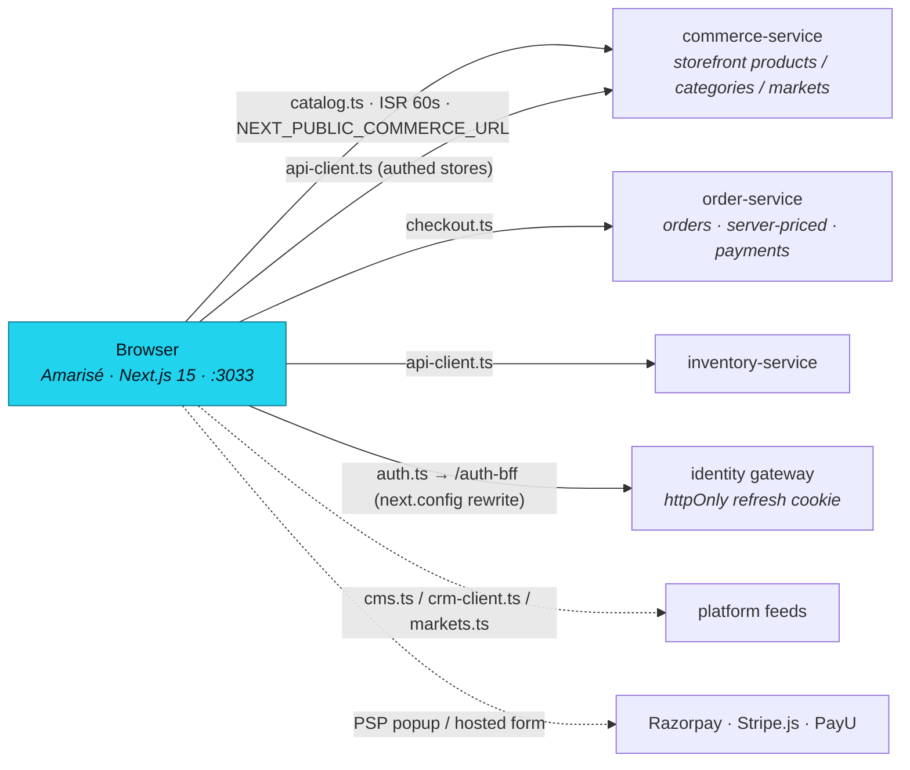

<div align="center">



<br/>
<br/>

**The ultra-luxury maison storefront of the Baalvion platform — a multi-market, SEO-rich Next.js commerce experience for haute couture, fine watches, and jewelry, served as a thin presentation tier over the shared Baalvion backend.**

<p>
  
  
  
  
  
  
  
  
</p>

<sub><a href="#overview">Overview</a> · <a href="#tech-stack">Tech Stack</a> · <a href="#architecture">Architecture</a> · <a href="#project-structure">Structure</a> · <a href="#pages--routes">Routes</a> · <a href="#getting-started">Getting started</a> · <a href="#environment-variables">Env</a> · <a href="#deployment">Deployment</a> · <a href="#notes--gotchas">Notes</a></sub>

</div>

---

## Overview

Amarisé Maison Avenue is the ultra-luxury maison storefront of the Baalvion platform — a
multi-market e-commerce experience for haute couture, high-end watches, and fine jewelry
("curating the world's most exquisite treasures since 1924"). It is a Next.js 15 App Router
application that serves a public, SEO-rich storefront across five jurisdictions (US, UK, UAE,
India, Singapore), a customer account area, and an AI-assisted curation layer.

It does **not** own its own backend: catalog, orders, payments, customers, and auth are all
served by the shared Baalvion backend services (commerce-service, order-service,
inventory-service, and the identity gateway), making this app a thin,
presentation-and-orchestration tier over the platform's bounded contexts.

The app is one of several Next.js / Vite frontends in the Baalvion **pnpm + Turborepo**
monorepo (`Frontend/AmariseMaisonAvenue-main`). Its workspace package name is
`amarise-maison-avenue-web`.

- **Local dev port:** `:3033` (Turbopack)
- **Markets:** `/us`, `/uk`, `/ae`, `/in`, `/sg` (every public route is nested under `[country]`)
- **Auth:** centralized via the identity gateway through a same-origin `/auth-bff` rewrite
- **Payments:** Razorpay, Stripe, PayU, bank transfer — orders priced server-side by order-service

State is managed by a single React Context store (`src/lib/store.tsx`, `AppProvider`) plus
per-feature hooks; there is no Redux/Zustand. Server data is fetched directly in Server
Components (catalog) and via a typed API client in Client Components (orders, auth, addresses).

## Tech Stack

| Layer | Technology | Version |
|-------|-----------|---------|
| Framework | [Next.js](https://nextjs.org) (App Router, Turbopack dev) | `15.5.18` |
| Language | TypeScript | `^5` |
| UI runtime | React / React DOM | `^19.2.1` |
| Styling | Tailwind CSS + `tailwindcss-animate`, CSS variables | `^3.4.1` / `^1.0.7` |
| Component primitives | Radix UI (accordion, dialog, dropdown, select, tabs, toast, etc.) + shadcn/ui conventions | `^1.x–2.x` |
| Variant/utility | `class-variance-authority`, `clsx`, `tailwind-merge` | `^0.7.1` / `^2.1.1` / `^3.0.1` |
| Icons | `lucide-react` | `^0.475.0` |
| Animation | `framer-motion` | `^12.4.7` |
| 3D | `three`, `@react-three/fiber`, `@react-three/drei` | `^0.174.0` / `^9.0.0` / `^10.0.0` |
| Forms / validation | `react-hook-form`, `@hookform/resolvers`, `zod` | `^7.54.2` / `^4.1.3` / `^3.24.2` |
| Carousel / charts / dates | `embla-carousel-react`, `recharts`, `react-day-picker`, `date-fns` | `^8.6.0` / `^2.15.1` / `^9.11.3` / `^3.6.0` |
| Markdown | `react-markdown` | `^10.1.0` |
| AI | Google Genkit (`genkit`, `@genkit-ai/google-genai`, model `googleai/gemini-2.5-flash`) | `^1.28.0` |
| Auth SDK | `@baalvion/auth-sdk` (workspace package) | `workspace:*` |
| Fonts | `next/font` — Inter (`--font-inter`, body) + Cormorant Garamond (`--font-serif`, headings) | — |

## Architecture

### Rendering model

- **App Router with mixed RSC + Client Components.** The root layout and metadata files are
  Server Components; the storefront shell (`[country]/layout.tsx`), checkout, cart, and account
  pages are Client Components (`"use client"`).
- **Catalog data is server-fetched** in `src/lib/catalog.ts` against the public storefront API
  with `fetch(..., { next: { revalidate: 60 } })` — i.e. **ISR with a 60s revalidation window**.
- **Dynamic metadata** is generated per-route (`generateMetadata`) for country home pages,
  products, etc.
- **`sitemap.ts` / `robots.ts` / `opengraph-image.tsx` / `twitter-image.tsx`** use the Next
  metadata-file conventions; the sitemap is generated dynamically from the live catalog plus
  mock editorial data.

### Multi-market routing

Every public page lives under a `[country]` URL segment (`/us`, `/uk`, `/ae`, `/in`, `/sg`).
`src/middleware.ts` normalizes any missing/invalid country to the visitor's preferred market
(cookie → `Accept-Language` → default `us`), canonicalizes casing, forwards the resolved
country to Server Components via the `x-amarise-country` request header (used by the root
layout to set `<html lang/dir>` — e.g. UAE → `ar` / RTL), and protects `/[country]/account/*`
behind the httpOnly refresh cookie.

### Data flow / backend integration

This frontend talks to the shared Baalvion backend, not a local DB:



Payments: the browser talks directly to the Razorpay popup / Stripe.js / PayU hosted form; the
order itself is created and priced server-side by order-service (no client-trusted totals).

- **Auth** (`src/lib/auth.ts`): real password auth against the Baalvion identity gateway
  through a same-origin `/auth-bff` rewrite (`next.config.ts → rewrites`). Access token is
  **in-memory only**; the refresh token is an httpOnly `baalvion_refresh` cookie. There is
  **no second JWT issuer** — auth is centralized per platform policy.
- **Checkout** (`src/lib/checkout.ts`): creates a **real** order via `order-service`. The
  client sends only product refs + quantity; the backend re-derives SKU/name/price and
  recomputes all totals and tax. Payment intents support Razorpay (in-page popup), Stripe
  (hosted redirect), PayU (signed form post), and bank transfer (wire instructions); a `mock`
  provider auto-confirms server-side. Failures are surfaced explicitly — the UI never fakes a
  "paid" state.
- **CMS / CRM / markets**: optional platform feeds via `NEXT_PUBLIC_CMS_URL`,
  `NEXT_PUBLIC_CRM_URL`, and the public `/commerce/markets` FX/tax feed (`src/lib/markets.ts`).
- **AI** (`src/ai/*`): Google Genkit flows (product descriptions, recommendations,
  editorial/campaign copy, city/category/collection narratives) marked `server-only` and
  reachable only through server flows.
- **`/admin` is retired in this app** — middleware redirects it to the central admin-platform
  console (`NEXT_PUBLIC_ADMIN_CONSOLE_URL`). The `src/app/admin/*` tree is legacy console UI
  kept in-repo.

### Security / SEO

- **CSP and security headers** are set in `next.config.ts → headers()` (script/style/img/
  connect/frame allowlists for Google Analytics, Razorpay, Stripe, PayU, and the configured
  media host), plus `X-Frame-Options: DENY`, `X-Content-Type-Options: nosniff`, HSTS,
  `Referrer-Policy`, and `Permissions-Policy`. `unsafe-eval` is dev-only;
  `upgrade-insecure-requests` is omitted for localhost prod builds.
- **SEO**: per-country `hreflang` alternates, Organization + WebSite JSON-LD in the root
  layout, dynamic sitemap across all 5 markets, and per-route Open Graph / Twitter images.

## Project Structure

```
AmariseMaisonAvenue-main/
├── src/
│   ├── app/                  # Next.js App Router — routes, layouts, metadata files
│   │   ├── [country]/        # Multi-market storefront (products, cart, checkout, account, editorial)
│   │   ├── admin/            # Legacy per-app admin console UI (retired; redirected by middleware)
│   │   └── lib/              # placeholder-images.json (homepage/mega-menu image manifest)
│   ├── ai/                   # Google Genkit config + server-only AI flows
│   ├── components/           # React components (layout, home, product, category, sales, demo, admin, ui)
│   ├── hooks/                # Reusable React hooks (toast, mobile, search, RBAC, AI, CMS, …)
│   ├── lib/                  # Data layer, API clients, i18n, auth, checkout, SEO, and feature engines
│   ├── types/                # Ambient type declarations (e.g. Razorpay window types)
│   └── middleware.ts         # Edge middleware: market routing + account auth gate + security headers
├── public/                   # Static assets (favicon + placeholder imagery)
├── docs/                     # Design/architecture reference docs (API spec, payment/inventory/search design)
├── next.config.ts            # CSP/headers, image hosts, auth-bff rewrite, standalone output
├── tailwind.config.ts        # Luxury theme tokens (cream/ivory/plum/gold/lavender, serif headings)
├── Dockerfile                # Standalone Next image built from the monorepo root (turbo prune)
├── vercel.json               # turbo-ignore guard for Vercel builds
├── apphosting.yaml           # Firebase App Hosting run config
├── IMAGERY.md                # Where to upload real photos / how BrandImage placeholders work
└── SEO_UPDATES_SUMMARY.md    # Notes on SEO hardening
```

## Pages & Routes

All public routes are nested under `/[country]` (one of `us`, `uk`, `ae`, `in`, `sg`).

| Route | Purpose |
|-------|---------|
| `/` | Client redirect → `/us`; middleware redirects `/` → preferred market |
| `/[country]` | Market home / landing for the jurisdiction |
| `/[country]/product/[id]` | Product detail (gallery, info panel, reviews, related) |
| `/[country]/category/[id]` | Category listing with filters/sort |
| `/[country]/collection/[id]` · `/collections` | Curated collection pages and index |
| `/[country]/[department]/[category]/[subcategory]/[productId]` | Deep merchandising hierarchy |
| `/[country]/search` | Storefront search |
| `/[country]/cart` · `/checkout` | Cart and atomic checkout (Razorpay / Stripe / PayU / bank) |
| `/[country]/account/login` · `register` · `reset-password` | Public auth screens |
| `/[country]/account/...` | Authenticated area: orders/acquisitions, addresses, wishlist, wallet, certificates, membership, concierge, curation, live sessions, returns, settings |
| `/[country]/journal` · `journal/[id]` | Editorial journal (articles) |
| `/[country]/buying-guide` · `buying-guide/[id]` | Curatorial buying guides |
| `/[country]/city/[cityId]` | High-authority city landing pages |
| `/[country]/services/[id]` · `appointments` · `inquiry/[id]` · `private-order/[id]` | Concierge services, appointments, private orders, inquiries |
| `/[country]/sell` · `how-to-sell` · `authenticity` · `reports/[id]` | Consignment, authenticity, certification reports |
| `/[country]/membership` · `membership/plans` · `gift-registry` | Membership tiers and gift registry |
| `/[country]/about` · `contact` · `faq` · `customer-service` · `privacy-policy` · `terms-of-service` | Institutional / legal pages |
| `/admin/*` | Retired — middleware redirects to the central admin-platform console |
| `/sitemap.xml` · `/robots.txt` | Generated metadata routes |

## Assets & Media

`public/` is intentionally lean — real photography is served from the configured media
host/CDN, and missing/placeholder images fall back to an elegant cream + monogram panel
rendered by `src/components/ui/BrandImage.tsx` (see `IMAGERY.md`).

| Asset | Use |
|-------|-----|
| `public/favicon.svg` | Site favicon / apple-touch icon / logo referenced in JSON-LD |
| `src/app/favicon.ico` | Classic ICO favicon |
| `public/placeholder/new-arrivals.jpg` | Mega-menu "New Arrivals" tile |
| `public/placeholder/hermes.jpg`, `chanel.jpg`, `goyard.jpg` | Mega-menu brand tiles |
| `public/placeholder/jewelry.jpg` | Mega-menu jewelry tile |
| `public/placeholder/product-1.jpg`, `product-2.jpg` | Placeholder product imagery |
| `public/placeholder/avatar-1.jpg`, `avatar-2.jpg` | Placeholder user/review avatars |

The homepage / mega-menu image manifest lives in `src/app/lib/placeholder-images.json` (ids →
`/placeholder/*.jpg`). OG/Twitter images are generated at runtime by
`src/app/opengraph-image.tsx` and `src/app/twitter-image.tsx` (no static social image file).

## Getting Started

### Prerequisites

- Node.js 20+ and `pnpm` (the repo is a `pnpm + Turborepo` monorepo — install from the
  **repo root**).
- Running Baalvion backend services for live data (commerce-service, order-service,
  inventory-service, identity gateway) — or point the env vars at staging/prod.

### Install, develop, build

```bash
# from the monorepo root
pnpm install

# from this app directory: create local env, then run
cp .env.local.example .env.local   # edit ports/URLs to match your local services

pnpm dev          # next dev --turbopack -p 3033
pnpm build        # next build
pnpm start        # next start (serves the production build)
pnpm lint         # next lint
pnpm typecheck    # tsc --noEmit

# AI flows (Genkit dev UI)
pnpm genkit:dev   # genkit start -- tsx src/ai/dev.ts
pnpm genkit:watch # genkit start -- tsx --watch src/ai/dev.ts
```

> The dev server runs on port **3033** (`pnpm dev`). If `NEXT_PUBLIC_APP_URL` in your env uses
> a different port, align the two for correct absolute URLs / CSP behavior.

## Environment Variables

All `NEXT_PUBLIC_*` values are baked into the client bundle at build time — treat them as
public. Never place secrets in this app (no payment/secret keys live here; gateways are called
with public keys/popups).

| Variable | Purpose |
|----------|---------|
| `NEXT_PUBLIC_COMMERCE_URL` | Public storefront API base (catalog + `/commerce/markets`), ends at `/api/v1`. Owned by `catalog.ts` / `markets.ts`. |
| `NEXT_PUBLIC_COMMERCE_API_URL` | Authed/admin commerce base (`/commerce/stores/:storeId`). Falls back to `NEXT_PUBLIC_COMMERCE_URL`. |
| `NEXT_PUBLIC_ORDER_URL` | Order-service base (orders + payments), ends at `/api/v1`. |
| `NEXT_PUBLIC_INVENTORY_URL` | Inventory-service base, ends at `/api/v1`. |
| `NEXT_PUBLIC_REAL_ESTATE_URL` | Real-estate service base (ancillary feed). |
| `NEXT_PUBLIC_AUTH_URL` | Auth endpoint base used by auth helpers. |
| `AUTH_PROXY_TARGET` | Server-side rewrite target for `/auth-bff/*` → identity gateway (so the httpOnly refresh cookie flows same-origin). |
| `NEXT_PUBLIC_APP_URL` | Canonical frontend URL (absolute links, OG tags, localhost-vs-prod CSP behavior). |
| `NEXT_PUBLIC_SITE_URL` | Canonical site URL used by `src/lib/seo.ts`. |
| `NEXT_PUBLIC_STORE_ID` | Active commerce storeId (single-brand fallback when no subdomain match). |
| `NEXT_PUBLIC_STORE_DOMAINS` | Optional subdomain → storeId map for multi-store resolution. |
| `NEXT_PUBLIC_MEDIA_HOST` | Production media/CDN hostname; auto-added to `next/image` remote patterns + CSP `img-src`. |
| `NEXT_PUBLIC_REFRESH_COOKIE_NAME` | Name of the httpOnly refresh cookie (default `baalvion_refresh`). |
| `NEXT_PUBLIC_ADMIN_CONSOLE_URL` | Central admin-platform console URL (`/admin` redirect target). |
| `NEXT_PUBLIC_CMS_URL` / `NEXT_PUBLIC_CMS_WEBSITE_SLUG` | CMS feed base + this site's slug (`src/lib/cms.ts`). |
| `NEXT_PUBLIC_CRM_URL` | CRM feed base (`src/lib/crm-client.ts`). |
| `NEXT_PUBLIC_GATEWAY_URL` / `NEXT_PUBLIC_BFF_MODE` | Gateway base + BFF mode for the gateway-session helper. |
| `NEXT_PUBLIC_CHECKOUT_MODE` | Checkout policy toggle (`src/lib/checkout-policy.ts`). |
| `NEXT_PUBLIC_ENABLE_LIVE_SHOP` | Feature flag for the live-shopping widget. |
| `GEMINI_API_KEY` / Google GenAI credentials | Server-side key for Genkit AI flows (server-only; **never** `NEXT_PUBLIC_`). |

## Deployment

The app ships as a **standalone Next.js server** and supports three deploy targets:

- **Docker / ECS / Amplify (primary):** `Dockerfile` builds from the **monorepo root** with
  `turbo prune amarise-maison-avenue-web --docker`, installs with `--no-frozen-lockfile` (a
  `uuid@11` override snapshot is dropped by `turbo prune`), builds with `output: 'standalone'`,
  and runs a minimal non-root `node Frontend/AmariseMaisonAvenue-main/server.js` with a health
  check. `NEXT_PUBLIC_*` values must be passed as `--build-arg` (baked at build time).
- **Vercel:** `vercel.json` uses `npx turbo-ignore amarise-maison-avenue-web` so builds are
  skipped when this app's inputs are unchanged.
- **Firebase App Hosting:** `apphosting.yaml` (`maxInstances: 1`).

> On Windows, `output: 'standalone'` is disabled (symlink EPERM) — local Windows builds produce
> a normal `.next` output; Linux CI/containers produce the standalone artifact. This is
> intentional and does not change the deployed image.

## Notes / Gotchas

- **Two commerce base URLs by design.** `NEXT_PUBLIC_COMMERCE_URL` is the public (no-auth)
  storefront base used by `catalog.ts`; `NEXT_PUBLIC_COMMERCE_API_URL` is the authed
  store-scoped base used by `api-client.ts`. Don't cross-wire them.
- **No client-trusted money.** Checkout sends only product refs + quantity; order-service
  recomputes all totals and tax. Unconfigured/declined gateways surface real errors — the UI
  never fabricates "paid".
- **Auth is in-memory + httpOnly cookie.** The access token is never persisted to
  `localStorage`; the refresh cookie is httpOnly and flows through the same-origin `/auth-bff`
  rewrite.
- **`store_id` resolution order:** JWT `store_id` → subdomain (`NEXT_PUBLIC_STORE_DOMAINS`) →
  `NEXT_PUBLIC_STORE_ID`. With no store id, the catalog logs a warning and returns empty (no
  fake data).
- **Unimplemented backends return `501 NOT_IMPLEMENTED`**, not silent 404s (e.g.
  product-by-slug, some inventory/cart/search endpoints) — see `src/lib/api-client.ts` and
  `docs/`.
- **`/admin` is retired here.** It redirects to the central admin-platform console; the
  `src/app/admin/*` tree and many `src/lib/*` engines (rbac, fraud, observability,
  ai-autopilot, mock-* data) are legacy console scaffolding, much of it mock-backed.
- **Real imagery** is dropped in via the media host / CMS, not committed — `BrandImage` shows a
  branded fallback for placeholders. Add new image hosts to
  `next.config.ts → images.remotePatterns` and the CSP `img-src`. See `IMAGERY.md`.
- **ESLint is ignored during builds** (`next.config.ts`); run `pnpm lint` / `pnpm typecheck`
  separately.

---

<div align="center">
<sub>Part of the <a href="https://github.com/baalvionservice/Baalvion-Project-Infra">Baalvion Platform</a> · centralized identity · domain-driven monorepo</sub>
</div>
