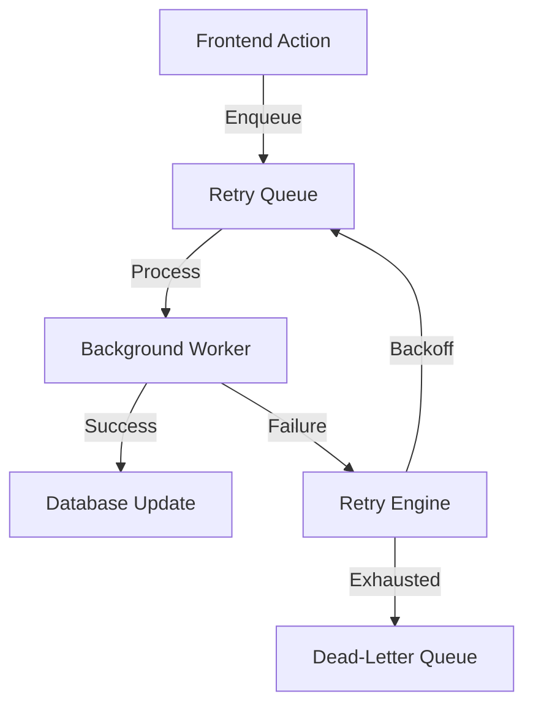

# AMARISÉ | INSTITUTIONAL BACKGROUND WORKER ARCHITECTURE

This document defines the asynchronous reliability engine for the Amarisé Global Luxury Platform.

---

## 1. CONCEPTUAL ARCHITECTURE

Background workers handle non-blocking, deferred, or recurring logic that ensures system consistency without impacting the connoisseur's UI performance.



---

## 2. WORKER REGISTRY (MANDATORY)

| Worker | Frequency | Responsibility |
| :--- | :--- | :--- |
| **Payment Reconciler** | 1 Min | Verifies `PENDING` transfers against gateway APIs. |
| **Inventory TTL Guard** | 5 Min | Releases `EXPIRED` locks back to the global registry. |
| **Event Courier** | Real-time | Retries failed cross-module events (e.g., Notif failure). |
| **Metrics Janitor** | Hourly | Aggregates time-series data & archives raw traces. |
| **Audit Sync** | Daily | Finalizes immutable integrity logs for jurisdictional compliance. |

---

## 3. RETRY ENGINE (EXPONENTIAL BACKOFF)

To prevent gateway hammering, the system uses an exponential backoff strategy:

- **Retry 1**: 2 minutes delay
- **Retry 2**: 4 minutes delay
- **Retry 3**: 8 minutes delay
- **Retry 4**: 16 minutes delay
- **Fail**: Move to `dead_letter` for manual curator audit.

---

## 4. RELIABILITY PROTOCOLS

- **Idempotency**: Every job contains a `job_id`. Workers must verify they haven't completed this ID before execution.
- **Transactional Atomicity**: State changes (e.g., releasing a lock) must occur within a Firestore Transaction.
- **Hub Isolation**: Regional workers only process jobs belonging to their `country_code`, preventing cross-market interference.

---

## 5. API INTERFACE (MOCK)

### `enqueueJob`
**Request**:
```json
{
  "type": "PAYMENT_VERIFY",
  "country": "ae",
  "payload": {
    "paymentId": "pay_9921",
    "orderId": "AM-882"
  }
}
```
