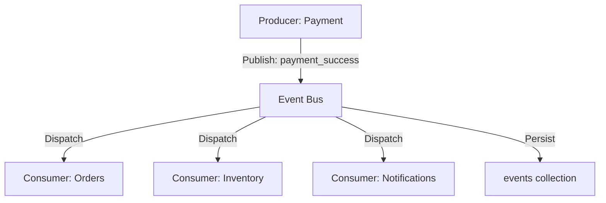

# AMARISÉ | GLOBAL EVENT BUS ARCHITECTURE

This document defines the asynchronous backbone of the Amarisé Global Luxury Platform.

---

## 1. CONCEPTUAL ARCHITECTURE

The Event Bus acts as a mediator, allowing Maison modules to communicate without direct dependencies. This ensures that if the Notification service is down, the Payment settlement can still complete.



---

## 2. EVENT FLOW LIFECYCLE

1. **Emission**: A service (e.g., Checkout) emits a `payment_initiated` event.
2. **Persistence**: The Bus logs the event to the `events` collection with status `pending`.
3. **Dispatch**: The Bus identifies all subscribers for that event type.
4. **Processing**: Each subscriber (e.g., Inventory) executes its logic.
5. **Retry/Fail-safe**: If a subscriber fails, the Bus increments the `retryCount`. After 3 failures, it moves to `dead_letter` for manual audit.

---

## 3. CORE REGISTRY (MANDATORY EVENTS)

| Event Type | Source | Reaction |
| :--- | :--- | :--- |
| `order_created` | orders | Triggers `inventory_locked`. |
| `payment_success` | payments | Triggers `order_confirmed` & `inventory_confirmed`. |
| `payment_failed` | payments | Triggers `inventory_released`. |
| `inventory_locked` | inventory | Starts 15-minute TTL timer. |
| `ai_insight_generated`| ai | Updates the User Resonance Matrix. |

---

## 4. RELIABILITY PROTOCOLS

- **Idempotency**: Every event contains a unique `event_id`. Consumers must verify they haven't processed this ID before executing logic.
- **Dead-Letter Queue**: Events that fail maximum retries are never lost; they are moved to a specific administrative view for reconciliation.
- **Geographic Context**: The `countryCode` allows regional hubs to process events independently (e.g., the India Hub only handles India shipping events).

---

## 5. API INTERFACE (MOCK)

### `publishEvent`
**Request**:
```json
{
  "type": "payment_success",
  "source": "payments",
  "countryCode": "ae",
  "payload": {
    "orderId": "AM-9921",
    "amount": 28500
  }
}
```
