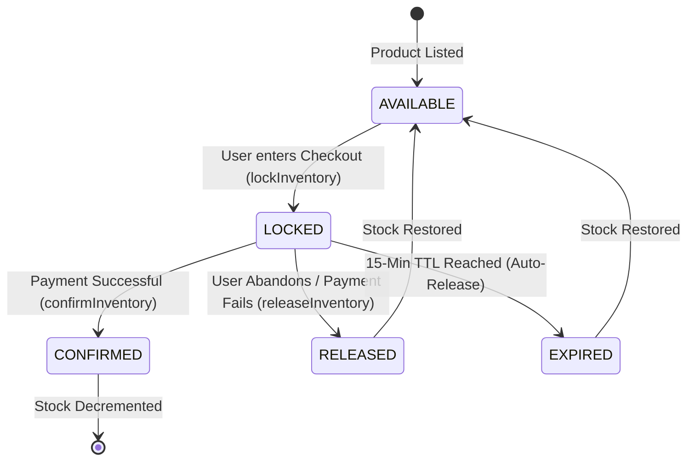

# AMARISÉ | ATOMIC INVENTORY & LOCKING SYSTEM DESIGN

This document defines the high-concurrency inventory management architecture for the Amarisé Global Luxury Platform.

---

## 1. THE INVENTORY LIFECYCLE

The system enforces a strict state machine to prevent overselling of rare artifacts ($10K+ value).



---

## 2. DATA ARCHITECTURE (MOCK)

### Collection: `inventory`
Partitions stock levels by regional hub.
| Field | Type | Description |
| :--- | :--- | :--- |
| `id` | string | `{variant_id}_{country_code}` |
| `product_id` | string | Link to root product |
| `variant_id` | string | Specific SKU reference |
| `country` | string | US, UK, AE, IN, SG |
| `total_stock` | number | Physical units in warehouse |
| `reserved_stock` | number | Units currently locked in checkouts |
| `available_stock` | number | `total_stock - reserved_stock` |
| `updated_at` | timestamp | Last sync time |

### Collection: `inventory_locks`
Transient records for active checkout sessions.
| Field | Type | Description |
| :--- | :--- | :--- |
| `id` | string | Unique Lock UUID |
| `variant_id` | string | Target SKU |
| `user_id` | string | Authenticated Collector ID |
| `order_id` | string | Linked Order ID (if created) |
| `status` | enum | `LOCKED`, `RELEASED`, `EXPIRED`, `CONFIRMED` |
| `quantity` | number | Usually 1 for rare artifacts |
| `expires_at` | timestamp | `created_at + 15 minutes` |

---

## 3. ATOMIC LOCKING PROTOCOL (PSEUDO-LOGIC)

When `POST /inventory/lock` is called:

1. **START TRANSACTION**
2. **READ** `inventory` doc for `{variant_id}`.
3. **CHECK** `available_stock >= requested_qty`.
4. If **FAIL**: Throw `409 Conflict` (Inventory Exhausted).
5. If **PASS**:
   - **CREATE** `inventory_locks` doc with status `LOCKED`.
   - **UPDATE** `inventory` doc: `reserved_stock += requested_qty`.
6. **COMMIT TRANSACTION**

---

## 4. AUTO-EXPIRY (TTL) RECONCILIATION

A background cron (Cloud Function) runs every 5 minutes:
1. **QUERY** `inventory_locks` where `status == LOCKED` AND `expires_at < now`.
2. For each stale lock:
   - **START TRANSACTION**
   - **UPDATE** lock status to `EXPIRED`.
   - **DECREMENT** `inventory.reserved_stock` by lock quantity.
   - **COMMIT TRANSACTION**

---

## 5. EDGE CASE MITIGATION

- **Double-Click**: Front-end disables button; back-end uses idempotency check on `user_id` + `variant_id`.
- **System Crash**: The TTL Reconciler recovers stock from any "stuck" locks upon restart.
- **Race Conditions**: Strict Firestore Transactions ensure that two users can never claim the final unit of a Birkin 25.

---

## 6. API INTERFACE

### `POST /inventory/lock`
**Request**:
```json
{
  "variant_id": "var_birkin_25_gold",
  "quantity": 1,
  "user_id": "usr_vip_001"
}
```
**Response (Success)**:
```json
{
  "status": "success",
  "data": {
    "lock_id": "lck_99218",
    "expires_at": "2024-03-15T12:15:00Z"
  }
}
```
