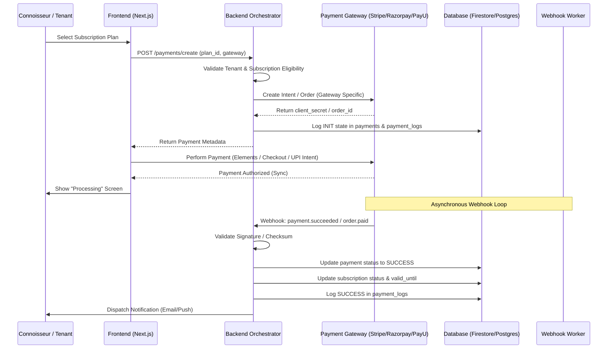

# PRODUCTION-GRADE PAYMENT INTEGRATION SYSTEM DESIGN

## 1. PAYMENT FLOW DIAGRAM

---

## 2. DATABASE DESIGN (RELATIONAL/IR)

### Table: `payments`
| Column | Type | Description |
|--------|------|-------------|
| `id` | UUID | Primary Key |
| `tenant_id` | String | Foreign Key to Company/Tenant |
| `subscription_id` | String | Link to subscription record |
| `user_id` | String | Link to individual user |
| `amount` | Decimal(20,2) | High-precision amount |
| `currency` | String(3) | ISO 4217 (USD, INR, EUR, etc.) |
| `gateway` | Enum | STRIPE, RAZORPAY, PAYU, BANK_TRANSFER |
| `gateway_id` | String | PG Reference (pi_123, order_abc) |
| `status` | Enum | PENDING, SUCCESS, FAILED, REFUNDED, DISPUTED |
| `idempotency_key` | String | Unique key to prevent double charging |
| `created_at` | Timestamp | Initial request time |
| `updated_at` | Timestamp | Last status change |

### Table: `payment_logs`
| Column | Type | Description |
|--------|------|-------------|
| `id` | UUID | Primary Key |
| `payment_id` | UUID | Link to payments table |
| `action` | Enum | INIT, WEBHOOK_RECEIVED, SUCCESS, FAILURE, REFUND_INIT, RECONCILED |
| `raw_payload` | JSON | Raw response from the gateway for debugging |
| `metadata` | JSON | Extracted searchable data (IP, browser, etc.) |
| `timestamp` | Timestamp | Log entry time |

---

## 3. GATEWAY-SPECIFIC API ENDPOINTS

### Unified Creator
`POST /api/v1/payments/create`
- **Logic**: Uses a Factory Pattern to call the appropriate provider.
- **Stripe**: Returns `client_secret` for Stripe Elements.
- **Razorpay**: Returns `order_id` for Checkout.js.
- **ACH/Wire**: Returns virtual account details or instructions + `payment_id`.

### Webhook Listeners
`POST /api/v1/webhooks/[gateway]`
- **Validation**: Strict signature verification using gateway-specific secrets (e.g., `stripe-signature`, `x-razorpay-signature`).
- **Processing**: Enqueues the payload to a **Message Queue** (Redis/PubSub) to prevent gateway timeouts during long processing.

---

## 4. MULTI-CURRENCY & GLOBAL SUPPORT

- **Dynamic Pricing**: Prices are calculated server-side based on the tenant's localized pricing rules or the gateway's real-time conversion.
- **Jurisdictional Tax**: Integration with Avalara or Stripe Tax to calculate GST (India), VAT (EU), and Sales Tax (US) before intent creation.
- **ACH/Wire**: Automated virtual account generation (Stripe Treasury or Razorpay Smart Collect) to allow unique references for easy reconciliation.

---

## 5. SECURITY & COMPLIANCE

1. **PCI DSS Level 1**: Zero card data touches the backend. Use Tokenization (Stripe Elements / Razorpay SDK).
2. **Idempotency**: Clients must send an `X-Idempotency-Key` header. Requests with the same key within 24 hours return the cached response.
3. **Webhook Security**: 
   - IP Whitelisting for PG webhook servers.
   - Strict timestamp checks to prevent replay attacks.
4. **Encryption**: PII in metadata is encrypted at rest using AES-256.

---

## 6. ERROR HANDLING & SCALABILITY

- **Retry Policy**: Exponential backoff for transient failures (e.g., DB locks).
- **Dead-Letter Queue (DLQ)**: Webhooks that fail after 5 retries are moved to a DLQ for manual curatorial review by the Finance Hub.
- **Horizontal Scaling**: Stateless webhook workers that can scale from 1 to 100+ instances during high-traffic billing cycles (e.g., first of the month).
- **Circuit Breaker**: If a gateway returns 5xx consistently, the system automatically marks it as "Degraded" and prompts the user to use an alternative (e.g., failover from PayU to Stripe).
