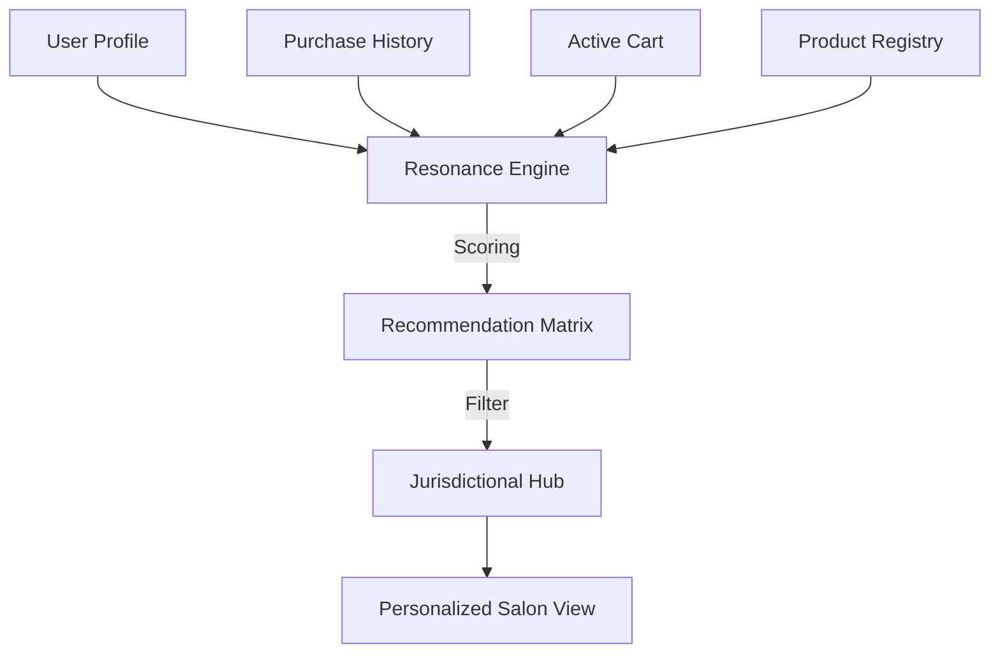

# AMARISÉ | INSTITUTIONAL AI RECOMMENDATION ENGINE

This document defines the personalized discovery architecture for the Amarisé Global Luxury Platform.

---

## 1. CONCEPTUAL ARCHITECTURE

The engine uses a **Hybrid Resonance Model** to provide high-fidelity suggestions that align with both personal taste and investment strategy.



---

## 2. SCORING HIERARCHY (WEIGHTS)

The system calculates a **Maison Affinity Score** (0.0 to 1.0) using the following weights:

| Signal | Weight | Logic |
| :--- | :--- | :--- |
| **Direct Purchase** | 0.50 | Categories previously acquired. |
| **Active Cart** | 0.30 | Immediate stylistic intent. |
| **Browsing History** | 0.15 | Exploratory resonance. |
| **Market Trending** | 0.05 | Social proof within the hub. |

---

## 3. DATA ARCHITECTURE

### Collection: `recommendations`
| Field | Type | Description |
| :--- | :--- | :--- |
| `id` | string | Unique record UUID |
| `userId` | string | Target connoisseur |
| `productId` | string | Recommended artifact |
| `type` | enum | `personalized`, `trending`, `similar`, `essential` |
| `score` | float | 0.0 - 1.0 (ranking weight) |
| `reason` | string | AI-generated "Why this piece?" |
| `hub` | string | Market isolation key (US, AE, etc) |

---

## 4. API INTERFACE

### `GET /api/v1/recommendations`
**Parameters**: `user_id`, `country`, `limit`

**Response**:
```json
{
  "status": "success",
  "data": [
    {
      "product_id": "prod_kelly_25",
      "score": 0.94,
      "reason": "Complements your recent 1924 series acquisition."
    }
  ]
}
```

---

## 5. EDGE CASE MITIGATION

- **Cold Start (New User)**: Defaults to `trending` artifacts within the specific hub.
- **Sparse Data**: AI triggers a "Style Discovery" logic based on the user's first 3 clicks.
- **Out of Stock**: Recommender automatically filters out artifacts with `stock == 0`.
