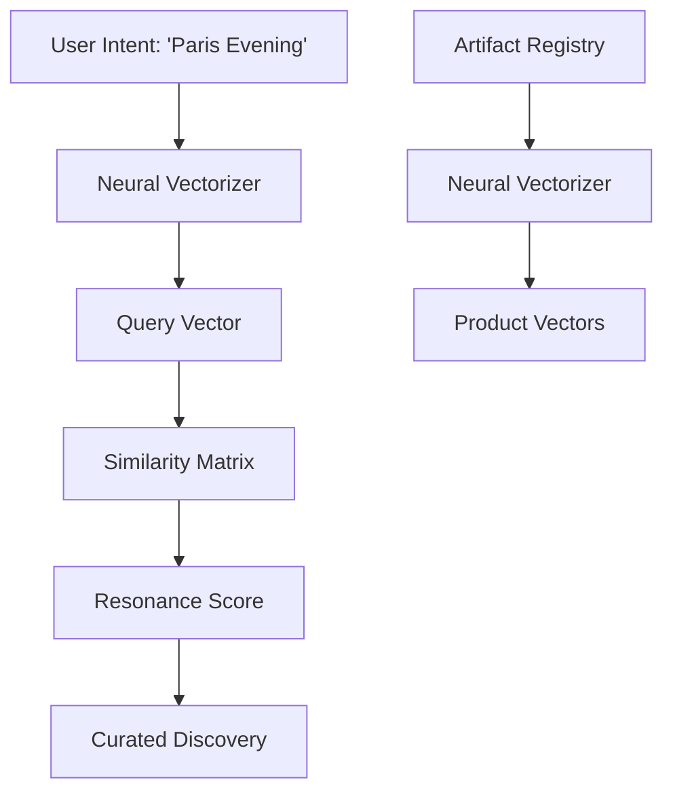

# AMARISÉ | INSTITUTIONAL SEMANTIC SEARCH ARCHITECTURE

This document defines the vector-based discovery engine for the Amarisé Global Luxury Platform.

---

## 1. CONCEPTUAL ARCHITECTURE

Traditional keyword search fails the luxury connoisseur who shops by **intent**, **vibe**, and **narrative context**. Our Semantic Search uses neural embeddings to map artifacts and queries into a shared latent space.



---

## 2. THE DISCOVERY PROTOCOL

| Query Type | logic | Example |
| :--- | :--- | :--- |
| **Strict** | Keyword match on SKU/Title | "Birkin 25 Gold" |
| **Semantic** | Vector similarity on Description | "Architectural minimalism" |
| **Hybrid** | Weighted combination of both | "Hermes for a wedding" |

---

## 3. DATA ARCHITECTURE (MOCK)

### Collection: `search_index`
| Field | Type | Description |
| :--- | :--- | :--- |
| `id` | string | Entry UUID |
| `productId` | string | Link to registry |
| `latentFeatures` | float[] | 8-dimension mock embedding vector |
| `resonanceTags` | string[] | AI-extracted context tags |
| `hub` | string | Market hub isolation (US, AE, etc) |

---

## 4. RANKING & RESONANCE

The system calculates **Resonance Score** (0.0 to 1.0) using Cosine Similarity:
- **0.9 - 1.0**: Absolute Resonance (Direct Match)
- **0.7 - 0.89**: High Resonance (Strong Stylistic Fit)
- **0.4 - 0.69**: Medium Resonance (Contextual Suggestion)
- **< 0.4**: Discarded

---

## 5. API INTERFACE

### `POST /api/v1/search/semantic`
**Request**:
```json
{
  "query": "Silent luxury for a London business brief",
  "filters": { "price_max": 50000 },
  "country": "uk"
}
```
**Response**:
```json
{
  "status": "success",
  "data": [
    {
      "product_id": "prod_tailoring_01",
      "resonance_score": 0.92,
      "context": ["Architectural", "Minimalist", "High-Stakes"]
    }
  ]
}
```
