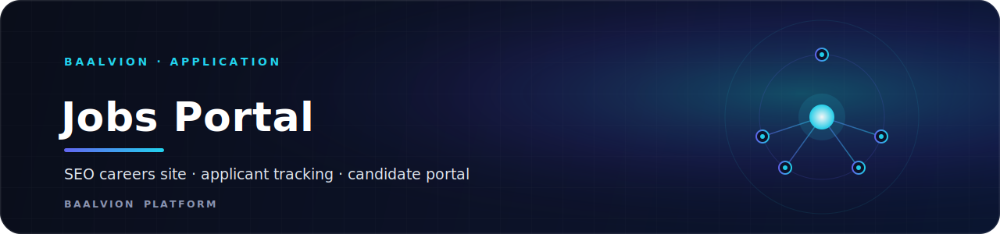
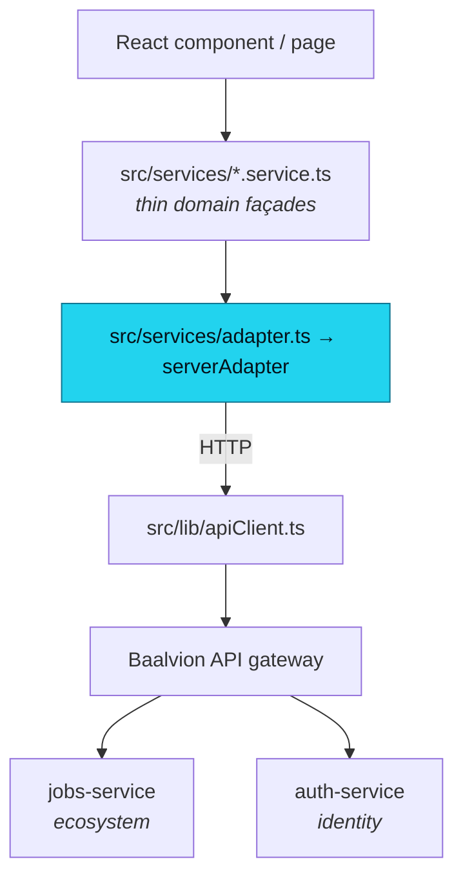

<div align="center">



<br/>
<br/>

**TalentOS by Baalvion — a public, SEO-first careers site combined with a full applicant-tracking-system (ATS) console and a candidate self-service portal, on one Next.js app backed by the central platform.**

<p>
  
  
  
  
  
  
  
  
</p>

<sub><a href="#overview">Overview</a> · <a href="#tech-stack">Tech Stack</a> · <a href="#architecture">Architecture</a> · <a href="#project-structure">Structure</a> · <a href="#pages--routes">Routes</a> · <a href="#getting-started">Getting started</a> · <a href="#environment-variables">Env</a> · <a href="#deployment">Deployment</a> · <a href="#notes--gotchas">Notes</a></sub>

</div>

---

## Overview

TalentOS is Baalvion's global talent-acquisition platform: a public, SEO-first careers site
combined with a full applicant-tracking-system (ATS) admin console and a candidate
self-service portal. It is the frontend for the Baalvion **jobs-service** (an `ecosystem`
bounded context) and authenticates against the central Baalvion **auth-service** /
**identity** stack. Public visitors browse and apply to roles worldwide; recruiters, hiring
managers, interviewers and campus-placement teams manage the entire hiring pipeline
(jobs → candidates → applications → interviews → offers) from the same Next.js application.

It lives inside the Baalvion **pnpm + Turborepo monorepo** and consumes the shared workspace
package `@baalvion/auth-sdk`.

> The application name shown to users is **TalentOS**; the company is **Baalvion Industries
> Pvt Ltd**.

- **Local dev port:** `:3026` (`next dev -p 3026`)
- **Backend:** Baalvion API gateway → `jobs-service` (ecosystem) + `auth-service` (identity)
- **Auth:** JWT — access token in memory, refresh token in an httpOnly cookie
- **Data:** Service Adapter pattern; the real `serverAdapter` unwraps the `{ success, data }`
  envelope and snake_case → camelCase keys
- **SEO:** per-route metadata, JSON-LD (`Organization`, `WebSite`, `JobPosting`), dynamic
  data-driven sitemap, optional Google Indexing API integration

## Tech Stack

| Layer | Choice | Version |
|-------|--------|---------|
| Framework | Next.js (App Router, RSC) | `15.5.18` |
| Language | TypeScript (`strict`) | `5.9.3` |
| Runtime | React / React DOM | `18.3.1` |
| Styling | Tailwind CSS + `tailwindcss-animate` | `3.4.1` / `1.0.7` |
| UI primitives | Radix UI + shadcn/ui (`components.json`) | Radix `1.x`/`2.x` |
| Icons | `lucide-react` | `0.394.0` |
| Animation | `framer-motion` | `11.2.10` |
| Client state | Zustand | `4.5.2` |
| Server-state / fetching | SWR | `2.2.5` |
| Forms + validation | `react-hook-form` + `@hookform/resolvers` + Zod | `7.51.5` / `3.9.0` / `3.23.8` |
| Tables | `@tanstack/react-table` | `8.17.3` |
| Drag & drop (pipeline Kanban) | `@dnd-kit/*` | core `6.1.0` |
| Charts | `recharts` | `2.12.7` |
| Dates | `date-fns` + `react-day-picker` | `3.6.0` / `8.10.1` |
| Carousel / command / debounce | `embla-carousel-react`, `cmdk`, `use-debounce` | `8.1.3` / `1.0.0` / `10.0.1` |
| AI flows | Genkit + `@genkit-ai/google-genai` (Gemini) | `1.0.x` |
| Google Indexing | `googleapis` | `171.4.0` |
| File export | `file-saver` | `2.0.5` |
| Auth | `@baalvion/auth-sdk` (workspace) + in-house JWT client | `workspace:*` |
| Testing | Vitest | `3.2.6` |
| Package manager | pnpm | `10.31.0` |

Class-name utilities: `clsx`, `tailwind-merge`, `class-variance-authority`.
`eslint.ignoreDuringBuilds` is `true` but `typescript.ignoreBuildErrors` is `false` — type
errors fail the build, lint errors do not.

## Architecture

### Rendering model

Next.js **App Router** with React Server Components by default. The site is split into
**route groups** that share layouts without affecting the URL:

- `(public)` — server-rendered, SEO-optimized careers/marketing pages and the multi-step
  application flow. Most public landing content is RSC and fetches live data at request
  time (e.g. the careers landing pulls jobs server-side via `talentService`).
- `(admin)` — the authenticated ATS console (dashboard, jobs, candidates, interviews,
  offers, campus, settings, RBAC, audit).
- `(candidate)` — the signed-in candidate's self-service area (`/my-account`).
- `(auth)` — login / register / forgot-password.
- `(dashboard)` + `/dashboard/*` — client/contractor project dashboards (marketplace-style
  project & milestone tracking).

`src/app/sitemap.ts`, `src/app/robots.ts` and `src/app/manifest.ts` are generated at the
edge; the sitemap merges static routes with **live published jobs and countries** fetched
from the backend.

### Data flow (Service Adapter pattern)

UI never calls the backend directly. All data access funnels through a typed adapter:



`adapter.ts` exports a single real backend adapter (`serverAdapter`) implementing the full
`ApiAdapter` surface — the legacy mock adapter branch has been retired (the `src/mocks/*`
fixtures remain as reference/seed data). `serverAdapter` (`adapters/server/index.ts`) is a
`Proxy` that auto-unwraps the backend's `{ success, data }` envelope and snake_case →
camelCase keys, and maps every backend entity (jobs, candidates, applications, interviews,
offers, documents, campus) into the portal's domain types.

### Backend / API / BFF integration

- **`apiClient`** targets `NEXT_PUBLIC_JOBS_SERVICE_URL` (defaults to the gateway path
  `.../ecosystem/jobs/api/v1`); **`authApiClient`** targets `NEXT_PUBLIC_AUTH_URL`
  (`.../identity/auth/v1/auth`).
- Internal Next.js **route handlers** under `src/app/api/*` act as same-origin BFF proxies
  and lightweight endpoints: `api/auth/[...path]` proxies the auth-service (rewriting the
  `Secure` cookie attribute for local http dev), `api/jobs`, `api/countries`,
  `api/departments`, `api/[country]/*`, `api/onboarding/*`, `api/compliance-profiles/*`,
  `api/webhooks/ats/[provider]`, and `api/google-indexing`.

### Auth

JWT-based, XSS-resistant by design. The **access token lives in memory only**
(`lib/apiClient`), the **refresh token is an httpOnly cookie** set by auth-service — never
`localStorage`. `AuthProvider` restores the session on load via the refresh cookie, decodes
the JWT, then enriches the identity with the real portal profile (role + `candidateId`) from
jobs-service. `apiClient` transparently refreshes on `401` and retries once. Authorization is
enforced with a permission matrix (`lib/access`) plus route/role guards
(`components/auth/RoleGuard`, `components/system/RouteGuard`, `components/system/AccessGuard`).
Portal roles: `SUPER_ADMIN`, `ADMIN`, recruiter / interviewer / hiring-manager equivalents,
and `CANDIDATE` (org `OWNER`/`MANAGER`/`MEMBER` roles are normalized into these).

### CMS

No external CMS. Marketing/landing content is code-defined (e.g. `src/components/new-skills`,
`careers-landing.tsx`) and operational data comes from jobs-service.

### SEO

First-class: per-route `generateMetadata`, canonical URLs, OpenGraph/Twitter cards,
JSON-LD structured data (`Organization`, `WebSite` + `SearchAction` in the root layout;
`JobPosting`/`Breadcrumb` helpers in `lib/structured-data.ts`), a dynamic data-driven
sitemap, and an optional **Google Indexing API** integration (`lib/googleIndexing.ts`,
`scripts/index-jobs.ts`) that pings Google when jobs change. Strict security headers + a
CSP are configured in `next.config.js`. The deep SEO growth blueprint lives in
[`docs/seo/`](docs/seo/README.md).

## Project Structure

```
Baalvion-Jobs-Portal-main/
├── src/
│   ├── app/             Next.js App Router: route groups, layouts, API route handlers, sitemap/robots
│   ├── ai/              Genkit AI flows (resume parsing, candidate↔job matching, summaries)
│   ├── api/             Standalone country-scoped application route handler
│   ├── components/      UI library: shadcn primitives (ui/), app system parts, layout, feature widgets
│   ├── config/          App config, routes, sidebar, countries, currencies, roles, scoring weights
│   ├── constants/       Workflow constants
│   ├── context/         React context providers (Theme, Tenant, UI, Notification)
│   ├── domain/          Static domain seed data (talent: jobs, candidates, countries, roles…)
│   ├── features/        Self-contained feature modules (auth, notifications, organization, users)
│   ├── hooks/           Shared React hooks (useAuth, usePermission, useDataTable, useToast…)
│   ├── integrations/    External ATS connectors (Greenhouse/Lever mappers, webhooks, retry queue)
│   ├── lib/             Core libs: apiClient/auth, access/RBAC, realtime, errors, SEO, utils
│   ├── mocks/           Mock/seed fixtures for entities and the talent platform
│   ├── modules/         Domain feature modules (jobs, candidates, interviews, offers, campus, pipeline…)
│   ├── scripts/         CLI scripts (index-jobs.ts — submit jobs to Google Indexing)
│   ├── services/        Service façades + the backend adapter layer (adapters/server/*)
│   ├── store/           Zustand stores (auth, application)
│   ├── types/           Shared TypeScript domain types / contracts
│   └── utils/           Small pure utilities (id, slug, workflow)
├── public/              Static assets (logo, OG image, team photos)
├── docs/                Project docs — incl. the SEO growth blueprint in docs/seo/
├── next.config.js       CSP + security headers, redirects, image domains, server-external pkgs
├── tailwind.config.ts   Design tokens (typography scale, spacing, shadows, colors via CSS vars)
├── components.json      shadcn/ui config
├── firestore.rules / storage.rules   Legacy Firebase rules (App Hosting heritage)
├── apphosting.yaml      Firebase App Hosting run config
└── vercel.json          Turbo-ignore guard for Vercel monorepo builds
```

## Pages & Routes

### Public (SEO) — `src/app/(public)`
| Route | Purpose |
|-------|---------|
| `/` and `/careers` | Careers landing (TalentOS marketing + live featured jobs) |
| `/careers/open-positions` | Searchable list of all open positions |
| `/careers/full-time`, `/part-time`, `/internship-program` | Role-type landing pages |
| `/careers/hiring-process`, `/hiring-strategy`, `/life-at-baalvion` | Employer-brand content |
| `/careers/countries/[slug]` and `.../jobs/[jobId]` | Country-filtered job lists + detail |
| `/careers/job/[id]` · `/job/[id]` | Public job detail page (`JobPosting` structured data) |
| `/careers/application/[slug]` → `/phase2` → `/phase3` → `/success` | Multi-step application flow |
| `/apply/[id]` | Direct apply entry point for a job |
| `/about`, `/about/team`, `/about/diversity` | About + team (uses `public/photos/*`) |
| `/placement`, `/onboarding`, `/onboarding/college`, `/onboarding/student` | Campus placement & onboarding |
| `/projects` · `/projects/[projectId]` · `/products` · `/studio` · `/new-skills` | Project marketplace & product pages |
| `/profiles/[candidateId]` | Public candidate profile |
| `/contact`, `/faqs`, `/privacy`, `/terms`, `/data-protection` | Support & legal |

### Admin ATS — `src/app/(admin)`
| Route | Purpose |
|-------|---------|
| `/dashboard` | Recruiter dashboard (KPIs, pipeline, open positions) |
| `/jobs` · `/jobs/[jobId]/pipeline` | Job management + Kanban hiring pipeline |
| `/candidates` · `/candidates/[id]` | Candidate database + detail |
| `/applications`, `/interviews`, `/offers` · `/offers/[applicationId]` | ATS stages |
| `/campus` (+ `colleges`, `students`, `placements`, `ai-matching`, `workflow`, `reports`, `tier-dashboard`, `student-dashboard`, `onboarding`) | Campus recruiting suite |
| `/analytics`, `/reports` | Hiring analytics & report builder |
| `/users`, `/roles`, `/team` | User, RBAC role & team administration |
| `/documents`, `/banking`, `/withdrawals` | Documents, banking & payout admin |
| `/audit-logs`, `/project-governance`, `/settings`, `/dev-tools` | Compliance, governance, settings, dev utilities |

### Candidate & dashboards
| Route | Purpose |
|-------|---------|
| `/my-account` (+ `applications`, `applications/[id]`) | Candidate self-service (tabbed: interviews/offers/settings) |
| `/dashboard/client/*`, `/dashboard/contractor/*` | Client & contractor project/milestone dashboards |

### API route handlers — `src/app/api`
`auth/[...path]` (auth BFF proxy), `jobs` · `jobs/[id]`, `countries` · `countries/[slug]`,
`departments`, `[country]/{jobs,roles,application}`, `compliance-profiles/[id]`,
`onboarding/{college,student}/[id]`, `webhooks/ats/[provider]`, `google-indexing`.

## Assets & Media

Everything ships from `public/`:

| File | Use |
|------|-----|
| `public/logo.png` | TalentOS / Baalvion brand logo (also used in the `Organization` JSON-LD logo URL) |
| `public/og-image.png` | 1200×630 OpenGraph / Twitter social-share card (referenced in root metadata) |
| `public/photos/*.jpeg` & `.png` | Team / people photos for the About & Team pages |

Remote images are allowed from `placehold.co`, `images.unsplash.com`, `picsum.photos`,
`i.pravatar.cc`, and `www.cdprojektred.com` (see `next.config.js` → `images.remotePatterns`);
Next/Image serves AVIF/WebP. Fonts use Google **Inter** via `next/font` (CSS variable
`--font-inter`).

## Getting Started

### Prerequisites
- Node.js 20+ (repo standard)
- pnpm `10.x` (this is a workspace package in the Baalvion monorepo)
- Access to a running Baalvion **auth-service** and **jobs-service** (or the API gateway)

### Install
From the monorepo root (recommended, so `@baalvion/auth-sdk` resolves):
```bash
pnpm install
```

### Environment
```bash
cp .env.example .env        # or .env.local
# also see .env.local.example for the Google Indexing variables
```
Fill in the variables from the table below.

### Develop / build / run
```bash
pnpm dev          # next dev on http://localhost:3026
pnpm build        # production build (NODE_OPTIONS raises heap to 4 GB)
pnpm start        # serve the production build
pnpm lint         # next lint
pnpm typecheck    # tsc --noEmit
pnpm test         # vitest run
pnpm test:watch   # vitest watch mode
pnpm index-jobs   # submit published jobs to the Google Indexing API
pnpm test-indexing # smoke-test the Google Indexing integration
```
The admin console is reached by signing in at `/login`.

## Environment Variables

> Never commit real secret values. `NEXT_PUBLIC_*` variables are bundled into the client.

| Variable | Purpose |
|----------|---------|
| `NEXT_PUBLIC_JOBS_SERVICE_URL` | Base URL for the jobs-service domain API (via gateway). Defaults to the gateway path / `http://localhost:3002/api/v1` in dev. |
| `NEXT_PUBLIC_AUTH_URL` | Base URL for the auth-service auth API (defaults to the gateway identity path). |
| `AUTH_SERVICE_URL` | Server-side upstream for the `/api/auth/*` BFF proxy (defaults to `http://localhost:3001/v1/auth`). |
| `NEXT_PUBLIC_GATEWAY_URL` | Single API-gateway ingress used to compose service URLs. |
| `NEXT_PUBLIC_API_URL` | Legacy/general backend base URL. |
| `NEXT_PUBLIC_BASE_URL` | Public site origin for canonical URLs / metadata (`AppConfig.baseUrl`). |
| `NEXT_PUBLIC_APP_URL` | App URL used by scripts and to detect https (cookie `Secure` handling). |
| `NEXT_PUBLIC_USE_MOCK` | Legacy flag to toggle mock data (the real adapter is now always used). |
| `GEMINI_API_KEY` | Google Gemini key for Genkit AI flows. |
| `GOOGLE_SERVICE_ACCOUNT_KEY` | Service-account JSON (string or path) for the Google Indexing API. |
| `GOOGLE_INDEXING_SECRET` | Shared secret guarding the `/api/google-indexing` route. |
| `NODE_ENV` | Standard env switch; gates CSP `unsafe-eval` (dev only) and cookie behavior. |

## Deployment

- **Vercel** is the primary target. `vercel.json` uses `npx turbo-ignore baalvion-jobs-portal-web`
  so the app only rebuilds when its inputs change in the monorepo. Build runs `next build`.
- **Firebase App Hosting** is supported as a heritage path (`apphosting.yaml`, `firestore.rules`,
  `storage.rules`) — the project originated on Firebase Studio (`.idx/`).
- Secrets (`GEMINI_API_KEY`, `GOOGLE_SERVICE_ACCOUNT_KEY`, `GOOGLE_INDEXING_SECRET`, service URLs)
  are injected at deploy time, never committed.
- Security headers (HSTS, `X-Frame-Options`, `X-Content-Type-Options`, Referrer-Policy) and the
  CSP are emitted by `next.config.js` and apply to every route.

## Notes / Gotchas

- **`dev` runs on port `3026`** (`next dev -p 3026`), not `3000`.
- **Mock adapter is retired.** `src/services/adapter.ts` always returns the real `serverAdapter`;
  `NEXT_PUBLIC_USE_MOCK` no longer switches data sources, and `src/mocks/*` is reference/seed data.
- The `serverAdapter` is a `Proxy` that unwraps `{ success, data }` envelopes and snake→camel keys
  for *every* method. Methods returning pre-shaped pagination (`PaginatedResponse`) are passed
  through untouched — don't double-wrap.
- **Backend job `status` must stay within the `JobStatus` enum** (`published`/`draft`/`closed`).
  Public job pages, the sitemap and the indexing script all gate on `status === 'published'`;
  mapping to a non-enum value silently 404s live jobs and drops their structured data.
- **Auth tokens only ever report org-level roles** (`OWNER`/`MANAGER`/`MEMBER`); the real portal
  role + `candidateId` are fetched from jobs-service in `AuthProvider`. Don't rely solely on the JWT.
- `eslint.ignoreDuringBuilds` is `true` but `typescript.ignoreBuildErrors` is `false` — type errors
  fail the build, lint errors do not.
- `serverExternalPackages` keeps Genkit/OpenTelemetry as runtime `require()`s; `src/ai/*` is
  server-only and reached only through flows / route handlers.
- Firebase rule files and `.idx/` reflect the project's Firebase Studio origin; current data lives
  in jobs-service/auth-service, not Firestore.

---

<div align="center">
<sub>Part of the <a href="https://github.com/baalvionservice/Baalvion-Project-Infra">Baalvion Platform</a> · centralized identity · domain-driven monorepo</sub>
</div>
