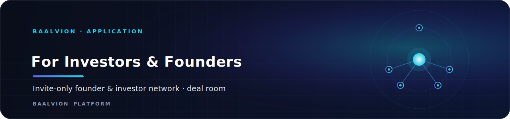
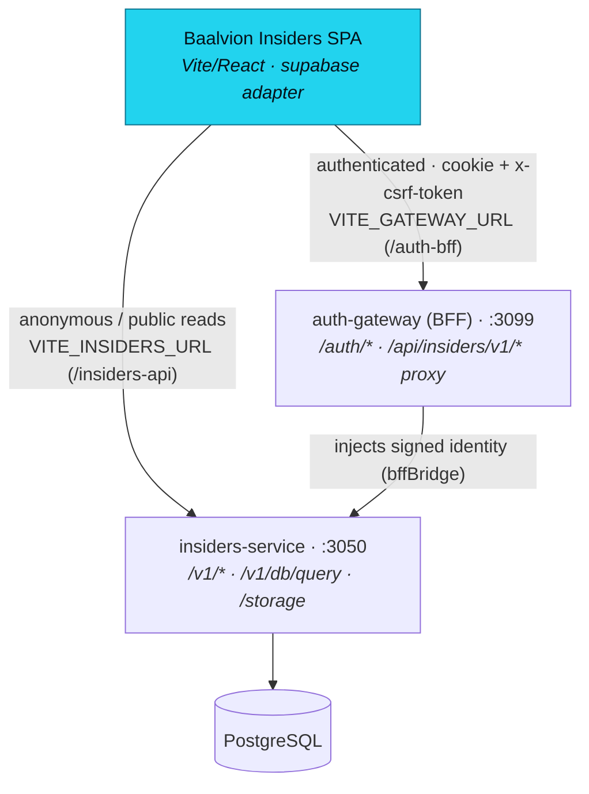

<div align="center">



<br/>
<br/>

**The authenticated members surface of the Baalvion platform where founders find investors who recently funded businesses like theirs — a private, invite-only network with a deal room, marketplace, forums, an Elite tier, and an embedded multi-role Protocol sub-app.**

<p>
  
  
  
  
  
  
</p>

<sub><a href="#overview">Overview</a> · <a href="#architecture">Architecture</a> · <a href="#tech-stack">Tech Stack</a> · <a href="#project-structure">Structure</a> · <a href="#pages--routes">Routes</a> · <a href="#getting-started">Getting started</a> · <a href="#configuration">Configuration</a> · <a href="#notes--gotchas">Notes</a></sub>

</div>

---

## Overview

**Baalvion Insiders** (package `investors-and-founders-web`) is the authenticated members surface of
the Baalvion platform where **founders find investors who recently funded businesses like theirs**
and raise their round faster. It is a private, invite-only network connecting verified founders with
active investors, plus a marketplace, deal room, discussion forums, an Elite membership tier, and an
embedded multi-role **Protocol** sub-app (admin / expert / student). It is built as a single-page
React application.

It sits in the Baalvion monorepo at `Frontend/For Invstors and Founders` as one of many
`Frontend/<app>` SPAs. Its backend is `Backend/services/ecosystem/insiders-service` (Node.js +
Express + Sequelize + PostgreSQL), and all authentication is centralized through the canonical
**auth-gateway BFF** (HttpOnly cookies + CSRF, RS256 via auth-service). A separate server-rendered
Next.js app (`Frontend/insiders-seo`) provides the public SEO surface; this app is the gated members
area.

- **Display name:** Baalvion Insiders (the in-app header brand reads "Baalvion Elite")
- **Dev / preview port:** `:8082` (`strictPort`, binds `::`)
- **Auth:** central auth-gateway BFF (`:3099`) — HttpOnly session cookie + `x-csrf-token`; no bearer token, no `localStorage` session
- **Backend:** `insiders-service` (`:3050`) for public reads, storage, and the `/db/query` adapter
- **Production target host:** `insiders.baalvion.com` (dev/preview also serves `founders.baalvion.com`)

## Architecture

### Rendering model

Pure client-side SPA. `index.html` mounts `<div id="root">` and loads `src/main.tsx`, which renders
`<App/>` inside `React.StrictMode`. All routing is client-side via React Router's `BrowserRouter`;
every page is a `React.lazy` dynamic import wrapped in a single `Suspense` boundary with a skeleton
fallback. There is **no server rendering** in this app (SEO is delegated to the sibling
`insiders-seo` Next.js app). The document ships `class="dark"` by default and includes Open Graph,
Twitter Card, canonical, and Organization JSON-LD meta in `index.html`.

### Data flow & backend integration

The app talks to its own backend (`insiders-service`) through a **Supabase-compatible adapter**
(`src/integrations/supabase/client.ts`). The export is named `supabase` so page code reads as
ordinary `supabase.from(table).select()...` even though there is no Supabase — calls are translated
into a single `POST /db/query` against `insiders-service`, plus `.rpc()`, `.storage`, `.functions`,
and no-op `.channel()` (realtime) shims. Two transport paths:



- **Authenticated** requests go `browser → ${GATEWAY}/api/insiders/v1/...` with the gateway's
  HttpOnly session cookie + `x-csrf-token` header (read from the JS-readable `csrf_token` cookie).
  The gateway injects signed identity verified by the backend's `bffBridge`.
- **Anonymous/public** requests go direct to `${INSIDERS}/v1/...`; only public table policies
  succeed there, so there is no privilege leak.
- **No bearer token, no localStorage session.** Only an optimistic public-user "mirror"
  (`insiders.user`) is cached in localStorage for fast first paint; it is reconciled against the
  real cookie session by `bootstrap()` → `/auth/me` → `/whoami`.
- A single-flight `401 → /auth/refresh → retry` loop dedupes concurrent token refreshes.

In dev/preview both bases are **same-origin Vite proxies** (`/auth-bff` → gateway, `/insiders-api`
→ insiders-service; see `vite.config.ts`) so the gateway cookies work without CORS.

### Auth

Cookie-based via the canonical gateway. The adapter's `auth.*` methods mirror the Supabase auth
surface (`signInWithPassword`, `signUp`, `signOut`, `getSession`, `onAuthStateChange`). Password
reset / change are intentionally **delegated to the central Baalvion identity provider** and return
an explanatory error rather than silently no-op. Route protection is two-tiered: `ProtectedRoute`
(must be authenticated + email-verified) and `MembershipGate` (must hold an **active paid
membership**; admins bypass). `src/lib/auth/gateway-session.ts` is an additive, `VITE_BFF_MODE`-gated
island that wraps `@baalvion/auth-sdk` for the future full cutover.

### CMS / payments

No CMS. Payments use a thin gateway-checkout client (`src/lib/gatewayCheckout.ts`) — the **only**
payment integration point — that holds no keys and no card fields. It posts to the site's own BFF
`/billing/checkout`, which resolves provider + keys from the central CMS vault server-side and hands
off to the provider's hosted checkout (Razorpay Checkout.js or Stripe Checkout). Supports
`razorpay`, `stripe`, `payu`, plus a `mock` mode for local/test.

### SEO

The gated app is mostly `Disallow`ed in `public/robots.txt`; only the public landing and `/elite`
are crawlable and listed in `public/sitemap.xml`. Major AI/LLM crawlers (GPTBot, ClaudeBot,
PerplexityBot, etc.) are explicitly allowed for the public surface. Rich meta + JSON-LD live in
`index.html`.

## Tech Stack

| Layer | Choice | Version |
|-------|--------|---------|
| Framework | React (SPA, no SSR) | `react` / `react-dom` `^18.3.1` |
| Language | TypeScript (loose config — see Notes) | `^5.8.3` |
| Build tool | Vite + `@vitejs/plugin-react-swc` | `^7.3.2` / plugin `^3.11.0` |
| Package manager | Bun (lockfile `bun.lockb`); npm-compatible | — |
| Routing | React Router DOM (client-side) | `^6.30.1` |
| Server state | TanStack React Query | `^5.83.0` |
| Styling | Tailwind CSS + `tailwindcss-animate` + `@tailwindcss/typography` | tailwind `^3.4.17` |
| UI primitives | Radix UI + shadcn/ui (local `ui/` components) | `^1.x–^2.x` |
| Icons | `lucide-react` | `^0.462.0` |
| Forms | `react-hook-form` + `@hookform/resolvers` | `^7.61.1` / `^3.10.0` |
| Validation | Zod | `^4.1.12` |
| Charts | Recharts | `^2.15.4` |
| Toasts | `sonner` + Radix toast | `^2.0.7` |
| Carousels | `embla-carousel-react` | `^8.6.0` |
| Dates | `date-fns` + `react-day-picker` | `^3.6.0` / `^8.10.1` |
| PDF export | `jspdf` + `jspdf-autotable` | `^4.2.1` / `^5.0.8` |
| Theme | `next-themes` | `^0.3.0` |
| Auth SDK | `@baalvion/auth-sdk` (workspace package) | `workspace:*` |
| Command menu | `cmdk` | `^1.1.1` |

The app declares the standard Baalvion `@baalvion/auth-sdk` workspace dependency, used by the gated
gateway session adapter (`src/lib/auth/gateway-session.ts`).

## Project Structure

```
For Invstors and Founders/
├── index.html              # SPA shell: root div, SEO meta, OG/Twitter, Organization JSON-LD
├── src/                    # Application source
│   ├── main.tsx            # React entry — mounts <App/> in StrictMode
│   ├── App.tsx             # Router: all routes, lazy imports, providers, guards
│   ├── index.css / App.css # Global styles + Tailwind layers + design tokens
│   ├── components/         # UI: shadcn/ui primitives + feature components
│   ├── pages/              # Route-level screens (members app + Protocol sub-app)
│   ├── hooks/              # Auth, membership, activity-tracking, toast, mobile hooks
│   ├── lib/                # Adapters & helpers: protocol-api, gatewayCheckout, validation, auth
│   └── integrations/       # Supabase-compatible client → insiders-service / gateway
├── public/                 # robots.txt, sitemap.xml (static, served as-is)
├── vite.config.ts          # Dev/preview server, same-origin BFF proxy table, esnext build target
├── tailwind.config.ts      # Design tokens, dark mode, keyframes/animations
├── components.json         # shadcn/ui generator config (aliases, base color)
├── eslint.config.js        # Flat ESLint config (typescript-eslint + react-hooks)
├── tsconfig*.json          # TS project refs (app + node), path alias @/* → ./src
├── .env.example            # Documented env vars (no secrets)
└── vercel.json             # Vercel ignore command (turbo-ignore)
```

## Pages & Routes

All non-public routes are wrapped in `<ProtectedRoute>`; members-only (paid) routes additionally in
`<MembershipGate>`.

### Public / auth
| Route | Page | Purpose |
|-------|------|---------|
| `/` | `Index` | Marketing landing (hero, stats, featured deals, members, live activity) |
| `/auth` | `Auth` | Sign in / sign up |
| `/auth/forgot-password` | `ForgotPassword` | Request password reset (delegated to identity provider) |
| `/auth/verify-email` | `VerifyEmail` | Email verification gate |
| `/auth/callback` | `AuthCallback` | Post-auth redirect handler |
| `/reset-password` | `ResetPassword` | Complete password reset |
| `/apply` | `Apply` | Membership application |
| `/elite` | `Elite` | Elite tier overview (public) |

### Authenticated members area
| Route | Page | Purpose |
|-------|------|---------|
| `/dashboard` | `Dashboard` | Member home feed |
| `/forums`, `/forums/new`, `/forums/thread/:threadId` | `ForumThreads`, `CreateThread`, `ThreadDetail` | Discussion forums |
| `/marketplace` | `MarketplaceConnected` | Marketplace listings |
| `/profile`, `/profile/edit`, `/onboarding` | `ProfileConnected`, `ProfileEdit`, `Onboarding` | Member profile management |
| `/connections` | `Connections` | Founder ↔ investor connections |
| `/membership` | `Membership` | Membership status & purchase (no paywall) |
| `/checkout` | `Checkout` | Hosted checkout handoff |
| `/leaderboard` | `Leaderboard` | Member leaderboard |
| `/elite/apply`, `/elite/status`, `/elite/premium` | `EliteApply`, `EliteStatus`, `ElitePremium` | Elite membership flow |
| `/admin`, `/admin/analytics`, `/admin/applications`, `/admin/members` | `AdminPanel`, `AdminAnalytics`, `AdminApplications`, `AdminMembers` | Admin console |

### Members-only (paid — `MembershipGate`)
| Route | Page | Purpose |
|-------|------|---------|
| `/pipeline` | `Pipeline` | Deal pipeline (kanban) |
| `/deals`, `/deals/new`, `/deals/:id`, `/deals/:id/manage` | `Deals`, `DealCreate`, `DealDetail`, `DealManage` | Deal room |
| `/investors`, `/investors/:id` | `Investors`, `InvestorDetail` | Investor directory |
| `/founders`, `/founders/:id` | `Founders`, `FounderDetail` | Founder directory |

### Protocol sub-app (multi-role)
| Route prefix | Pages | Purpose |
|--------------|-------|---------|
| `/protocol`, `/protocol/select-role` | `ProtocolLanding`, `RoleSelector` | Protocol entry + role chooser |
| `/protocol/admin/*` | `AdminDashboard`, `ExpertsManagement`, `CountryCAD`, `AdminRevenue`, `AdminUsers` | Protocol super-admin |
| `/protocol/expert/*` | `ExpertDashboard`, `ExpertStudents`, `ExpertCalls`, `ExpertFeed`, `ExpertContent`, `ExpertInvites` | Expert (CAD) workspace |
| `/protocol/student/*` | `StudentDashboard`, `StudentFeed`, `StudentCalls`, `StudentStore` | Student workspace |
| `*` | `NotFound` | 404 catch-all |

## Assets & Media

`public/` is deliberately lean — there are **no bundled images, photos, logos, or fonts** in this
repo. The app uses code-rendered visuals instead: gradient/blur "ambient glow" divs, Tailwind design
tokens, and `lucide-react` SVG icons (e.g. `Zap` as the logo mark, `Crown`, `Sparkles`, `Eye` for
Protocol). Avatars and uploaded media are served at runtime from `insiders-service` storage
(`${INSIDERS}/storage/<bucket>/<path>`), not from `public/`.

Static files actually present in `public/`:

| File | Use |
|------|-----|
| `public/robots.txt` | Crawl rules — public landing + `/elite` allowed; members area disallowed; AI crawlers explicitly allowed |
| `public/sitemap.xml` | Two public URLs: `/` (priority 1.0, weekly) and `/elite` (priority 0.8, monthly) |

The favicon is an inline empty data URI (`<link rel="icon" href="data:," />`); OG/Twitter images
reference `https://insiders.baalvion.com/og-image.png` (served by the deploy host, not committed
here).

## Getting Started

### Prerequisites
- Node.js 18+ (Bun optional — `bun.lockb` present; npm works too)
- The Baalvion backend running locally:
  - `insiders-service` on **:3050**
  - `auth-gateway` (BFF) on **:3099**
  - PostgreSQL + Redis

```bash
# from the repo root (recommended — pnpm/Turbo monorepo)
pnpm install

# or standalone in this folder
npm install   # or: bun install
```

For local same-origin dev, leaving `VITE_GATEWAY_URL` / `VITE_INSIDERS_URL` unset lets them default
to the `/auth-bff` and `/insiders-api` Vite proxies.

```bash
npm run dev        # Vite dev server on :8082 (strictPort)
npm run build      # production build → dist/  (target: esnext)
npm run build:dev  # development-mode build
npm run preview    # serve the built dist/ on :8082 with the same BFF proxy
npm run lint       # ESLint (flat config)
```

The dev and preview servers share one BFF proxy table so authenticated (`/auth-bff`) and anonymous
(`/insiders-api`) calls behave identically in both.

## Configuration

All client env vars are Vite `VITE_`-prefixed and therefore **public** (bundled into the client).
Never put secrets here. Defaults are wired in `vite.config.ts`.

| Variable | Purpose | Default |
|----------|---------|---------|
| `VITE_GATEWAY_URL` | Base for auth + authenticated data via the auth-gateway BFF | `/auth-bff` (same-origin proxy in dev) |
| `VITE_INSIDERS_URL` | Base for anonymous/public reads + storage URLs (direct to insiders-service) | `/insiders-api` (same-origin proxy in dev) |
| `VITE_GATEWAY_TARGET` | Dev-proxy upstream for `/auth-bff` (server-side only) | `http://localhost:3099` |
| `VITE_INSIDERS_TARGET` | Dev-proxy upstream for `/insiders-api` (server-side only) | `http://localhost:3050` |
| `VITE_API_BASE_URL` | Optional override base for the checkout BFF (`/billing/checkout`) | falls back to `VITE_GATEWAY_URL`, then `http://localhost:4000/v1` in dev only |
| `VITE_BFF_MODE` | Feature flag enabling the `@baalvion/auth-sdk` gateway-session island | `off` |

`.env.example` documents the single production ingress override
(`VITE_GATEWAY_URL=https://api.baalvion.com`).

## Deployment

- **Vercel** (per `vercel.json`): the build is skipped when the app is unchanged via
  `npx turbo-ignore investors-and-founders-web` (Turborepo affected-graph gating).
- **Self-hosted / reverse-proxy** option: build to `dist/` and serve via `vite preview` behind Caddy
  at `founders.baalvion.com` / `.local`. The preview server's `allowedHosts` already permits
  `.baalvion.com`, `.baalvion.local`, and `localhost`; otherwise Vite returns "Blocked request.
  This host is not allowed."
- Production target host is `insiders.baalvion.com` (canonical URL in `index.html` / sitemap).
- In production an unset `VITE_GATEWAY_URL`/`VITE_API_BASE_URL` must resolve relative (same-origin
  ingress), **not** fall back to localhost — the localhost defaults are dev-only and guarded by
  `import.meta.env.PROD`.

## Notes / Gotchas

- **Folder name ≠ product name.** The directory is `For Invstors and Founders` (note the typo and
  spaces — always quote paths), but the package is `investors-and-founders-web` and the product is
  **Baalvion Insiders**. The in-app header brand reads "Baalvion Elite".
- **The `supabase` export is not Supabase.** It is a hand-written compatibility adapter over the
  gateway + insiders-service. Realtime is a no-op shim; live updates are done by **polling** (e.g.
  `NotificationBell` polls every 30s).
- **Dev port is fixed at 8082** with `strictPort: true` to avoid colliding with Proxy-BaalvionStack
  (8080) — a port conflict fails loudly instead of grabbing a random port.
- **Build target is `esnext`** to dodge an esbuild "Transforming destructuring to the configured
  target environment is not supported yet" error that is fatal in CI (Linux) but only a warning
  locally on Windows.
- **Loose TypeScript:** `tsconfig.json` relaxes strict null/implicit-any/unused checks; the adapter
  and page code lean on `any` in places.
- **Two tiers of gating:** `ProtectedRoute` (auth + email-verified) then `MembershipGate` (active
  paid membership; admins bypass). The deal/investor/founder directories are paid-only.
- **Backend health banner:** `BackendHealthBanner` pings `${INSIDERS}/health` and shows a dismissible
  warning if `insiders-service` (:3050) is unreachable.
- **Protocol is a self-contained sub-app** with its own `ProtocolLayout`, role-based sidebars
  (admin/expert/student), and a live data client (`src/lib/protocol-api.ts`). Its routes are **not**
  wrapped in `ProtectedRoute`.

---

<div align="center">
<sub>Part of the <a href="https://github.com/baalvionservice/Baalvion-Project-Infra">Baalvion Platform</a> · centralized identity · domain-driven monorepo</sub>
</div>
