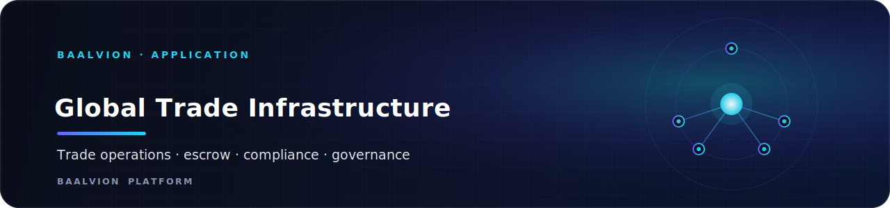
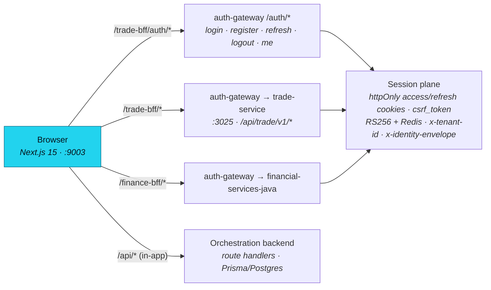

<div align="center">



<br/>
<br/>

**Frontend for the Baalvion Global Trade Operating System — a neutral, institutional infrastructure layer for international trade, pairing a public marketing/onboarding surface with an authenticated trade-operations control center.**

<p>
  
  
  
  
  
  
  
  
  
</p>

<sub><a href="#overview">Overview</a> · <a href="#architecture">Architecture</a> · <a href="#tech-stack">Tech Stack</a> · <a href="#project-structure">Structure</a> · <a href="#pages--routes">Routes</a> · <a href="#getting-started">Getting started</a> · <a href="#environment-variables">Env</a> · <a href="#deployment">Deployment</a> · <a href="#notes--gotchas">Notes</a></sub>

</div>

---

## Overview

**Baalvion GTI** is the frontend for the **Baalvion Global Trade Operating System** — a neutral,
institutional infrastructure layer for international trade. It pairs a public marketing/onboarding
surface (banks, governments, enterprises, logistics providers) with an authenticated
**trade-operations control center**: sourcing & RFQs, deals/orders, escrow-secured payments, trade
finance, compliance & sanctions screening, customs, logistics/shipment tracking, intelligence, and a
sovereign governance plane.

It is one app inside the larger **Baalvion** pnpm + Turborepo monorepo. The browser only ever talks
to this origin; all live trade data is fetched through a same-origin **BFF proxy**
(`/trade-bff`, `/finance-bff`) that forwards to the canonical **auth-gateway**, which in turn proxies
to the `trade-service` and Java finance services with signed identity + tenant headers. The app also
ships a self-contained Next.js **orchestration backend** (route handlers + Prisma) used for the
`TradeTransaction` aggregate, event store, and health probes.

- **Public site / dev port:** `9003` (`next dev -p 9003`)
- **Canonical production host:** `https://trade.baalvion.com`
- **Audience:** enterprises, banks, government/customs authorities, and logistics carriers transacting cross-border
- **Auth model:** cookie-based via the central auth-gateway (no JS bearer token); httpOnly access/refresh cookies + double-submit CSRF

> **Package identity:** `name: "baalvion-eternal-absolute-singularity"`, `version: 142.0.0-SINGULARITY`
> (internal versioning theme; the user-facing product is "Baalvion Global Trade OS").

## Architecture

### Request topology

The browser talks **only to this origin**. `next.config.ts` rewrites set up two BFF lanes that proxy
to the auth-gateway (`GATEWAY_PROXY_TARGET`, default `http://localhost:3099`), which owns sessions,
CSRF, RS256 verification, and the signed identity/tenant headers.



### Rendering model

- **Next.js App Router** with React Server Components. The **root layout is `force-dynamic`**
  (`export const dynamic = 'force-dynamic'`) because the app is a store-driven, authenticated platform
  that is not SSG-safe.
- Two top-level route groups:
  - **`(public)`** — marketing + onboarding, fully crawlable, server components own SEO (metadata + JSON-LD).
  - **`(dashboard)`** — the authenticated operations workspace (resizable panes, sidebar, AI copilot, realtime), wrapped in a `TradeQueryProvider` (TanStack Query).
- A top-level **`governance/`** tree is the sovereign command + oversight plane (authenticated, persona-gated).

### Data flow & backend integration

- **`src/lib/api-client.ts`** is the single production client: base `/trade-bff`, no JS bearer token
  (cookie mode), CSRF double-submit header on unsafe methods, automatic single-flight refresh on `401`, retries.
- **`src/api/*`** is the typed TradeOps data layer (React Query keys + domain modules: shipments,
  customs, compliance, documents, logistics, workflows…). Paths are passed **without** the `/v1`
  prefix; the proxy adds it.
- **`src/services/*`** is a large catalog of domain service singletons (commerce, finance,
  intelligence, identity, logistics, compliance, governance…) used by dashboard pages.
- **Orchestration backend (in-app):** `src/server/*` + `src/app/api/*` provide route handlers backed
  by **Prisma/Postgres** for the `TradeTransaction` aggregate, event store, audit, repositories, and a
  `/api/health` DB liveness probe. `src/ai/*` holds **server-only Genkit flows** (risk alerts,
  negotiation assistant, delay prediction, etc.).

### Auth & route gating (defense in depth)

1. **Edge middleware** (`src/middleware.ts`) — proves a *session exists* by checking the un-forgeable
   httpOnly refresh cookie (`NEXT_PUBLIC_REFRESH_COOKIE_NAME`, default `baalvion_refresh`). Redirects
   unauthenticated users to `/login?redirect=…` (open-redirect–safe). Sets a strict CSP + security headers.
2. **Client `RouteGuard`** (`src/app/(dashboard)/_components/route-guard.tsx`, mounted in the root
   layout) — per-persona authorization allowlist.
3. **API (authoritative)** — the gateway/trade-service enforce real tenant + authority.

Route classification is centralized in **`src/lib/route-access.ts`** so the edge and the guard share
one source of truth (`AUTH_REQUIRED_PREFIXES`, `ADMIN_PREFIXES`, `PUBLIC_EXACT`).

### Onboarding loop

The public **department onboarding wizard** (`/onboard/[department]` for
banking/customs/logistics/enterprise, plus `/onboard/buyer` and `/onboard/seller`) is
**config-driven**: `_lib/department-configs.ts` declares each persona's steps, fields, documents, and
compliance-screening checks; the shared `<DepartmentWizard>` renders any of them. On completion it
submits to the backend via `onboarding-service.ts` (→ governance review queue). **No client-side
access is ever granted** — real access comes from a backend session after review.

### SEO

- `src/lib/seo.ts` centralizes metadata + JSON-LD helpers (`Organization`, `WebSite`,
  `SoftwareApplication`, `Service`, `BreadcrumbList`).
- App Router primitives: `app/sitemap.ts`, `app/robots.ts` (only the public marketing surface is
  indexable; the entire authenticated app is `disallow`ed), `app/manifest.ts`, and `app/opengraph-image.png`.

## Tech Stack

| Layer | Choice | Version |
|-------|--------|---------|
| Framework | [Next.js](https://nextjs.org) (App Router, RSC) | `15.0.3` |
| Language | TypeScript | `5.6.3` |
| UI runtime | React / React DOM | `18.3.1` |
| Styling | Tailwind CSS + `tailwindcss-animate` | `^3.4.19` (config) / `@tailwindcss/postcss` `4.0.0` |
| Component primitives | ShadCN UI on Radix UI (`@radix-ui/react-*`) | accordion/dialog/select/tabs/etc. |
| Class utilities | `clsx`, `tailwind-merge`, `class-variance-authority` | `^2.1.1` / `^2.5.4` / `^0.7.1` |
| Icons | `lucide-react` | `^0.454.0` |
| Animation | `framer-motion` | `^11.11.0` |
| Carousel | `embla-carousel-react` | `^8.3.0` |
| Server state | `@tanstack/react-query` | `^5` |
| Client state | `zustand` | `^5.0.1` |
| Forms | `react-hook-form` | `^7.53.2` |
| Validation | `zod` | `^3.23.8` |
| Charts / viz | `recharts`, `d3` | `^2.13.3` / `^7.9.0` |
| Dates | `date-fns` | `^4.1.0` |
| ORM (orchestration DB) | Prisma + `@prisma/client` + `pg` | `^6` / `^8` |
| AI flows (server-only) | `genkit` + `@genkit-ai/google-genai` | `^1.0.0` |
| Eventing (server-only) | `kafkajs` | `^2.2.4` |
| Auth SDK (workspace) | `@baalvion/auth-sdk` | `workspace:*` |
| Backend-as-a-service | `firebase` | `^11.0.1` |
| Tests | Vitest (unit), Playwright (security E2E) | `^2.1.9` |
| Local DB (dev) | `embedded-postgres` | `17.10.0-beta.17` |

## Project Structure

```
.
├── src/
│   ├── app/                  # App Router: routes, layouts, route handlers, SEO files
│   │   ├── (public)/         # Marketing + onboarding (crawlable) — header/footer shell
│   │   ├── (dashboard)/      # Authenticated trade-ops workspace (sidebar + panes + copilot)
│   │   ├── governance/       # Sovereign command + oversight plane (authenticated)
│   │   ├── api/              # In-app orchestration route handlers (trades, finance, health…)
│   │   ├── login | forgot-password | reset-password | accept-invite   # auth entry pages
│   │   └── layout.tsx        # Root layout: providers, RouteGuard, SEO, fonts
│   ├── api/                  # Typed TradeOps data layer + React Query (client/keys/domains)
│   ├── lib/                  # api-client, route-access, seo, safe-redirect, utils, clients
│   ├── services/             # Domain service singletons (commerce/finance/intelligence/…)
│   ├── server/               # In-app orchestration backend (Prisma, repositories, http, ai)
│   ├── ai/                   # Server-only Genkit AI flows, agents, orchestration kernel
│   ├── orchestration/        # Workflow/lifecycle/consensus/compensation engines + event bus
│   ├── core/                 # Personas, roles, routes, authorization, GST, organizations
│   ├── components/           # Shared components incl. ShadCN UI primitives (/ui)
│   ├── modules/              # Feature modules (workspace store, analytics, financials…)
│   ├── design-system/        # Tokens, density provider, design store
│   ├── hooks/                # Reusable React hooks (mobile, realtime, toast, device-class)
│   ├── store/                # Global Zustand app store
│   ├── repositories/         # Client-side repository abstractions (base, sourcing)
│   ├── types/ data/          # Shared types + data index
│   └── middleware.ts         # Edge auth gate + security headers/CSP
├── prisma/                   # Orchestration datastore schema + migrations
├── packages/                 # Local SDK/contract packages (.proto contracts, SDK stubs)
├── scripts/                  # migrate-init.cjs (Prisma migration bootstrap)
├── docs/                     # Engineering/API/DB/deployment specs + blueprint
├── public/                   # Static assets (icon.svg)
├── tests/ testing/           # Playwright security tests + helpers
├── next.config.ts            # BFF rewrites, CSP/security headers, server-external packages
├── tailwind.config.js | postcss.config.mjs | components.json   # styling + ShadCN config
├── apphosting.yaml | docker-compose.yml | firestore.rules      # deploy/infra config
└── vitest.config.ts | playwright.security.config.ts            # test configs
```

## Pages & Routes

### Public (`src/app/(public)/`) — indexable

| Route | Purpose |
|-------|---------|
| `/` | Home — Global Trade OS hero + value proposition (`home-client.tsx`) |
| `/platform` | Platform overview |
| `/banks` `/governments` `/enterprises` `/logistics` | Audience solution pages (shared `solution-page.tsx`) |
| `/pricing` | Pricing |
| `/about` `/contact` | Company / contact |
| `/privacy` `/terms` | Legal |
| `/onboard` | Onboarding entry / department picker |
| `/onboard/[department]` | Config-driven institutional wizard (banking/customs/logistics/enterprise) |
| `/onboard/buyer` `/onboard/seller` | Buyer/seller onboarding tracks |
| `/access/request` `/access/pending` | Access request + pending states |

### Auth entry (`src/app/`)

| Route | Purpose |
|-------|---------|
| `/login` | Sign in (redirects authenticated users onward) |
| `/forgot-password` `/reset-password` | Password recovery |
| `/accept-invite` | Accept an organization invitation |

### Dashboard (`src/app/(dashboard)/`) — authenticated workspace (selected)

| Route | Purpose |
|-------|---------|
| `/dashboard` | Operational home |
| `/trade-ops` `/trade-ops/[id]` | **Shipment-centric Trade Operations control center** (live trade-service) |
| `/buyer/*` `/seller/*` `/agent/*` | Persona workspaces (RFQs, listings, responses) |
| `/sourcing/*` | Auctions, pipeline, RFQ templates |
| `/deals/*` `/orders/*` `/negotiations/*` | Commerce lifecycle |
| `/marketplace/*` | Listings, prices, sellers |
| `/payments/*` `/escrow/*` `/finance-settlement` | Payments, escrow, settlement |
| `/financials/*` | Trade finance, treasury, credit lines, invoices, risk-governance |
| `/compliance/*` `/compliance-regulatory/*` `/sanctions-screening` | KYC, declarations, HS codes, screening |
| `/customs/[shipmentId]` `/logistics-shipment/*` `/shipments` `/carriers/*` | Customs + logistics tracking |
| `/intelligence-hub/*` | Risk, geopolitical, maritime, sea-routes, disruptions, analytics |
| `/insurance/*` `/documents` `/messages/*` | Insurance, document vault, messaging |
| `/executive/*` `/crisis-center` `/oversight/*` | Executive command, crisis, oversight admin |
| `/organization/*` `/platform/organizations/*` `/settings/*` `/profile` | Org admin, platform console, settings, MFA |

### Governance (`src/app/governance/`) — sovereign/oversight plane (authenticated, persona-gated)

| Route | Purpose |
|-------|---------|
| `/governance` | Governance home |
| `/governance/platform-status` | Live ROUTE_REGISTRY / service coverage tracker |
| `/governance/onboarding` | Onboarding review queue |
| `/governance/security/*` | RBAC, tenants, security audit |
| `/governance/intelligence` | Risk heatmap, anomaly/exposure/supplier-risk |
| `/governance/{approvals,policies,disputes,audit-logs,compliance-admin,…}` | Approval, policy, dispute, audit surfaces |

### In-app API (`src/app/api/`) — orchestration route handlers

| Route | Purpose |
|-------|---------|
| `/api/health` | Liveness/readiness probe (verifies DB) |
| `/api/trades` + `/api/trades/[id]/{workflow,events,audit,documents,finance,compliance,cancel,complete}` | TradeTransaction aggregate operations |
| `/api/finance/[requestId]/decision` | Finance decisioning |
| `/api/sanctions/screen` | Sanctions screening |
| `/api/[entity]` `/api/v1/[entity]` | Generic CRUD entity routes |
| `/api/v1/intelligence/delay-prediction` | AI delay prediction |

## Assets & Media

`public/` is intentionally minimal — this app sources hero/marketing imagery from approved remote CDNs
rather than bundling large files.

| Asset | Location | Use |
|-------|----------|-----|
| `icon.svg` | `public/icon.svg` | App/site icon (favicon is also set to a `data:` URI in the root layout) |
| `opengraph-image.png` | `src/app/opengraph-image.png` | Default Open Graph / Twitter share card |
| `opengraph-image.alt.txt` | `src/app/opengraph-image.alt.txt` | Alt text for the OG image |
| `preview.png` | `.github/preview.png` | Repo social preview |
| `banner.svg` | `assets/banner.svg` | README banner (docs only, not served) |

**Remote image allowlist** (`next.config.ts` `images.remotePatterns` + CSP `img-src`): `placehold.co`,
`images.unsplash.com`, `picsum.photos`. No local fonts are bundled — **Inter** and **JetBrains Mono**
load from Google Fonts (preconnected in the root layout).

## Getting Started

### Prerequisites

- Node.js (matching the monorepo toolchain; `@types/node` `20.x`) and **pnpm** (this is a workspace
  package; `@baalvion/auth-sdk` resolves via `workspace:*`).
- A reachable **auth-gateway** at `GATEWAY_PROXY_TARGET` (default `http://localhost:3099`) for live
  trade/finance data.
- PostgreSQL for the in-app orchestration DB (`DATABASE_URL`); `embedded-postgres` is available for local dev.

### Install & run

```bash
pnpm install            # from the monorepo root (preferred)
pnpm run dev            # this app on http://localhost:9003

# build & serve production
pnpm run build
pnpm run start

# orchestration database (Prisma)
pnpm run prisma:generate
pnpm run prisma:migrate     # node scripts/migrate-init.cjs
pnpm run prisma:studio
pnpm run db:backfill        # node scripts/run-backfill.cjs

# tests
pnpm run test               # vitest run
pnpm run test:watch
pnpm run test:security      # playwright (playwright.security.config.ts)
```

Copy the variables you need into `.env.local` (gitignored). See **Environment Variables** below.

## Environment Variables

> `.env*` files are gitignored. **Never commit secrets.** `NEXT_PUBLIC_*` vars are exposed to the
> browser bundle — treat them as public.

| Variable | Exposed to browser? | Purpose |
|----------|---------------------|---------|
| `NEXT_PUBLIC_APP_URL` | yes | Canonical site origin (SEO `metadataBase`, sitemap/robots, OG). Default `https://trade.baalvion.com`; dev `http://localhost:9003`. |
| `NEXT_PUBLIC_API_BASE_URL` | yes | Public API base hint (dev `http://localhost:3025`). |
| `NEXT_PUBLIC_DEMO_MODE` | yes | Toggles demo/seed behavior in the UI. |
| `NEXT_PUBLIC_REFRESH_COOKIE_NAME` | yes | Name of the httpOnly refresh cookie the edge middleware reads (default `baalvion_refresh` / `refresh_token`). |
| `GATEWAY_PROXY_TARGET` | no (server) | Upstream auth-gateway the `/trade-bff` + `/finance-bff` rewrites proxy to (default `http://localhost:3099`). |
| `DATABASE_URL` | no (server) | Postgres connection for the in-app orchestration datastore (Prisma). |
| `NODE_ENV` | no (server) | Gates dev-only CSP relaxations (`'unsafe-eval'`, `ws:`/`http:` localhost) and HSTS. |

## Deployment

- **Firebase App Hosting** is the primary target: `apphosting.yaml` (`runConfig.maxInstances`) defines
  the backend; `firestore.rules` ships Firestore security rules (Firebase SDK `^11`).
- **Containerized infra** for local/integration: `docker-compose.yml` provisions Postgres 16, Redis 7,
  Zookeeper/Kafka, ClickHouse, and MinIO (object storage) for the broader platform.
- Additional deployment specs/order live in `docs/DEPLOYMENT_SPEC.md`, `deployment-order.md`,
  `production-deployment.yaml`, and `REAL_PRODUCTION_EXECUTION_ORDER.md`.
- **Security headers + CSP** are emitted both at build (`next.config.ts headers()`) and at the edge
  (`middleware.ts`), and include payment-gateway allowances (Razorpay, Stripe, PayU) for the embedded
  checkout flows.

## Testing

- **Unit:** `pnpm run test` (Vitest; `vitest.config.ts`). Watch mode via `pnpm run test:watch`.
- **Security E2E:** `pnpm run test:security` (Playwright; `playwright.security.config.ts`) — exercises
  the auth gate, redirect safety, and CSP/header posture.

## Security

- **No JS bearer token.** Auth is cookie-based via the gateway; `api-client.ts` keeps legacy
  `setToken`/`clearToken` shims as no-ops so existing imports compile. Do not add a bearer or tenant
  header in JS — the trade-service will reject it and it regresses the security model.
- **Defense in depth.** Edge middleware (session existence) → client RouteGuard (per-persona) → API
  (authoritative tenant + authority). The client gate prevents display, not access.
- **CSP + security headers** ship from both `next.config.ts headers()` and `middleware.ts`; `NODE_ENV`
  gates dev-only relaxations and HSTS.
- **Server-only packages.** Genkit / OpenTelemetry / Kafka are listed in `serverExternalPackages` and
  stubbed out of the client webpack `fallback` (`kafkajs: false`, `node:*: false`).
- **Robots/sitemap stay in sync with `route-access.ts`** — only public marketing routes are indexable.

## Notes / Gotchas

- **BFF path convention.** Pass resource paths **without** `/v1` (e.g. `/shipments`); the rewrite chain
  expands `/trade-bff/<path>` → `/api/trade/v1/<path>`. Middleware explicitly lets `/trade-bff` and
  `/api/` through.
- **`force-dynamic` root layout.** Client stores are not SSG-safe, so the app renders dynamically; do
  not expect static prerendering of authenticated pages.
- **ESLint is not run during `build`** (`eslint.ignoreDuringBuilds: true`), but **TypeScript errors DO
  fail the build** (`typescript.ignoreBuildErrors: false`).
- **Two READMEs predate this rewrite** (`ARCHITECTURE.md` is an aspirational "Quantum Constellation"
  narrative; an older README referenced port `9002`). The authoritative dev port is **`9003`**.
- This folder is its **own git repository** (a submodule of the Baalvion monorepo).

---

<div align="center">
<sub>Part of the <a href="https://github.com/baalvionservice/Baalvion-Project-Infra">Baalvion Platform</a> · centralized identity · domain-driven monorepo</sub>
</div>
