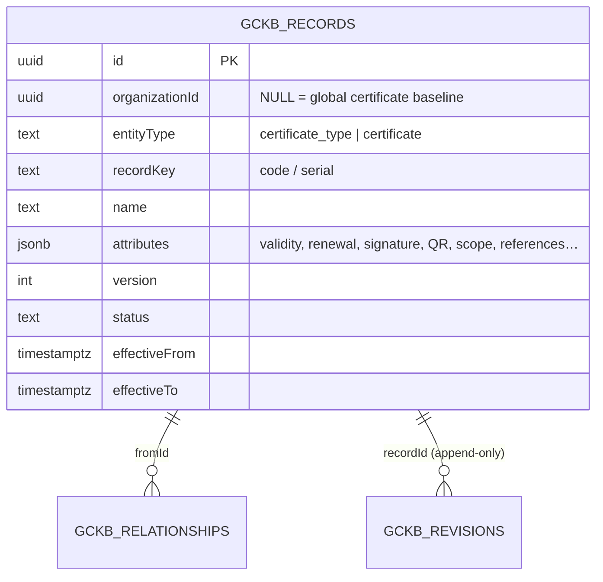

# Global Certificate Registry — Phase 1 (Module 3)

> **Status:** ✅ Implemented & tested (backend config + tests; full GCKB suite
> green on real PostgreSQL). Admin UI delivered by the shared registry-driven
> console.
> **Principle:** *Configuration over code.* Certificate types and issued
> certificates are GCKB registry entities — not new tables, migrations, services
> or routes. **Nothing is seeded.** Digital-signature and QR fields are
> **metadata only** (no signing/verification service is implemented in Phase 1).

Two entities in `src/server/gckb/registries/certificate.ts`:

| Entity | Purpose |
|--------|---------|
| `certificate_type` | The catalogue of certificate kinds — Certificate of Origin, Phytosanitary, CE, Health, Conformity, Inspection, Insurance … |
| `certificate` | An issued certificate instance (serial, holder, validity window, signature + QR payload, renewal chain) |

Both ride the GCKB engine → versioning, append-only history, version comparison,
effective-dated search, faceted/keyword search, CSV/JSON import (dry-run +
rollback), export, immutable audit, domain events and RLS — **no new migration**.

---

## 1. `certificate_type` — what a certificate is

`attributes`: `category, issuingAuthorityKey, mandatory, legalBasis,
defaultValidityMonths, renewable, renewalLeadDays, requiresInspection,
digitalSignature{standard,required,trustList}, qrVerification{supported,
urlTemplate,algorithm}, appliesToHsCodes[], appliesToCountries[],
appliesToProductCategories[], documentTemplateKey, workflowTemplateKey, ruleKey`.

- **Validity / renewal** → `defaultValidityMonths`, `renewable`, `renewalLeadDays`.
- **Digital signature metadata** → `digitalSignature` (eIDAS / PKI / X.509 / PAdES…).
- **QR verification** → `qrVerification` (supported, `urlTemplate`, algorithm).
- **Workflow / rule references** → `workflowTemplateKey` (Module 6), `ruleKey`
  (Rule Engine), plus typed edges `VERIFIED_BY_WORKFLOW` / `ENFORCED_BY_RULE`.
- **Products / countries / HS scope** → `appliesTo*` arrays + typed edges.

Natural key: `code` › `slug(name)` (uppercased).

## 2. `certificate` — an issued instance

`attributes`: `certificateTypeKey (required), serialNumber, holderOrganizationKey,
issuingAuthorityKey, issuedAt, validFrom, validTo, certificateStatus
(VALID|EXPIRED|REVOKED|SUSPENDED), scope{hsCodes,productKeys,countryCodes},
digitalSignature{...,signatureValue,signedAt,signerId,certificateChainRef},
qr{payload,verificationUrl,hash}, renewal{renews,supersedesCertificateKey,
renewalDueAt}`.

Natural key: `serialNumber` › `code` › `slug(name)`. Domain status
(`certificateStatus`) is distinct from the record lifecycle status.

---

## 3. Relationships (`CERTIFICATE_RELATIONSHIP_TYPES`)

```
ISSUED_BY               certificate_type / certificate → authority
REQUIRED_IN             certificate_type → country
APPLIES_TO_HS           certificate_type → hs_code
APPLIES_TO_PRODUCT      certificate_type → product
USES_DOCUMENT_TEMPLATE  certificate_type → document   (Module 5)
VERIFIED_BY_WORKFLOW    certificate_type → workflow   (Module 6)
ENFORCED_BY_RULE        certificate_type → rule        (Rule Engine)
INSTANCE_OF             certificate → certificate_type
SUPERSEDES              certificate → certificate      (renewal chain)
```

Products reference certificate types via the product registry's
`REQUIRES_CERTIFICATE` edge; country policies via the `certificate` policy type.

---

## 4. ER diagram



---

## 5. API

Served automatically by the generic registry routes for both `certificate_type`
and `certificate`:

| Method & path | Purpose |
|---------------|---------|
| `GET /api/gckb/certificate_type?keyword=&page=` | Search the catalogue |
| `POST /api/gckb/certificate_type` | Catalogue a certificate type |
| `GET /api/gckb/certificate?keyword=` | Search issued certificates |
| `POST /api/gckb/certificate` | Issue a certificate instance |
| `GET /api/gckb/{certificate_type\|certificate}/{id}` · `/history` · `/versions` · `/relationships` | Read / history / edges |
| `POST …/validate` · `…/import` · `GET …/export` | Validate / import / export |

### OpenAPI (fragment)

```yaml
openapi: 3.0.3
info: { title: Global Certificate Registry, version: "1.0" }
paths:
  /api/gckb/certificate_type:
    post:
      summary: Catalogue a certificate type
      requestBody:
        content:
          application/json:
            schema:
              type: object
              required: [name, attributes]
              properties:
                name: { type: string }
                code: { type: string }
                attributes:
                  type: object
                  properties:
                    category: { type: string }
                    issuingAuthorityKey: { type: string }
                    defaultValidityMonths: { type: integer }
                    renewable: { type: boolean }
                    digitalSignature: { type: object }
                    qrVerification: { type: object }
                    appliesToHsCodes: { type: array, items: { type: string } }
                    workflowTemplateKey: { type: string }
                    ruleKey: { type: string }
      responses: { "201": { description: Created } }
  /api/gckb/certificate:
    post:
      summary: Issue a certificate instance
      requestBody:
        content:
          application/json:
            schema:
              type: object
              required: [name, attributes]
              properties:
                name: { type: string }
                attributes:
                  type: object
                  required: [certificateTypeKey]
                  properties:
                    certificateTypeKey: { type: string }
                    serialNumber: { type: string }
                    validFrom: { type: string }
                    validTo: { type: string }
                    certificateStatus: { type: string, enum: [VALID, EXPIRED, REVOKED, SUSPENDED] }
                    digitalSignature: { type: object }
                    qr: { type: object }
      responses: { "201": { description: Issued } }
```

---

## 6. Import / data dictionary

Import follows the standard GCKB engine (reserved columns → promoted/envelope;
others → `attributes`; transactional; idempotent; 422 on any invalid row). The
`gckb_records` columns used: `entityType` (`certificate_type`/`certificate`),
`recordKey` (code/serial), `name`, `attributes` (all certificate metadata),
`tags`, `version`, `status`, `effectiveFrom/To`, `organizationId`.

---

## 7. Events

`CERTIFICATE_TYPE_CREATED/UPDATED/ARCHIVED`; `CERTIFICATE_ISSUED` /
`CERTIFICATE_UPDATED` / `CERTIFICATE_ARCHIVED`. Tenant events via the
transactional outbox; global-baseline events directly to the bus.

---

## 8. Testing

```bash
npx vitest run src/server/gckb/__tests__/certificate-registry.test.ts \
               src/server/gckb/__tests__/certificate-service.integration.test.ts
```

- Unit — registration, key handling, validity / signature / QR-code checks,
  required `certificateTypeKey`, events, relationship catalogue.
- Integration (real PostgreSQL) — catalogue → issue → link (INSTANCE_OF), renewal
  (SUPERSEDES), search, idempotent import, and RLS tenant isolation.

---

## 9. Scope boundary

**In this module:** the two certificate registry entities, schemas, keys, events,
relationships, form metadata; unit + PostgreSQL integration tests; this doc. No
new migration.

**Delivered by shared infrastructure:** REST API, import/export, search,
versioning/history, audit, events, RLS, registry-driven Admin UI.

**Deliberately not here:** no real signing / cryptographic QR verification (Phase
1 models the metadata only); no seeded certificate data.
