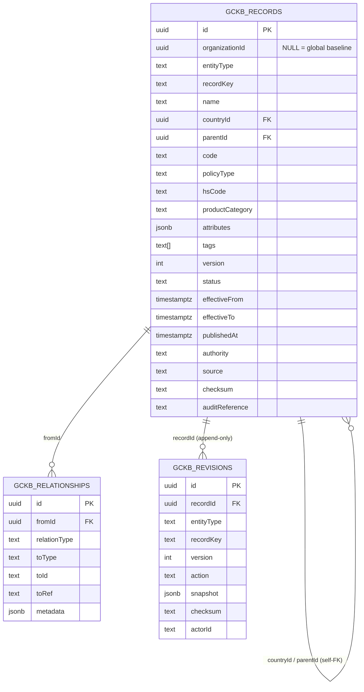

# Global Country Knowledge Base (GCKB) — Phase 1

> **Status:** ✅ Implemented & tested (backend + import engine; 33 GCKB tests, full suite 210/210 on real PostgreSQL).
> **Principle:** *Configuration over code.* Every country, authority, port and policy is **data** — no country is hardcoded; adding an entity or policy type is a registry entry, never a new table/service/route.

The GCKB is the platform's canonical, versioned, tenant-safe reference for every
country and its trade policy. It is designed to hold **250+ countries and
territories** and to be the integration point for future government APIs (their
**metadata** is modelled here; no integration is implemented — Phase 1 only).

---

## 1. Architecture

A single generic, registry-driven framework serves every entity type. Three
tables, one configuration registry, one generic service and one generic
(registry-parameterised) API.

```
HTTP (App Router, registry-driven)        Service (generic lifecycle)        Config (registry)
──────────────────────────────────        ───────────────────────────        ─────────────────
/api/gckb/entities                  ─┐
/api/gckb/[entity]                   │
/api/gckb/[entity]/[id]              │
/api/gckb/[entity]/[id]/history      ├──►  gckbService  ──► withTransaction ──► gckb_records
/api/gckb/[entity]/[id]/versions     │        │                                 gckb_relationships
/api/gckb/[entity]/[id]/relationships│        │            gckb_revisions (append-only, immutable)
/api/gckb/[entity]/validate          │        │            audit_logs (tenant writes, immutable)
/api/gckb/[entity]/import            │        │            outbox_events ─► flushOutbox ─► bus
/api/gckb/[entity]/export           ─┘        ▼
                                       registry.ts  +  policy-types.ts  +  import-engine.ts
```

| Layer | File | Responsibility |
|------|------|----------------|
| Types | `src/server/gckb/types.ts` | Write input, search query, envelope, statuses. |
| Checksum | `src/server/gckb/checksum.ts` | Deterministic content hash (change/dup detection). |
| Policy catalog | `src/server/gckb/policy-types.ts` | The 19 policy types as data (zod schemas + events). |
| Registry | `src/server/gckb/registry.ts` | The 10 entity definitions (validate, key, events). |
| Import engine | `src/server/gckb/import-engine.ts` | CSV/JSON parse, coerce, validate, dedupe, report. |
| Repositories | `src/server/repositories/gckb-repository.ts` | Records, relationships, append-only revisions. |
| Service | `src/server/services/gckb-service.ts` | Generic lifecycle, versioning, audit, events, import. |
| HTTP | `src/app/api/gckb/**` | Generic registry-driven REST. |

### Why single-table generic design

The 30+ "modules" in the brief share one lifecycle (same versioning envelope,
CRUD, history, search, import, audit, events). Modelling them as one
discriminated `gckb_records` table + a registry is the literal embodiment of
"configuration over code": a new entity type or policy type is a config entry —
no migration, service or route. Relational integrity is preserved via a
**self-referential FK** (`countryId`/`parentId` → `gckb_records`) and a generic
typed-edge table (`gckb_relationships`). Indexed promoted columns
(`entityType`, `countryId`, `policyType`, `hsCode`, `code`, `status`,
effective dates) plus GIN indexes on `attributes`/`tags` keep search fast.

---

## 2. Entity & policy catalog

**Entities (10)** — `country`, `currency`, `language`, `timezone`,
`trade_region`, `subdivision` (state/province), `authority`
(government/customs — `kind` discriminates), `point_of_entry` (port / airport /
land border / dry port / rail — `kind` discriminates), `trade_agreement`
(FTA / customs union / EPA — `kind` discriminates), `country_policy`.

**Policy types (19, under `country_policy`)** — `import_policy`, `export_policy`,
`tax`, `tariff`, `duty`, `certificate`, `license`, `restricted_goods`,
`prohibited_goods`, `inspection_rule`, `packaging_rule`, `labeling_rule`,
`document_requirement`, `government_form`, `digital_api`, `signature_standard`,
`compliance_requirement`, `risk_level`, `sanctions_metadata`.

`GET /api/gckb/entities` returns this catalog at runtime (drives Admin UI forms).

---

## 3. ER diagram



---

## 4. Versioning model

Every record carries the full envelope: `version`, `effectiveFrom`,
`effectiveTo`, `publishedAt`, `status` (`DRAFT | PUBLISHED | SUPERSEDED |
ARCHIVED`), `authority`, `source`, `checksum`, `auditReference`, `createdAt`,
`updatedAt`.

- The **head row** (`gckb_records`) is the current projection.
- **Every version is preserved forever** in `gckb_revisions` — an append-only
  table with a database trigger that **rejects UPDATE and DELETE**. History,
  version listing and side-by-side comparison read from it.
- An update with identical content (same `checksum`) is a **no-op** (no version
  bump). `asOf=<ISO>` search returns records effective at an instant.
- Archive sets `status=ARCHIVED` + `deletedAt` (hidden from search; history
  retained). Nothing is destroyed.

---

## 5. Multi-tenancy & security

- `organizationId` is **nullable**: `NULL` = the platform-global canonical
  baseline inherited by every tenant; a tenant UUID = a tenant override/addition.
- **Row-Level Security** (migration `20260621140000_country_knowledge_base`):
  every tenant reads global + its own rows and writes only its own. The
  global baseline is provisioned by privileged tooling (RLS-bypassing).
- Every API route authenticates via the gateway-signed principal (identity +
  tenant from the signature, never client headers), rate-limits writes, and
  returns the standard `{ success, data, error }` envelope.
- Tenant writes produce an **immutable `audit_logs`** row; all writes produce an
  immutable `gckb_revisions` snapshot. Events flow through the transactional
  outbox (tenant) or directly to the bus (global).

---

## 6. API

| Method & path | Purpose |
|---------------|---------|
| `GET /api/gckb/entities` | Registry introspection (entities + policy types) |
| `GET /api/gckb/{entity}` | Search / list (filters below) |
| `POST /api/gckb/{entity}` | Create a record |
| `GET /api/gckb/{entity}/{id}` | Read (record + relationships) |
| `PATCH /api/gckb/{entity}/{id}` | Update (optimistic `expectedVersion`; `status:"PUBLISHED"` to publish) |
| `DELETE /api/gckb/{entity}/{id}` | Archive (`?reason=`) |
| `GET /api/gckb/{entity}/{id}/history` | Append-only revision history |
| `GET /api/gckb/{entity}/{id}/versions` | List versions; `?a=&b=` compares two |
| `GET/POST /api/gckb/{entity}/{id}/relationships` | List / add typed edges |
| `POST /api/gckb/{entity}/validate` | Validate a payload without persisting |
| `POST /api/gckb/{entity}/import` | Bulk import (CSV/JSON; `dryRun`) |
| `GET /api/gckb/{entity}/export` | Bulk export (`?format=json|csv`) |

**Search filters** (`GET /api/gckb/{entity}`): `countryCode`, `hsCode`,
`productCategory`, `policyType`, `authority`, `code`, `status`, `tag`, `keyword`,
`asOf`, `page`, `pageSize`.

### OpenAPI (fragment)

```yaml
openapi: 3.0.3
info: { title: GCKB API, version: "1.0" }
paths:
  /api/gckb/{entity}:
    parameters: [{ name: entity, in: path, required: true, schema: { type: string } }]
    get:
      summary: Search records
      parameters:
        - { name: countryCode, in: query, schema: { type: string } }
        - { name: hsCode, in: query, schema: { type: string } }
        - { name: policyType, in: query, schema: { type: string } }
        - { name: keyword, in: query, schema: { type: string } }
        - { name: asOf, in: query, schema: { type: string, format: date-time } }
      responses: { "200": { description: Paginated records } }
    post:
      summary: Create a record
      requestBody:
        content:
          application/json:
            schema: { $ref: "#/components/schemas/CreateRecord" }
      responses: { "201": { description: Created } }
  /api/gckb/{entity}/import:
    post:
      summary: Bulk import (dryRun supported)
      responses: { "200": { description: Committed/preview }, "422": { description: Validation report } }
components:
  schemas:
    CreateRecord:
      type: object
      required: [name, attributes]
      properties:
        recordKey: { type: string }
        name: { type: string }
        countryCode: { type: string }
        code: { type: string }
        policyType: { type: string }
        hsCode: { type: string }
        productCategory: { type: string }
        tags: { type: array, items: { type: string } }
        status: { type: string, enum: [DRAFT, PUBLISHED, SUPERSEDED, ARCHIVED] }
        attributes: { type: object }
        envelope:
          type: object
          properties:
            effectiveFrom: { type: string }
            effectiveTo: { type: string }
            authority: { type: string }
            source: { type: string }
            auditReference: { type: string }
```

---

## 7. Import specification

`POST /api/gckb/{entity}/import` with `{ format, content | rows, dryRun }`.

- **Formats:** `csv` and `json` are implemented. `xml` and `excel` are recognised
  but their adapters are intentionally not enabled — they fail with a clear,
  actionable error (wire an adapter in `import-engine.ts` to enable).
- **CSV:** the header row names columns. Reserved columns map to envelope/promoted
  fields (`recordKey, name, countryCode, code, policyType, hsCode,
  productCategory, tags, status, effectiveFrom, effectiveTo, authority, source,
  auditReference`); every other column becomes an `attributes` field, with scalar
  coercion (numbers, `true`/`false`, and JSON literals). `tags` is `a|b|c`. An
  `attributes` column may carry a full JSON object instead.
- **JSON:** an array of records, or `{ "records": [...] }`. Each record matches
  the create payload (`attributes` is a typed object).
- **Pipeline:** parse → per-row validation against the registry → derive natural
  keys → **in-file duplicate detection** → structured **error report**. With
  `dryRun:true` the engine also returns a **preview** (would create / update /
  unchanged) and writes nothing.
- **Commit:** runs in a **single transaction** — any row error rolls back the
  entire batch. Existing records (by natural key) update only when their checksum
  changed; unchanged rows are skipped. Every written row gets an `IMPORT`
  revision + (tenant) audit + event.
- **Validation report shape:** `{ entityType, format, total, valid, invalid,
  duplicatesInFile, errors: [{ row, recordKey?, errors[] }] }`. A batch with any
  invalid row returns HTTP **422** and is not committed.

### Example CSV (country_policy / tax)

```csv
name,countryCode,policyType,taxName,taxType,ratePercent,exemptions
Standard VAT,DE,tax,VAT,VAT,19,"[""exports""]"
Reduced VAT,DE,tax,VAT,VAT,7,
```

---

## 8. Data dictionary (gckb_records)

| Column | Type | Notes |
|--------|------|-------|
| id | uuid | PK |
| organizationId | uuid? | NULL = global baseline; else tenant owner |
| entityType | text | registry key (country, authority, country_policy, …) |
| recordKey | text | natural key, unique per (org, entityType) while live |
| name | text | human label |
| countryId | uuid? | self-FK → owning country |
| parentId | uuid? | self-FK → hierarchy parent |
| code | text? | ISO / UN-LOCODE / IATA, indexed |
| policyType | text? | for country_policy |
| hsCode / productCategory | text? | indexed search facets |
| attributes | jsonb | entity-specific payload (registry-validated); GIN-indexed |
| tags | text[] | GIN-indexed |
| version | int | current version |
| status | text | DRAFT / PUBLISHED / SUPERSEDED / ARCHIVED |
| effectiveFrom / effectiveTo | timestamptz? | temporal validity |
| publishedAt | timestamptz? | set on publish |
| authority / source / checksum / auditReference | text | provenance envelope |
| createdAt / updatedAt / deletedAt | timestamptz | lifecycle |

`gckb_relationships`: `fromId` (FK) · `relationType` · `toType` · `toId`/`toRef` ·
`metadata`. `gckb_revisions` (append-only): `recordId` · `entityType` ·
`recordKey` · `version` · `action` · `snapshot` · `checksum` · `actorId`.

---

## 9. Events

`COUNTRY_CREATED/UPDATED/ARCHIVED`, `POLICY_CREATED/UPDATED/ARCHIVED`,
`CERTIFICATE_ADDED` (certificate policies), `FTA_CREATED/UPDATED/ARCHIVED`,
`AUTHORITY_CREATED/UPDATED/ARCHIVED`, plus `<ENTITY>_CREATED/UPDATED/ARCHIVED`
for the remaining entities. Tenant events are delivered via the transactional
outbox (durable, at-least-once); global-baseline events publish directly to the bus.

---

## 10. Testing

```bash
npx vitest run src/server/gckb/__tests__
```

- `checksum.test.ts` — deterministic, order-independent hashing.
- `registry.test.ts` — entity + policy-type catalog, validation, key derivation, events.
- `import-engine.test.ts` — CSV/JSON parse + coercion, validation, dedupe, error report.
- `gckb-service.test.ts` — real PostgreSQL: create/version/history/compare, search,
  relationships, archive, RLS (global + tenant), append-only immutability, events,
  import (commit / unchanged / rollback / preview).

The vitest global setup boots embedded PostgreSQL and runs `prisma migrate
deploy`, so the suite also verifies the migration (RLS, GIN/partial-unique
indexes, self-FK, append-only trigger) on real Postgres.

---

## 11. Scope boundary & next slices

**In this slice:** complete backend — data model, generic versioned framework,
all 10 entities + 19 policy types as configuration, full API, CSV/JSON import
engine with dry-run/preview/rollback/error-report, tests, docs.

**Deliberately not in this slice (Phase-1 follow-ups):**
- **Admin UI** (dashboard, table/detail/timeline, version comparison,
  relationship views, advanced filters, CSV/JSON/Excel import-export) — consumes
  the APIs above; `GET /api/gckb/entities` already powers dynamic forms.
- **XML & Excel import adapters** — recognised formats; wire parsers into
  `import-engine.ts`.
- **Data population** — no countries are seeded (the spec forbids mock/hardcoded
  data). Load real reference data through the import API.

**Out of scope (later phases):** financial/settlement/escrow, banking/insurance
integrations, live government-API integration (only their metadata is modelled),
and AI agents.
