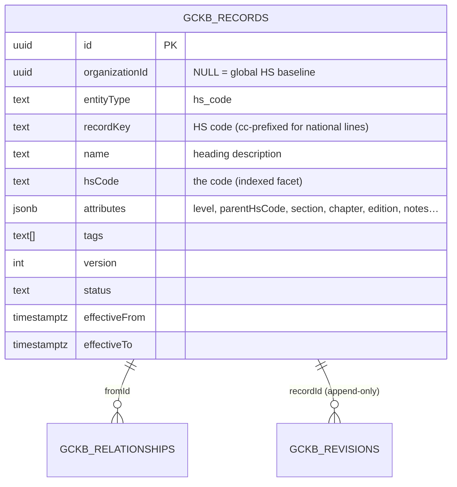

# Global HS Registry — Phase 1 (Module 2)

> **Status:** ✅ Implemented & tested (backend config + tests; full GCKB suite
> green on real PostgreSQL). Admin UI delivered by the shared registry-driven
> console (consumes the `formFields`/`relationshipTypes` declared here).
> **Principle:** *Configuration over code.* The HS nomenclature is one `hs_code`
> registry entity on the GCKB engine — not a new table, migration, service or
> route. **No HS data is seeded**; real nomenclature loads through the import API.

The Global HS Registry is the platform's canonical, versioned, tenant-safe
Harmonized System library: chapters (HS2) → headings (HS4) → subheadings (HS6) →
national tariff lines (HS8/HS10), with explanatory notes, effective-dated
editions (HS 2017 / 2022 / …) and the hierarchy + cross-reference graph.

---

## 1. Architecture — one entity, full hierarchy

`src/server/gckb/registries/hs-code.ts` registers a single `hs_code` entity.
Through the GCKB engine it inherits versioning, append-only history, version
comparison, effective-dated (`asOf`) search, faceted search on the promoted
`hsCode` column, CSV/JSON import (dry-run + rollback), export, audit, events and
RLS — **with no new migration** (it reuses `gckb_records`, whose `hsCode` column
is already indexed).

| Aspect | Modelling |
|--------|-----------|
| HS2/4/6/8/10 | `attributes.level ∈ {2,4,6,8,10}` (validated); the code itself is the promoted, indexed `hsCode` column |
| Hierarchy | `attributes.parentHsCode` + a `SUBHEADING_OF` typed edge (`gckb_relationships`) |
| Country extensions | a national `hs_code` record carrying `attributes.countryCode` + `level` 8/10 + a `NATIONAL_EXTENSION_OF` edge to the international HS6 |
| Explanatory notes | `attributes.explanatoryNotes`, `inclusions[]`, `exclusions[]` |
| Effective dates / editions | the record envelope `effectiveFrom`/`effectiveTo` + `attributes.edition` (`HS2022`) |
| Version history | append-only `gckb_revisions` |

### Natural key

The dot/space-stripped HS code, prefixed with the country code for national
extensions: `'100630'`, `'IN:10063010'`. The international and national codes
therefore coexist without collision.

---

## 2. Relationships (`HS_RELATIONSHIP_TYPES`)

```
SUBHEADING_OF          hs_code → hs_code  (parent in the hierarchy)
NATIONAL_EXTENSION_OF  hs_code → hs_code  (national line → international HS6)
CROSS_REFERENCED       hs_code → hs_code  ("see also")
SUPERSEDES             hs_code → hs_code  (replaces a prior-edition code)
```

Products link to HS codes via the product registry's `CLASSIFIED_UNDER_HS` edge;
country policies via `APPLIES_TO_HS`. Both are cross-module typed edges.

---

## 3. ER diagram



---

## 4. API

Served automatically by the generic registry routes:

| Method & path | Purpose |
|---------------|---------|
| `GET /api/gckb/hs_code?hsCode=&keyword=&asOf=&page=&pageSize=` | Search (faceted + effective-dated) |
| `POST /api/gckb/hs_code` | Create an HS node |
| `GET /api/gckb/hs_code/{id}` | Read (node + relationships) |
| `PATCH /api/gckb/hs_code/{id}` | Update (optimistic `expectedVersion`) |
| `DELETE /api/gckb/hs_code/{id}` | Archive |
| `GET /api/gckb/hs_code/{id}/history` · `/versions` | History; `?a=&b=` compares editions |
| `GET/POST /api/gckb/hs_code/{id}/relationships` | Hierarchy / cross-reference edges |
| `POST /api/gckb/hs_code/validate` · `/import` · `GET …/export` | Validate / bulk import / export |

### OpenAPI (fragment)

```yaml
openapi: 3.0.3
info: { title: Global HS Registry, version: "1.0" }
paths:
  /api/gckb/hs_code:
    post:
      summary: Create an HS node
      requestBody:
        content:
          application/json:
            schema:
              type: object
              required: [name, hsCode, attributes]
              properties:
                name: { type: string, description: "heading description" }
                hsCode: { type: string }
                tags: { type: array, items: { type: string } }
                attributes:
                  type: object
                  required: [level]
                  properties:
                    level: { type: integer, enum: [2, 4, 6, 8, 10] }
                    parentHsCode: { type: string }
                    countryCode: { type: string, description: "set for national HS8/HS10 lines" }
                    section: { type: string }
                    chapter: { type: string }
                    edition: { type: string }
                    unitOfQuantity: { type: string }
                    explanatoryNotes: { type: string }
                    inclusions: { type: array, items: { type: string } }
                    exclusions: { type: array, items: { type: string } }
      responses: { "201": { description: Created }, "400": { description: Validation error } }
```

---

## 5. Import specification

`POST /api/gckb/hs_code/import` with `{ format, content | rows, dryRun }`.
Reserved CSV columns (`recordKey, name, hsCode, tags, status, effectiveFrom,
effectiveTo, …`) map to promoted/envelope fields; every other column becomes an
`attributes` field (`level`, `parentHsCode`, `countryCode`, …). One transaction —
any invalid row (e.g. a non-{2,4,6,8,10} level) rolls back the whole batch and
returns **422**. Unchanged rows (same checksum) are skipped.

### Example JSON

```json
[
  { "name": "Cereals", "hsCode": "10", "attributes": { "level": 2, "chapter": "10" } },
  { "name": "Rice", "hsCode": "1006", "attributes": { "level": 4, "parentHsCode": "10" } },
  { "name": "Milled rice", "hsCode": "100630", "attributes": { "level": 6, "parentHsCode": "1006", "edition": "HS2022" } }
]
```

---

## 6. Data dictionary (HS-specific use of `gckb_records`)

| Column | Type | HS use |
|--------|------|--------|
| entityType | text | `hs_code` |
| recordKey | text | HS code (cc-prefixed for national lines) |
| name | text | heading / subheading description |
| hsCode | text | the code (indexed facet, drives product↔HS joins) |
| attributes.level | int | 2 / 4 / 6 / 8 / 10 |
| attributes.parentHsCode | text | hierarchy parent |
| attributes.countryCode | text | national-extension owner |
| attributes.edition | text | `HS2022` / `HS2017` / national schedule |
| effectiveFrom / effectiveTo | timestamptz | edition validity window |

---

## 7. Events

`HS_CODE_CREATED/UPDATED/ARCHIVED`. Tenant events via the transactional outbox;
global-baseline events publish directly to the bus.

---

## 8. Testing

```bash
npx vitest run src/server/gckb/__tests__/hs-registry.test.ts \
               src/server/gckb/__tests__/hs-service.integration.test.ts
```

- `hs-registry.test.ts` — level validation, hierarchical + national keys, events,
  relationship catalog.
- `hs-service.integration.test.ts` (real PostgreSQL) — hierarchy with typed edges,
  faceted search, edition versioning, transactional import (idempotent + rollback),
  and RLS tenant isolation.

---

## 9. Scope boundary

**In this module:** the `hs_code` registry entity, validation schema, keys, events,
relationships and form metadata; unit + PostgreSQL integration tests; this doc. No
new migration.

**Delivered by shared infrastructure:** REST API, import/export, search,
versioning/history, audit, events, RLS, and the registry-driven Admin UI.

**Deliberately not here:** no seeded HS nomenclature (load real data through the
import API).
