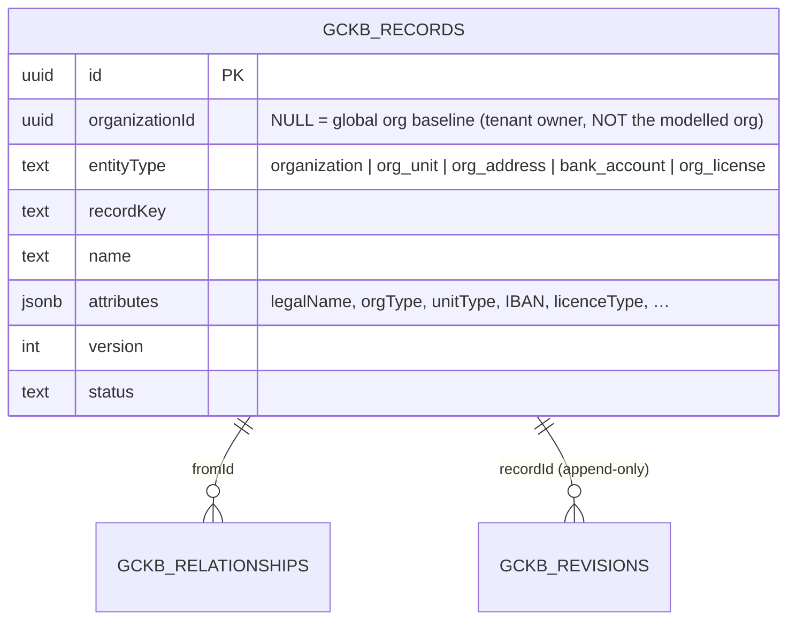

# Universal Organization Registry — Phase 1 (Module 4)

> **Status:** ✅ Implemented & tested (backend config + tests; full GCKB suite
> green on real PostgreSQL). Admin UI delivered by the shared registry-driven
> console.
> **Principle:** *Configuration over code.* Organizations are modelled as GCKB
> registry **master data** — distinct from the tenant `Organization` table (which
> records *who owns* data). No new tables, migrations, services or routes; nothing
> is seeded.

The Universal Organization Registry models the trade graph's legal entities and
their structure: parent companies, subsidiaries, branches, factories, warehouses,
departments, teams, plus the addresses, bank accounts, licences, certificates and
people attached to them.

---

## 1. Entities (five — `src/server/gckb/registries/organization.ts`)

| Entity | Models | Natural key |
|--------|--------|-------------|
| `organization` | a legal entity (parent / subsidiary / counterparty) | LEI › registration › DUNS › code › slug |
| `org_unit` | a sub-unit discriminated by `unitType` ∈ {BRANCH, FACTORY, WAREHOUSE, DEPARTMENT, TEAM, OFFICE} | code › slug |
| `org_address` | a postal/geographic address | code › slug |
| `bank_account` | bank-account reference metadata (no payment integration) | IBAN › account number › code › slug |
| `org_license` | a licence held by an organization | number › code › slug |

**Branches, factories, warehouses, departments and teams are one entity**
(`org_unit`), discriminated by a configurable `unitType` — not five hardcoded
tables. **Users and certificates are not re-modelled**: an organization links to
identity `user`s and Module-3 `certificate`s via typed edges (reuse, no
duplication).

---

## 2. Relationships (`ORG_RELATIONSHIP_TYPES`) — hierarchy & graph

```
SUBSIDIARY_OF      organization → organization   (parent company)
HAS_UNIT           organization → org_unit
SUB_UNIT_OF        org_unit → org_unit / organization
LOCATED_AT         organization / org_unit → org_address
HAS_BANK_ACCOUNT   organization → bank_account
HOLDS_LICENSE      organization → org_license
HOLDS_CERTIFICATE  organization → certificate     (Module 3)
HAS_MEMBER         organization / org_unit → user (identity, external ref)
REGISTERED_IN      organization → country
SUPPLIES           organization → organization    (supplier → buyer trade edge)
```

The full corporate hierarchy and the supplier/buyer trade graph are expressed as
typed edges in `gckb_relationships`, traversable by the Knowledge Graph (Module 7).

---

## 3. ER diagram



> Note the two distinct meanings of "organization": the `organizationId` **column**
> is the owning tenant; the `organization` **entity** is a modelled company.

---

## 4. API

Served automatically by the generic registry routes for all five entities:

| Method & path | Purpose |
|---------------|---------|
| `GET /api/gckb/organization?keyword=&page=` | Search organizations |
| `POST /api/gckb/organization` | Create an organization |
| `GET /api/gckb/org_unit?keyword=` | Search units (branch/factory/warehouse/…) |
| `POST /api/gckb/{org_unit\|org_address\|bank_account\|org_license}` | Create the related record |
| `GET /api/gckb/{entity}/{id}` · `/history` · `/versions` · `/relationships` | Read / history / hierarchy edges |
| `POST …/validate` · `…/import` · `GET …/export` | Validate / import / export |

### OpenAPI (fragment)

```yaml
openapi: 3.0.3
info: { title: Universal Organization Registry, version: "1.0" }
paths:
  /api/gckb/organization:
    post:
      summary: Create an organization
      requestBody:
        content:
          application/json:
            schema:
              type: object
              required: [name, attributes]
              properties:
                name: { type: string }
                code: { type: string }
                attributes:
                  type: object
                  properties:
                    legalName: { type: string }
                    orgType: { type: string }
                    registrationNumber: { type: string }
                    leiCode: { type: string }
                    countryCode: { type: string }
                    parentOrganizationKey: { type: string }
      responses: { "201": { description: Created } }
  /api/gckb/org_unit:
    post:
      summary: Create an organization unit
      requestBody:
        content:
          application/json:
            schema:
              type: object
              required: [name, attributes]
              properties:
                name: { type: string }
                attributes:
                  type: object
                  required: [unitType]
                  properties:
                    unitType: { type: string, enum: [BRANCH, FACTORY, WAREHOUSE, DEPARTMENT, TEAM, OFFICE] }
                    organizationKey: { type: string }
      responses: { "201": { description: Created } }
```

---

## 5. Import / data dictionary

Standard GCKB engine import (reserved columns → promoted/envelope; others →
`attributes`; transactional; idempotent; 422 on invalid rows). `gckb_records`
columns used: `entityType` (one of the five), `recordKey`, `name`, `attributes`
(all org metadata), `tags`, `version`, `status`, `organizationId` (tenant owner).

---

## 6. Events

`ORGANIZATION_*`, `ORG_UNIT_*`, `ORG_ADDRESS_*`, `BANK_ACCOUNT_*`,
`ORG_LICENSE_*` (created/updated/archived). Tenant events via the transactional
outbox; global-baseline events directly to the bus.

---

## 7. Testing

```bash
npx vitest run src/server/gckb/__tests__/organization-registry.test.ts \
               src/server/gckb/__tests__/organization-service.integration.test.ts
```

- Unit — registration, keys (LEI/IBAN/licence-number), `unitType` validation
  (one entity for all unit kinds), required fields, events, relationships.
- Integration (real PostgreSQL) — a full corporate hierarchy (parent → subsidiary
  → factory/warehouse) with address/bank/licence edges, search, idempotent import,
  and RLS tenant isolation.

---

## 8. Scope boundary

**In this module:** the five organization registry entities, schemas, keys,
events, relationships, form metadata; unit + PostgreSQL integration tests; this
doc. No new migration.

**Delivered by shared infrastructure:** REST API, import/export, search,
versioning/history, audit, events, RLS, registry-driven Admin UI.

**Reused, not duplicated:** the tenant `Organization` table (ownership) is left
untouched; `user` (identity) and `certificate` (Module 3) are linked by edges.
