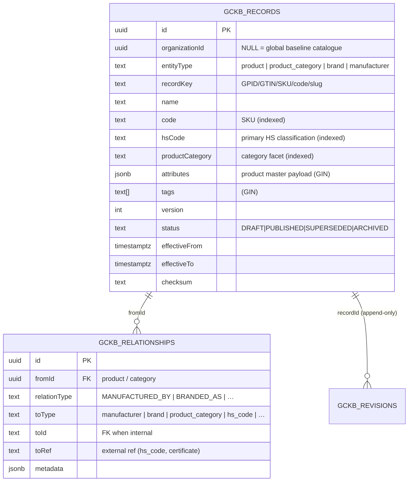

# Universal Product Registry — Phase 1 (Module 1)

> **Status:** ✅ Implemented & tested (backend config + tests; 17 product tests, full
> GCKB suite green on real PostgreSQL). Admin UI is delivered by the shared
> registry-driven console (it consumes the `formFields`/`relationshipTypes`
> metadata declared here).
> **Principle:** *Configuration over code.* A product, its taxonomy, its brand and
> its manufacturer are **registry configuration on the GCKB engine** — not a new
> table, migration, service or route. There is **no seeded product data**; real
> catalogues are loaded through the import API.

The Universal Product Registry is the platform's canonical, versioned,
tenant-safe master record for every traded product — its identity (GPID / GTIN /
SKU), classification (HS code, category), origin, physical envelope (weight,
volume, packaging, shelf life, storage), and trade / compliance metadata.

---

## 1. Architecture — why there is no `products` table

The product registry is **four entity types added to the GCKB registry**
(`src/server/gckb/registries/product.ts`): `product`, `product_category`,
`brand`, `manufacturer`. Because they are registered with the generic engine,
they inherit the entire platform lifecycle with **zero bespoke persistence
code**:

| Capability | Where it comes from |
|------------|---------------------|
| Storage | `gckb_records` (discriminated by `entityType`), `gckb_relationships`, append-only `gckb_revisions` |
| Versioning + history + version compare | generic `gckbService` + `gckb_revisions` (DB-enforced append-only) |
| Faceted + temporal search | promoted columns `hsCode`, `productCategory`, `code`, `tags` (+ GIN), `asOf` |
| CSV / JSON import (dry-run, rollback, dedupe) | `import-engine.ts` + `gckbService.applyImport/previewImport` |
| Export | `GET /api/gckb/product/export` |
| Immutable audit + domain events (outbox) | `gckbService` writeAudit / enqueueEvents |
| Row-Level-Security tenant isolation | migration `20260621140000_country_knowledge_base` |
| REST API | the generic registry routes under `/api/gckb/[entity]/**` |
| Admin UI | the shared registry-driven console (driven by `GET /api/gckb/entities`) |

Adding the registry was a **config entry** — `productEntities` is composed into
`definitions` in `src/server/gckb/registry.ts`. No new migration was required.

| Layer | File | Responsibility |
|------|------|----------------|
| Registry kit | `src/server/gckb/entity-kit.ts` | `KbEntityDefinition`, `simpleEntity`, form/relationship metadata types (cycle-free shared kit). |
| Product registry | `src/server/gckb/registries/product.ts` | The 4 product-domain entity definitions + `PRODUCT_RELATIONSHIP_TYPES`. |
| Composition | `src/server/gckb/registry.ts` | Spreads `productEntities` into the registry. |
| Engine (reused) | `src/server/services/gckb-service.ts` | Generic lifecycle, versioning, audit, events, import. |
| Tests | `src/server/gckb/__tests__/product-registry.test.ts`, `product-service.integration.test.ts` | Unit (validation/keys/events) + PostgreSQL integration. |

---

## 2. Entity catalog

| Entity type | Country-scoped | Natural key (precedence) | Lifecycle events |
|-------------|----------------|--------------------------|------------------|
| `product` | no | `globalProductId` › `gtin` › `sku` › `code` › `slug(name)` | `PRODUCT_CREATED/UPDATED/ARCHIVED` |
| `product_category` | no | `code` › `slug(name)` (upper) | `PRODUCT_CATEGORY_CREATED/UPDATED/ARCHIVED` |
| `brand` | no | `code` › `slug(name)` (upper) | `BRAND_CREATED/UPDATED/ARCHIVED` |
| `manufacturer` | no | `code` › `slug(name)` (upper) | `MANUFACTURER_CREATED/UPDATED/ARCHIVED` |

Products are intentionally **not country-scoped**: origin is captured as metadata
(`attributes.originCountryCode`) and/or an `ORIGINATES_FROM` relationship, so a
product can be created without first seeding its origin country.

### Product `attributes` schema (shape only — no hardcoded values)

`globalProductId, gtin, sku, mpn, description, brand, brandKey, manufacturer,
manufacturerKey, categoryKey, originCountryCode, originRegion,
specifications{}, packaging{}, weight{net,gross,tare,unit},
volume{value,unit,dimensions}, shelfLife{value,unit,afterOpeningDays},
storageConditions{temperature/humidity/hazardClass/specialHandling},
tradeMetadata{unitOfMeasure,incoterms,dutiable,dangerousGoods,unNumber,…},
hsClassifications[], certificates[], compliance{}, restrictions[]`

Promoted (indexed) facets set at the **top level** of the write input:
`code` (SKU), `hsCode`, `productCategory`, `tags`.

---

## 3. Relationships (typed edges via `gckb_relationships`)

`PRODUCT_RELATIONSHIP_TYPES` (constants — no magic strings):

```
MANUFACTURED_BY      product → manufacturer
BRANDED_AS           product → brand
CLASSIFIED_AS        product → product_category
CLASSIFIED_UNDER_HS  product → hs_code           (Module 2; held by toRef until present)
REQUIRES_CERTIFICATE product → certificate        (Module 3)
ORIGINATES_FROM      product → country
VARIANT_OF           product → product
SUBSTITUTE_FOR       product → product
COMPONENT_OF         product → product            (bill of materials)
SUBCATEGORY_OF       product_category → product_category
```

Cross-module edges (`hs_code`, `certificate`) are stored as `toRef` until those
registries exist, so Module 1 has **no forward dependency** on Modules 2–3.

---

## 4. ER diagram



---

## 5. Versioning, multi-tenancy & security

Identical to the GCKB engine (see `COUNTRY-KNOWLEDGE-BASE.md` §4–5):

- Full envelope per record (`version`, `effectiveFrom/To`, `publishedAt`,
  `status`, `authority`, `source`, `checksum`, `auditReference`).
- Every version preserved forever in append-only `gckb_revisions` (DB trigger
  rejects UPDATE/DELETE). An identical-checksum update is a **no-op** (no bump).
- `organizationId` nullable: `NULL` = a platform-global product baseline shared
  by every tenant; a tenant UUID = that tenant's own catalogue/override. **RLS**
  lets a tenant read global + its own rows and write only its own.
- Tenant writes emit an immutable `audit_logs` row + outbox event; global-baseline
  writes publish events directly to the bus.

---

## 6. API

The generic registry routes serve `product`, `product_category`, `brand`,
`manufacturer` automatically (`assertEntity` 404s unknown types):

| Method & path | Purpose |
|---------------|---------|
| `GET /api/gckb/product` | Search (`hsCode, productCategory, code, tag, keyword, status, asOf, page, pageSize`) |
| `POST /api/gckb/product` | Create a product |
| `GET /api/gckb/product/{id}` | Read (record + relationships) |
| `PATCH /api/gckb/product/{id}` | Update (optimistic `expectedVersion`; `status:"PUBLISHED"` to publish) |
| `DELETE /api/gckb/product/{id}` | Archive (`?reason=`) |
| `GET /api/gckb/product/{id}/history` · `/versions` | Append-only history; `?a=&b=` compares versions |
| `GET/POST /api/gckb/product/{id}/relationships` | List / add typed edges |
| `POST /api/gckb/product/validate` | Validate a payload without persisting |
| `POST /api/gckb/product/import` | Bulk import (CSV/JSON; `dryRun`) |
| `GET /api/gckb/product/export` | Bulk export (`?format=json\|csv`) |
| `GET /api/gckb/entities` | Catalog incl. product `formFields` + `relationshipTypes` (drives the Admin UI) |

### OpenAPI (fragment)

```yaml
openapi: 3.0.3
info: { title: Universal Product Registry, version: "1.0" }
paths:
  /api/gckb/product:
    get:
      summary: Search products
      parameters:
        - { name: hsCode, in: query, schema: { type: string } }
        - { name: productCategory, in: query, schema: { type: string } }
        - { name: code, in: query, schema: { type: string } }
        - { name: tag, in: query, schema: { type: string } }
        - { name: keyword, in: query, schema: { type: string } }
        - { name: asOf, in: query, schema: { type: string, format: date-time } }
      responses: { "200": { description: Paginated products } }
    post:
      summary: Create a product
      requestBody:
        content:
          application/json:
            schema: { $ref: "#/components/schemas/CreateProduct" }
      responses: { "201": { description: Created }, "400": { description: Validation error } }
components:
  schemas:
    CreateProduct:
      type: object
      required: [name, attributes]
      properties:
        name: { type: string }
        code: { type: string, description: "SKU (promoted, indexed)" }
        hsCode: { type: string }
        productCategory: { type: string }
        tags: { type: array, items: { type: string } }
        status: { type: string, enum: [DRAFT, PUBLISHED, SUPERSEDED, ARCHIVED] }
        attributes:
          type: object
          properties:
            globalProductId: { type: string }
            gtin: { type: string }
            sku: { type: string }
            originCountryCode: { type: string }
            specifications: { type: object, additionalProperties: true }
            weight: { type: object, properties: { net: {type: number}, gross: {type: number}, unit: {type: string} }, required: [unit] }
            volume: { type: object }
            packaging: { type: object }
            shelfLife: { type: object, properties: { value: {type: integer}, unit: {type: string, enum: [DAY,WEEK,MONTH,YEAR]} }, required: [value, unit] }
            storageConditions: { type: object }
            tradeMetadata: { type: object }
            compliance: { type: object }
            restrictions: { type: array, items: { type: object } }
```

---

## 7. Import specification

`POST /api/gckb/product/import` with `{ format, content | rows, dryRun }`.

- **CSV:** reserved columns map to promoted/envelope fields (`recordKey, name,
  code, hsCode, productCategory, tags, status, effectiveFrom, effectiveTo,
  authority, source, auditReference`); every other column becomes an `attributes`
  field (scalar coercion; JSON literals supported; an `attributes` column may
  carry a full JSON object). `tags` is `a|b|c`.
- **JSON:** an array of product records (or `{ "records": [...] }`).
- **Pipeline:** parse → per-row validation against the product schema → derive
  natural key → in-file dedupe → structured error report. `dryRun:true` returns a
  preview (create / update / unchanged) and writes nothing.
- **Commit:** one transaction — any row error rolls back the whole batch.
  Existing products (by natural key) update only when their checksum changed;
  unchanged rows are skipped. Every written row gets an `IMPORT` revision +
  (tenant) audit + event. A batch with any invalid row returns **422**.

### Example JSON

```json
[
  { "name": "Basmati Rice 5kg", "code": "RICE-BAS-5", "hsCode": "100630",
    "productCategory": "FOOD/GRAINS", "tags": ["food","grain"],
    "attributes": { "gtin": "8901234567890", "weight": { "net": 5, "unit": "kg" },
      "shelfLife": { "value": 24, "unit": "MONTH" } } }
]
```

---

## 8. Data dictionary (product-specific use of `gckb_records`)

| Column | Type | Product use |
|--------|------|-------------|
| entityType | text | `product` / `product_category` / `brand` / `manufacturer` |
| recordKey | text | natural key (GPID › GTIN › SKU › code › slug) |
| code | text? | SKU / internal code (promoted, indexed) |
| hsCode | text? | primary HS classification (indexed facet) |
| productCategory | text? | category facet (indexed) |
| attributes | jsonb | product master payload (registry-validated; GIN-indexed) |
| tags | text[] | free tags (GIN-indexed) |
| version / status | int / text | lifecycle |
| organizationId | uuid? | NULL = global product baseline; else tenant catalogue |

(Full `gckb_records` / `gckb_relationships` / `gckb_revisions` dictionary: see
`COUNTRY-KNOWLEDGE-BASE.md` §8.)

---

## 9. Events

`PRODUCT_CREATED/UPDATED/ARCHIVED`, `PRODUCT_CATEGORY_*`, `BRAND_*`,
`MANUFACTURER_*`. Tenant events are delivered via the transactional outbox
(durable, at-least-once); global-baseline events publish directly to the bus.

---

## 10. Testing

```bash
npx vitest run src/server/gckb/__tests__/product-registry.test.ts \
               src/server/gckb/__tests__/product-service.integration.test.ts
```

- `product-registry.test.ts` — registration, key precedence (GPID › GTIN › SKU ›
  code › slug), nested-attribute validation, events, relationship-type catalog.
- `product-service.integration.test.ts` (real PostgreSQL) — create/version/history,
  faceted search (hsCode/productCategory/code/tag/keyword), typed relationships to
  manufacturer/brand/category/HS, archive + retained history, transactional import
  (idempotent + rollback), domain events, and RLS tenant isolation.

The vitest global setup boots embedded PostgreSQL and runs `prisma migrate
deploy`, so the suite also verifies RLS, indexes and the append-only trigger on
real Postgres.

---

## 11. Scope boundary

**In this module:** the four product-domain registry entities, their validation
schemas, natural keys, events, typed relationships, and form metadata; unit +
PostgreSQL integration tests; this documentation. No new migration (reuses the
GCKB tables).

**Delivered by shared infrastructure:** REST API (generic registry routes),
import/export engine, search, versioning/history, audit, events, RLS, and the
registry-driven Admin UI (consumes the `formFields`/`relationshipTypes` declared
here via `GET /api/gckb/entities`).

**Deliberately not here:** no seeded products/categories/brands/manufacturers
(spec forbids mock data — load real catalogues through the import API); the
`hs_code` and `certificate` registries (Modules 2–3) are referenced only by
`toRef` edges until they exist.
